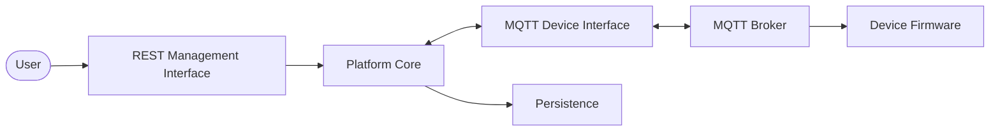

# System Architecture Overview

Esp Monitor is a server-side platform that provides architectural interfaces for communication between users, client applications, and managed devices.

The system architecture is built around clearly defined interaction contracts. External participants never communicate directly with the platform's internal components; instead, they use dedicated interfaces and APIs. This approach allows individual parts of the system to evolve independently while preserving the stability of the overall architecture.

## System Architecture

## Architectural Components

### User

The user is the primary actor of the system. All management, configuration, and monitoring operations are initiated by the user through one of the clients that communicates with the platform via the REST Management Interface.

### REST Management Interface

The REST Management Interface is the primary administrative interface of Esp Monitor for interaction with users and external applications.

The web interface, mobile applications, automation tools, and any other clients all use the same REST Management Interface, regardless of their implementation technology.

### Platform Core

The Platform Core is the central subsystem of the server.

It coordinates the operation of external interfaces, the platform's information model, the Persistence layer, and the messaging infrastructure, while hiding internal implementation details from external participants.

### MQTT Device Interface

The MQTT Device Interface defines the architectural contract between the platform and managed devices.

It specifies the messaging protocol used by devices to communicate with the platform through the MQTT infrastructure.

### Persistence

The Persistence layer is responsible for storing and maintaining the platform's current information model.

The Platform Core communicates with Persistence through the Storage API and remains independent of any specific data storage implementation.

### MQTT Broker

The MQTT Broker is an external infrastructure service responsible for delivering MQTT messages between the server and managed devices.

The broker is not part of Esp Monitor and may be replaced with any MQTT-compliant implementation.

### Managed Devices

Managed devices are the endpoints controlled by the platform.

They receive configuration and management commands through the MQTT Device Interface and publish operational data using the same messaging infrastructure.

## Interaction Model

Esp Monitor is organized around architectural contracts rather than direct coupling between internal and external system components.

Users and client applications interact with the platform through the REST Management Interface, while managed devices communicate through the MQTT Device Interface using an external MQTT Broker as the transport layer.

This separation keeps the platform independent of specific client applications, hardware platforms, and infrastructure implementations while providing a unified and stable communication model for all participants.

## Summary

This chapter introduced the primary architectural components of Esp Monitor and illustrated the high-level relationships between them.

The following chapters examine each architectural area in greater detail while preserving the overall system model presented here.