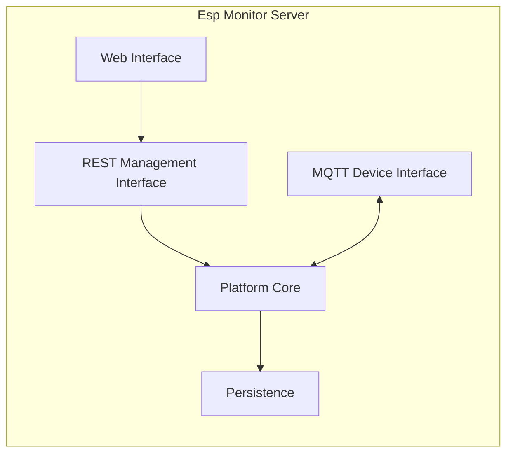
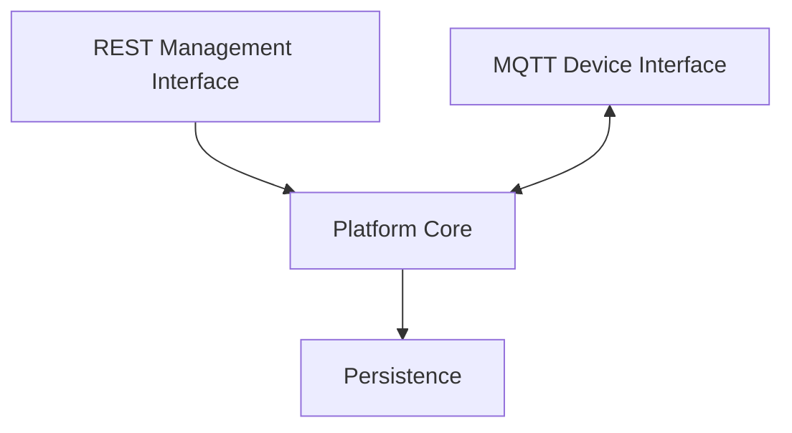

# Chapter 05. Server Architecture

## 1. Introduction

As the functionality of Esp Monitor grows, the server evolves beyond a single area of responsibility and begins to address several fundamentally different concerns simultaneously: processing external requests, communicating with managed devices, coordinating platform subsystems, interacting with the Persistence layer, and delivering user-facing functionality.

When these responsibilities are implemented within a single, undifferentiated system, changes made in one area inevitably affect others. This leads to tighter coupling, increased maintenance complexity, and reduced predictability as the platform evolves.

The Esp Monitor architecture addresses this challenge through the deliberate decomposition of the server into a set of specialized subsystems, each responsible for a clearly defined aspect of the system's behavior.

Figure 5.1 illustrates this architectural decomposition.

**Figure 5.1 — Architectural Subsystems of the Esp Monitor Server**

---

## 2. Architectural Subsystems

The server architecture does not mirror the project's source code organization or package structure. Instead, it is organized around **architectural responsibilities** rather than technical implementation details.

Each subsystem represents a well-defined area of responsibility that encapsulates a specific aspect of the server's behavior. Interactions between subsystems are established through explicit architectural dependencies.

This approach allows individual parts of the system to evolve independently without altering the overall architectural model.

Figure 5.1 identifies the following subsystems:

- REST Management Interface
- MQTT Device Interface
- Platform Core
- Persistence
- Web Interface

---

### REST Management Interface and MQTT Device Interface

The REST Management Interface and the MQTT Device Interface represent two independent communication channels between external participants and the platform.

They are separated into distinct subsystems to isolate protocol-specific concerns from the Platform Core.

Although they use different communication protocols and transport mechanisms, both interfaces perform the same architectural role: translating incoming requests into internal platform operations. Differences in communication protocols therefore have no impact on the processing rules implemented by the Platform Core.

This separation makes it possible to introduce additional communication interfaces without modifying the platform's internal behavioral model.

---

### Platform Core

The Platform Core is the central subsystem of the server architecture.

It coordinates the operation of external interfaces, the Persistence layer, configuration mechanisms, and event publication, while keeping these responsibilities separate from protocol processing and data storage implementation details.

All external interfaces delegate business operations to this subsystem.

As a result, the Platform Core serves as the single coordination point for the behavior of the server-side platform.

---

### Persistence

The Persistence subsystem isolates the storage of the platform's information model from the rest of the architecture.

Its responsibility extends beyond simply storing data. More importantly, it provides the Storage API through which the Platform Core accesses and manipulates the current system state.

This allows the Platform Core to remain independent of database schemas and storage technologies by interacting exclusively through a well-defined architectural contract.

---

### HTTP Server

The HTTP Server provides the infrastructure required to process HTTP requests.

Its responsibility is limited to supplying the runtime environment for web communication and does not include any platform-specific business logic.

Consequently, the HTTP Server acts purely as a technical request-processing mechanism and has no influence on the structure or behavior of the Platform Core.

---

### Web Interface

The Web Interface is responsible for presenting information to users.

Its separation reflects the architectural principle of isolating presentation concerns from the Platform Core.

This allows the user interface to evolve independently of the server platform's behavior.

---

## 3. Subsystem Interaction

Decomposing the server into subsystems is meaningful only when accompanied by a clearly defined interaction model.

In Esp Monitor, subsystem interactions are organized to minimize cross-dependencies while establishing a consistent direction of control flow.

Figure 5.2 illustrates these architectural dependencies.

**Figure 5.2 — Interaction Between Architectural Subsystems**

The REST Management Interface and the MQTT Device Interface serve as independent entry points into the system. Neither interface implements business logic directly; instead, both delegate request processing to the Platform Core.

The Platform Core is the only subsystem that interacts with the Persistence layer, creating a centralized point for managing the platform's state.

This dependency structure establishes an important architectural property: all external interactions ultimately converge into a single behavioral model implemented by the Platform Core.

As a result:

- protocol-specific differences do not affect the Platform Core;
- application logic is not duplicated across communication interfaces;
- changes to the storage implementation do not require modifications to external interfaces.

The architecture therefore remains extensible, since new communication channels integrate with the existing Platform Core instead of introducing their own independent processing models.

---

## 4. Summary

The architectural decomposition of the Esp Monitor server establishes the internal structure of the platform by separating responsibilities among specialized subsystems.

Each subsystem fulfills a clearly defined architectural role, while all interactions follow a consistent dependency flow centered on the Platform Core.

This approach reduces coupling, simplifies long-term evolution, and preserves the Platform Core's independence from communication protocols and data storage technologies.

The following chapters examine each subsystem in greater detail, focusing on its specific role within the overall architecture of the platform.