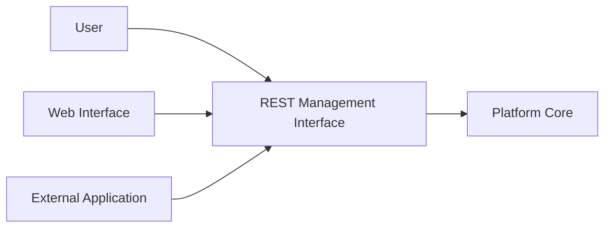
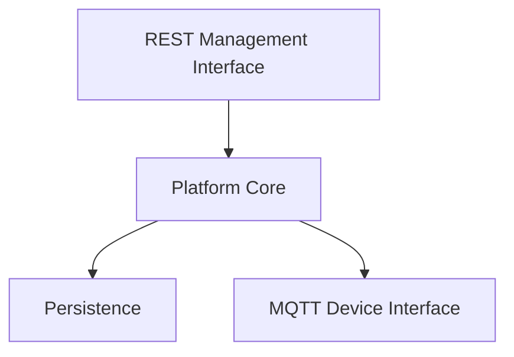

# 06. REST Management Interface

## 6.1 Purpose

The REST Management Interface is the primary administrative interface of the Esp Monitor server. It provides a unified entry point for users, the built-in web application, and external software systems, exposing the platform's management capabilities through a stable HTTP-based API.

Unlike the MQTT Device Interface, which is responsible for communication with deployed ESP devices, the REST Management Interface operates exclusively on the server side. Its responsibility is to expose the platform's information model—including registered devices, their configuration, operational metadata, and management functions—without exposing the internal implementation of the server.

<div align="center">

**Figure 6.1 — Position of the REST Management Interface Within the Platform Architecture**

</div>



From an architectural perspective, REST Management Interface never communicates directly with ESP devices. Any interaction with physical devices is delegated to the Platform Core, which coordinates the remaining subsystems of the platform.

Configuration delivery, telemetry collection, and device messaging are implemented by the MQTT Device Interface and are discussed in the following chapter.

---

## 6.2 Architectural Responsibilities

The REST Management Interface is responsible for exposing the administrative capabilities of the platform through a conventional HTTP request/response model.

Its responsibilities include:

- receiving HTTP requests;
- validating request parameters;
- applying authentication and authorization policies;
- converting external requests into internal platform operations;
- formatting HTTP responses.

Business rules are intentionally excluded from this layer. The REST interface neither accesses Persistence directly nor communicates with the MQTT infrastructure. Instead, every request is delegated to the Platform Core, which contains the application's business logic and orchestrates the remaining subsystems.

This separation ensures that the Platform Core remains independent of the transport protocol. As a result, internal implementation details can evolve without affecting existing REST clients or requiring changes to the public API.

---

## 6.3 Request Processing

All administrative requests follow the same architectural processing pipeline.

<div align="center">

**Figure 6.2 — REST Request Processing**

</div>



After receiving an HTTP request, the REST Management Interface performs protocol-specific processing before transferring control to the Platform Core.

The Platform Core determines the execution strategy for the requested operation and coordinates the remaining platform components.

Depending on the requested operation, the Platform Core may:

- retrieve or update data stored in Persistence;
- publish commands through the MQTT Device Interface;
- perform both actions as part of a single logical operation.

The REST Management Interface remains completely isolated from storage and messaging mechanisms. Its responsibility ends once the request has been translated into an internal platform operation.

When an operation targets a physical device, the REST interface updates the platform's information model, while the actual command delivery is performed asynchronously through the MQTT Device Interface.

---

## 6.4 Summary

The REST Management Interface serves as the primary administrative interface of the Esp Monitor platform.

Its architectural responsibility is limited to accepting administrative requests, validating them, and delegating execution to the Platform Core. This strict separation keeps the transport layer independent of business logic while preserving clear architectural boundaries between administrative operations and device communication.

Communication with ESP devices remains the exclusive responsibility of the MQTT Device Interface, allowing both interfaces to evolve independently while maintaining a consistent internal architecture.

# REST Management API Reference

## 1. Purpose

The REST Management API provides a stable and versioned programming interface for administering the Esp Monitor platform.

It is intended for use by the built-in Web Interface, external applications, automation tools, and third-party integrations. The API exposes the platform's management capabilities through standard HTTP requests while keeping the internal implementation of the server hidden from clients.

The REST Management API operates exclusively against the Esp Monitor server. Communication with ESP devices—including configuration delivery, telemetry exchange, and command execution—is performed internally by the Platform Core through the MQTT Device Interface and is therefore outside the scope of this API.

---

## 2. Base URL

All endpoints are exposed under the following base path:

```text
/api/v1
```

Including the version number in the URL establishes a stable contract between clients and the server, allowing future API revisions without breaking existing integrations.

---

## 3. Authentication

Most management operations require authentication.

Authentication is performed using the `xToken` HTTP request header.

```http
xToken: <access-token>
```

The supplied token must match the value configured when the server starts, either through the configuration file or via command-line parameters.

Requests without a valid token are rejected before reaching the Platform Core.

---

## 4. Request Format

Unless stated otherwise, the following conventions apply to all endpoints.

### HTTP Methods

| Method | Purpose                                   |
|--------|-------------------------------------------|
| GET    | Retrieve information                      |
| POST   | Create a resource or execute an operation |
| DELETE | Remove a resource                         |

### Content Types

JSON requests use:

```http
Content-Type: application/json
```

File uploads use:

```http
Content-Type: multipart/form-data
```

---

## 5. Response Format

All API responses use JSON.

Successful requests return an appropriate HTTP status code and, when applicable, a JSON document containing the requested data.

Error responses return the corresponding HTTP status code together with diagnostic information describing the failure.

The exact response payload depends on the endpoint being invoked.

---

## 6. HTTP Status Codes

The REST Management API follows standard HTTP semantics.

| Status                    | Description                                                 |
|---------------------------|-------------------------------------------------------------|
| 200 OK                    | The request completed successfully.                         |
| 201 Created               | A new resource was created successfully.                    |
| 204 No Content            | The request completed successfully without a response body. |
| 400 Bad Request           | The request is invalid or malformed.                        |
| 401 Unauthorized          | Authentication failed.                                      |
| 403 Forbidden             | The requested operation is not permitted.                   |
| 404 Not Found             | The requested resource does not exist.                      |
| 409 Conflict              | The request conflicts with the current resource state.      |
| 500 Internal Server Error | An unexpected server-side error occurred.                   |

# Device Management

## GET /api/v1/devices

### Purpose

Returns the list of all devices currently registered in the platform.

Optionally, the result may be filtered by the beginning of the device identifier, allowing clients to retrieve only matching entries.

### Authentication

Required.

### Request

#### Query Parameters

| Name   | Type   | Required | Description                                                            |
|--------|--------|----------|------------------------------------------------------------------------|
| filter | string | No       | Returns devices whose SSDP identifier begins with the specified value. |

Example:

```http
GET /api/v1/devices
```

Filtered request:

```http
GET /api/v1/devices?filter=esp-001
```

### Response

Returns a JSON array containing the matching devices.

### Possible Responses

| Status                    | Description                                 |
|---------------------------|---------------------------------------------|
| 200 OK                    | Device list returned successfully.          |
| 401 Unauthorized          | Authentication failed.                      |
| 500 Internal Server Error | Unexpected server error.                    |

---

## POST /api/v1/devices/upload

### Purpose

Imports or updates multiple devices from a CSV file.

If a device already exists in the registry, its information is updated. Otherwise, a new device is created.

### Authentication

Required.

### Request

#### Content-Type

```http
multipart/form-data
```

#### Form Parameters

| Name | Type | Required | Description                               |
|------|------|----------|-------------------------------------------|
| file | File | Yes      | CSV file containing the device inventory. |

### Response

Returns the result of the import operation, including any validation or processing errors encountered during the upload.

### Possible Responses

| Status                    | Description                            |
|---------------------------|----------------------------------------|
| 200 OK                    | File processed successfully.           |
| 400 Bad Request           | Invalid CSV file or malformed request. |
| 401 Unauthorized          | Authentication failed.                 |
| 500 Internal Server Error | Unexpected server error.               |

## POST /api/v1/devices/cfg

### Purpose

Publishes a new configuration for the specified device.

The configuration is stored by the server and forwarded to the MQTT Device Interface, which is responsible for delivering it to the target device.

The REST Management API does not communicate with devices directly. Instead, it requests a configuration update through the Platform Core, which coordinates the remaining platform components.

### Authentication

Required.

### Request

#### Headers

| Header | Required | Description                 |
|--------|----------|-----------------------------|
| SSDP   | Yes      | Identifier of the target device. |

#### Content-Type

```http
Content-Type: application/json
```

#### Request Body

The request body contains a JSON document representing the device configuration.

The structure of this document depends on the firmware implementation and is therefore intentionally not constrained by the REST Management API.

### Response

Returns the result of the configuration publication request.

A successful response confirms that the server has accepted the configuration and initiated the delivery process.

### Possible Responses

| Status                    | Description                                    |
|---------------------------|------------------------------------------------|
| 200 OK                    | Configuration accepted successfully.           |
| 400 Bad Request           | Invalid request body or configuration format.  |
| 401 Unauthorized          | Authentication failed.                         |
| 404 Not Found             | The specified device does not exist.           |
| 500 Internal Server Error | Unexpected server error.                       |

> **Note**
>
> Acceptance of the request does not imply that the device has already applied the new configuration.
>
> Configuration delivery is performed asynchronously through the MQTT Device Interface. If the target device is temporarily offline, the configuration will be delivered when communication with the MQTT broker is re-established, subject to the messaging policy implemented by the platform.

---

## DELETE /api/v1/devices

### Purpose

Removes a device from the platform registry.

Only the server-side representation of the device is removed. This operation does not physically affect the device itself.

### Authentication

Required.

### Request

#### Headers

| Header | Required | Description                         |
|--------|----------|-------------------------------------|
| SSDP   | Yes      | Identifier of the device to remove. |

### Response

Returns the result of the deletion request.

### Possible Responses

| Status                    | Description                           |
|---------------------------|---------------------------------------|
| 200 OK                    | Device removed successfully.          |
| 401 Unauthorized          | Authentication failed.                |
| 404 Not Found             | The specified device does not exist.  |
| 500 Internal Server Error | Unexpected server error.              |

---

# Revision History

| Version | Description                                 |
|---------|---------------------------------------------|
| v1      | Initial release of the REST Management API. |