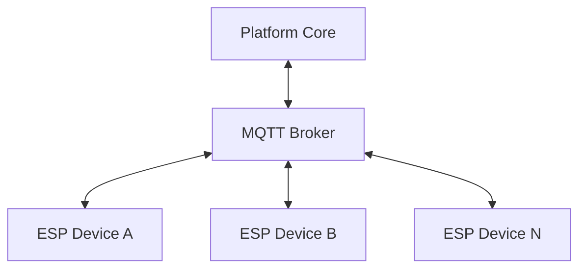
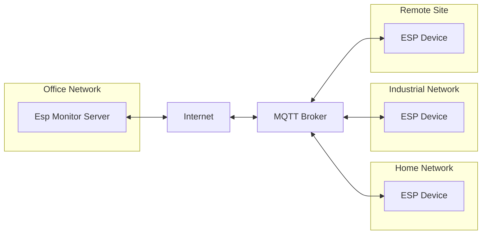
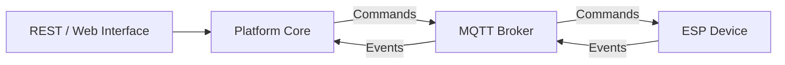
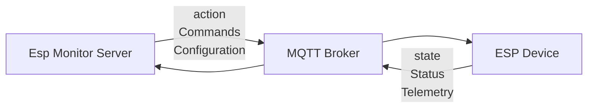

# 07. MQTT Device Interface

## 7.1 Purpose

Following the completion of the Provisioning process, the Esp Monitor platform no longer communicates with devices through direct network connections. All subsequent interaction between the server and registered ESP devices is performed exclusively through the MQTT Device Interface.

This architectural decision is one of the fundamental design principles of the platform. It decouples the logical device model maintained by the server from the physical network topology in which devices are deployed, allowing the system to manage geographically distributed installations through a unified communication model.

This chapter describes the architectural role of the MQTT Device Interface. The message contract, topic hierarchy, and JSON payloads are specified separately in the **MQTT Device API Reference**.

Provisioning is the only exception to this communication model. During the initial setup, the user is physically located near the device and transfers the network and MQTT configuration required for autonomous operation. Once this process is complete, the device becomes a full participant in the distributed system, and all further communication is performed through the MQTT broker.

<div align="center">

**Figure 7.1 — MQTT-Based Communication Architecture**

</div>



---

## 7.2 Architectural Principles

The MQTT Device Interface completely eliminates the need for direct network communication between the server and managed devices.

The server never establishes TCP sessions with individual devices, never performs HTTP requests against their IP addresses, and never attempts to determine their physical location within a network. Instead, both the server and every ESP device establish independent connections to the same MQTT broker and exchange information exclusively by publishing and subscribing to messages.

This architecture makes the platform independent of network topology. Devices may reside in different local networks, operate behind NAT gateways, receive dynamically assigned IP addresses, temporarily lose connectivity, or even be relocated to entirely different sites. None of these changes require modifications to the server or its internal architecture.

From the perspective of the Platform Core, every device is represented as a logical entity identified by a stable device identifier rather than a network endpoint. Responsibility for locating connected devices and routing messages is delegated entirely to the MQTT infrastructure.

One of the most significant consequences of this approach is the complete removal of the concept of device location from the server architecture. The Platform Core operates exclusively on the platform's information model and has no knowledge of how individual devices are reached across the underlying network.

<div align="center">

**Figure 7.2 — Network Topology Independence**

</div>



## 7.3 Event-Driven Communication

The MQTT Device Interface implements a fully event-driven communication model.

Either side of the communication channel may initiate message exchange at any time. The server publishes commands intended for individual devices, while devices independently publish status updates and telemetry without waiting for explicit requests.

This communication model is particularly well suited for monitoring systems, where changes in device state represent events that should be propagated to the platform as soon as they occur.

Unlike traditional polling-based architectures, the Esp Monitor server never periodically queries devices for their current state. Instead, the platform's information model is updated whenever new state messages are received from the MQTT broker.

Similarly, configuration changes do not result in direct communication between a user interface and a device. After processing an administrative request, the Platform Core generates the appropriate command and publishes it through the MQTT Device Interface. From that point onward, message delivery is handled independently by the MQTT infrastructure.

---

## 7.4 Separation of Responsibilities

All interaction with the MQTT infrastructure is encapsulated within the Platform Core and the MQTT Device Interface.

User-facing components—including the REST Management Interface and the Web Interface—never communicate directly with the MQTT broker. Instead, they operate exclusively on the platform's information model and delegate all business operations to the Platform Core.

The Platform Core determines whether a requested operation requires communication with a physical device. When necessary, it generates the corresponding MQTT message and passes it to the MQTT Device Interface for delivery.

This architectural separation prevents presentation-layer components from becoming dependent on transport protocols or messaging infrastructure, allowing each subsystem to evolve independently.

<div align="center">

**Figure 7.3 — Responsibility Separation Between User Interfaces and MQTT Infrastructure**

</div>



---

## 7.5 Fault Tolerance

The MQTT broker also isolates the server from the lifecycle of individual devices.

Devices may connect, disconnect, and reconnect at arbitrary times without requiring intervention from the Platform Core or user-facing components. Once a device reconnects to the MQTT broker, message exchange resumes automatically according to the MQTT protocol.

The server is not responsible for establishing individual device connections, tracking network availability, or implementing device-specific reconnection logic. These responsibilities are delegated entirely to the messaging infrastructure.

Even temporary unavailability of the MQTT broker does not compromise the overall architecture of the platform. During such periods, the server continues to process REST requests, serve the Web Interface, and operate on the platform's information model. Only communication with physical devices is temporarily suspended.

When connectivity to the MQTT broker is restored, message exchange resumes without requiring changes to business logic, data storage, or user interfaces.

---

## 7.6 Summary

The MQTT Device Interface is considerably more than a messaging protocol. It is the architectural mechanism that completely separates the platform's information model from the physical infrastructure in which devices are deployed.

By delegating message routing and connectivity management to the MQTT infrastructure, the Platform Core operates exclusively on logical device identities rather than network addresses.

This design enables Esp Monitor to support geographically distributed deployments, tolerate changing network topologies, and naturally implement an event-driven communication model while maintaining clear separation between business logic, transport infrastructure, and user-facing interfaces.

# MQTT Device API Reference

## 1. Overview

The MQTT Device API defines the messaging contract between the Esp Monitor server and registered ESP devices after the Provisioning process has been completed.

Following initial configuration, MQTT becomes the exclusive communication mechanism between the server and managed devices. Neither side establishes direct network connections to the other. Instead, both independently connect to the same MQTT broker and exchange information by publishing and subscribing to messages.

All MQTT messages are UTF-8 encoded JSON documents.

---

## 2. Topic Hierarchy

All MQTT topics follow the same hierarchical structure:

```text
<ROOT>/<DEVICE>/<TOPIC>
```

where

| Component  | Description                                                                                                                     |
|------------|---------------------------------------------------------------------------------------------------------------------------------|
| `<ROOT>`   | Root topic configured by the `MQTT_ROOT` setting. It isolates independent Esp Monitor deployments sharing the same MQTT broker. |
| `<DEVICE>` | Unique device identifier (SSDP Name).                                                                                           |
| `<TOPIC>`  | Logical message type.                                                                                                           |

### Example

```text
company-a/
    esp-0001/
        state
        action

    esp-0002/
        state
        action
```

---

## 3. Topic Summary

| Topic    | Publisher          | Subscriber          | Purpose                                      |
|----------|--------------------|---------------------|----------------------------------------------|
| `state`  | ESP Device         | Esp Monitor Server  | Reports the current device state.            |
| `action` | Esp Monitor Server | ESP Device          | Delivers commands and configuration updates. |

---

## 4. Topic: `state`

### Full Topic Name

```text
<ROOT>/<DEVICE>/state
```

### Publisher

ESP Device

### Subscriber

Esp Monitor Server

### Purpose

The `state` topic reports the current operational state of an ESP device.

Messages are typically published:

- immediately after connecting to the MQTT broker;
- whenever the device state changes;
- when digital or analog pin values change;
- whenever additional firmware-defined events occur.

The server consumes these messages to keep its information model synchronized with the actual state of deployed devices.

### Message Format

```json
{
    "SSDP": "esp-0001",
    "MDNS": "esp-0001.local",
    "Started": 1750000000,
    "Updated": 1750001234,
    "Pins": {
        "D1": "1",
        "D2": "0",
        "A0": "512"
    }
}
```

### Fields

| Field     | Type    | Description                                                                                |
|-----------|---------|--------------------------------------------------------------------------------------------|
| `SSDP`    | string  | Unique device identifier.                                                                  |
| `MDNS`    | string  | Device mDNS name.                                                                          |
| `Started` | integer | Device startup time (Unix time).                                                           |
| `Updated` | integer | Timestamp when the message was generated (Unix time).                                      |
| `Pins`    | object  | Current digital and analog pin states. The exact structure depends on the device firmware. |

## 5. Topic: `action`

### Full Topic Name

```text
<ROOT>/<DEVICE>/action
```

### Publisher

Esp Monitor Server

### Subscriber

ESP Device

### Purpose

The `action` topic is used to deliver commands from the server to an individual ESP device.

In the current version of the platform, its primary purpose is to distribute configuration updates. The API, however, has been designed to support additional command types without requiring changes to the topic hierarchy or communication model.

After receiving a configuration update, the device performs the following sequence:

1. Merges the received values with the existing configuration.
2. Stores the updated `config.json` file in persistent storage.
3. Restarts to apply the new configuration.

### Message Format

```json
{
    "config": {
        "wifi": {
            "ssid": "Office",
            "pass": "********"
        },
        "mqtt": {
            "host": "broker.example.com",
            "port": 1883
        }
    }
}
```

### Fields

| Field    | Type   | Description                                  |
|----------|--------|----------------------------------------------|
| `config` | object | Partial or complete device configuration.    |

Only the configuration fields included in the message are modified. Any omitted fields retain their existing values.

---

## 6. Message Flows

The MQTT Device API defines two independent message flows.

<div align="center">

**Figure 7.4 — MQTT Message Flows**

</div>



### State Flow

```text
ESP Device
      │
 publish state
      │
      ▼
 MQTT Broker
      │
      ▼
 Esp Monitor Server
```

The device independently publishes status updates whenever significant events occur. These messages are consumed by the server to keep the platform's information model synchronized with the physical device.

---

### Command Flow

```text
Esp Monitor Server
         │
 publish action
         │
         ▼
   MQTT Broker
         │
         ▼
    ESP Device
```

The server publishes commands after processing user requests or executing internal Platform Core logic. Delivery is handled entirely by the MQTT infrastructure, allowing user interfaces to remain independent of transport-specific concerns.

## 7. Delivery Guarantees

### Quality of Service (QoS)

The Quality of Service (QoS) level is determined by the MQTT client implementation used by each platform component.

The current implementation uses the following QoS levels:

| Component          | QoS |
|--------------------|-----|
| ESP Device         | 0   |
| Esp Monitor Server | 1   |

As a result, messages published by ESP devices may be lost under adverse network conditions, while messages published by the server use a more reliable delivery mode.

The selected QoS levels represent a practical balance between communication overhead and delivery reliability for the intended deployment scenarios.

---

### Retained Messages

The platform does not use retained MQTT messages.

Each published message represents the current state of the system and is intended for immediate processing rather than long-term storage by the MQTT broker.

---

### Automatic Reconnection

Both the server and ESP devices rely on the automatic reconnection capabilities provided by their MQTT client libraries.

If connectivity to the MQTT broker is temporarily lost, clients automatically re-establish the connection when the broker becomes available again. Message exchange then resumes without user intervention or modifications to the application architecture.

---

## 8. Topic Lifecycle

MQTT topics do not require explicit creation.

Topics are created automatically by the MQTT broker when the first message is published.

Similarly, topic persistence, message retention, and internal storage policies are entirely implementation-specific and remain the responsibility of the MQTT broker.

The Esp Monitor platform does not directly manage the lifecycle of MQTT topics.

---

## 9. Message Requirements

Unless specified otherwise, all MQTT messages exchanged between the server and ESP devices must satisfy the following requirements.

| Property            | Value       |
|---------------------|-------------|
| Encoding            | UTF-8       |
| Payload Format      | JSON        |
| Time Representation | Unix Time   |
| Device Identifier   | SSDP Name   |
| Message Type        | JSON Object |

Receiving implementations should ignore unknown fields whenever possible.

This approach allows the protocol to evolve while maintaining backward compatibility with existing firmware versions and server deployments.

---

## 10. API Extensibility

The MQTT Device API has been designed for forward compatibility.

New command types can be introduced without modifying the existing topic hierarchy or breaking compatibility with deployed devices.

For example, the existing topic

```text
<ROOT>/<DEVICE>/action
```

may carry additional commands in future versions of the protocol.

Reboot command:

```json
{
    "reboot": {}
}
```

Firmware update command:

```json
{
    "ota": {
        "url": "https://example.com/fw.bin"
    }
}
```

GPIO control command:

```json
{
    "gpio": {
        "D5": 1
    }
}
```

Devices that do not recognize a particular command should safely ignore the corresponding JSON object while continuing to process the remainder of the message.

This design enables independent evolution of the server software and device firmware while preserving protocol compatibility across platform versions.

