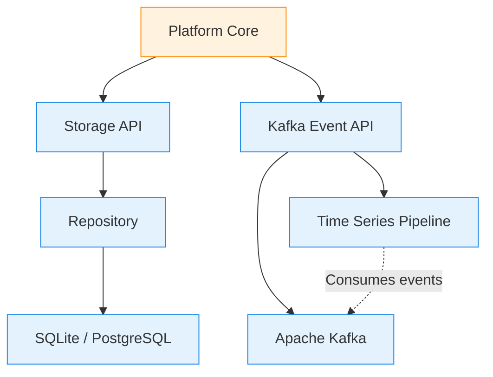
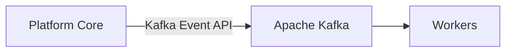
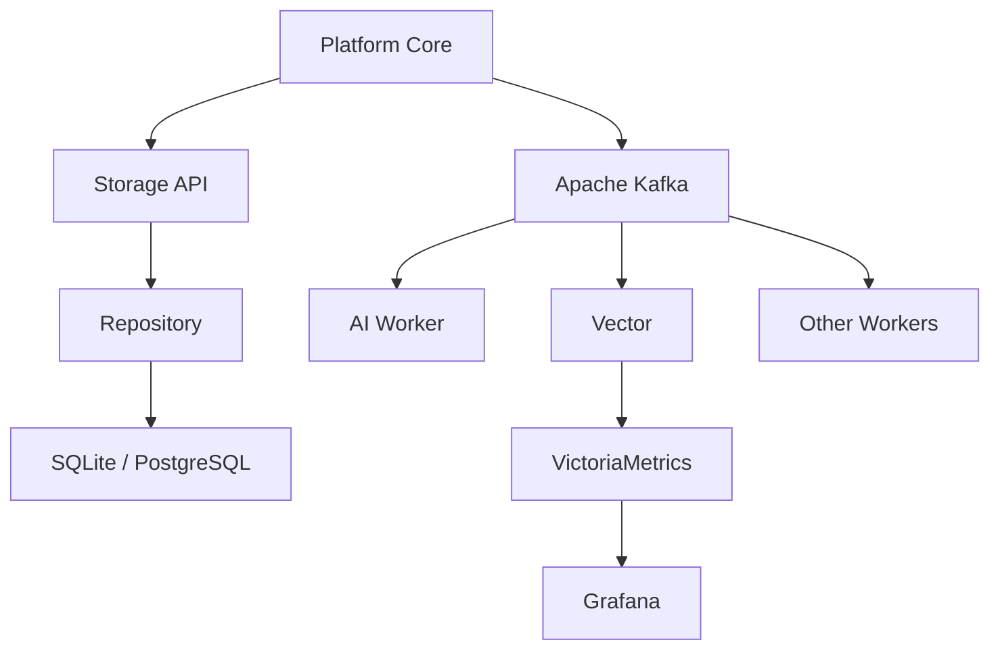
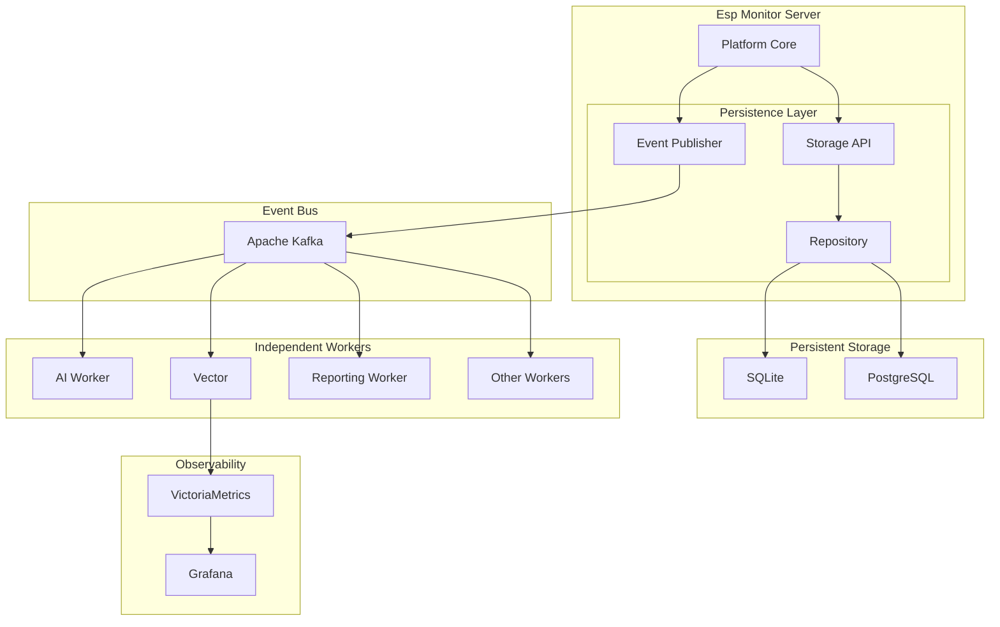

# Chapter 08. Persistence Architecture

## Purpose

The Persistence subsystem is responsible for preserving the server's knowledge of the managed infrastructure independently of network conditions, device availability, or active connections.

Previous chapters described the external interfaces used to interact with users and devices: the **REST Management Interface** and the **MQTT Device Interface**. Both are communication mechanisms whose primary responsibility is the exchange of information.

Persistence addresses a different concern: maintaining the platform's information model and making it available to other architectural components.

Throughout this chapter, three related but distinct architectural concepts are used:

- **Persistence** — the architectural subsystem responsible for data storage;
- **Storage API** — the architectural contract through which Platform Core accesses the information model;
- **SQLite** and **PostgreSQL** — concrete implementations of the Repository.

These terms are not interchangeable. Persistence defines the architectural responsibility, the Storage API defines the interaction contract, and the database is simply one possible implementation of that contract.

One of the key architectural decisions in Esp Monitor is to avoid relying on a single, universal data store.

Different categories of information serve different purposes, have different lifecycles, and are consumed by different parts of the system. Attempting to store all of them in a single database inevitably increases architectural complexity and reduces overall efficiency.

For this reason, Esp Monitor separates persistent data into several independent, specialized subsystems.

The architecture distinguishes three categories of stored information:

- Repository
- Event Bus
- Time Series Pipeline

Each category is responsible for a specific class of data and is implemented using technologies best suited to its requirements.

---

## Three Categories of Stored Information

Although all of these subsystems deal with persistent data, they serve fundamentally different purposes.



<div align="center">

**Figure 8.1 — Persistence Architecture Overview**

</div>

### Information Model

The information model represents the current state of the managed device infrastructure.

It includes registered devices, their configuration, the latest known operational state, and all other information required for system management.

This model reflects the server's current understanding of the managed environment.

When new MQTT messages are received, the existing information is updated rather than accumulated as historical records.

---

### Events

Events describe actions and activities that occur throughout the system.

Examples include:

- server startup;
- MQTT broker connection;
- device state changes;
- commands sent to devices;
- background service activity;
- diagnostic messages;
- analytical processing results.

Unlike the information model, events are immutable.

Each new event extends the event log, while older records are automatically removed according to the configured retention policy.

---

### Time Series

Some data is valuable primarily because it represents changes over time rather than individual values.

Typical examples include:

- GPIO values;
- sensor readings;
- analog signal changes;
- operational metrics;
- system performance statistics.

This information is intended for visualization, monitoring, and trend analysis rather than transactional processing.

---

The distinction between these three categories of information is a fundamental architectural principle of Esp Monitor.

Each category has its own requirements for performance, retention, processing, and consumption.

For this reason, Esp Monitor uses multiple specialized storage subsystems instead of relying on a single, general-purpose database.

## Repository

The Repository is the primary storage component for the platform's information model.

Its responsibility is to maintain the current representation of every registered device, regardless of whether that device is currently online or reachable.

For each managed device, the Repository stores:

- the device identifier;
- registration metadata;
- configuration;
- the latest known device state;
- the most recent Action command sent to the device;
- additional information required for device management.

The Repository is the **single source of truth** for the current state of the system.

All server components operate exclusively on this information model.

Neither the **REST Management Interface**, the **Web Interface**, nor the **Platform Core** attempt to reconstruct the current state of a device by replaying events stored in Kafka.

Instead, whenever a new MQTT message is received, the Platform Core updates the information model through the **Storage API**. Once the update is complete, the Repository immediately becomes the authoritative source of current information for every other subsystem.

### Repository Implementations

Esp Monitor currently provides two Repository implementations.

#### SQLite

SQLite is the default storage engine.

As an embedded relational database, it requires no separate database server and stores the entire information model in a single file.

This approach greatly simplifies deployment and makes SQLite the preferred choice for standalone installations, development environments, and small to medium-sized deployments.

#### PostgreSQL

PostgreSQL is an enterprise-grade client-server relational database management system.

It is intended for larger deployments that require centralized data management, concurrent client access, backup strategies, replication, and horizontal scalability.

Although the underlying technologies differ, both implementations expose the same **Storage API**.

The **Platform Core** interacts only with this architectural contract and remains completely independent of the underlying database technology.

As a result, switching between SQLite and PostgreSQL requires no changes to the Platform Core or any higher-level architectural component.

---

## Event Bus

While the Repository stores the current state of the system, the Event Bus is responsible for distributing events between independent architectural components.

In Esp Monitor, events are published through the **Kafka Event API**, while **Apache Kafka** serves as the underlying Event Bus implementation.

Kafka is an infrastructure service designed for publishing, storing, and delivering event streams between loosely coupled services.

Unlike the Repository, Kafka does not maintain the system's information model.

Its responsibility is to record events as they occur and make them available to any interested consumers.

The **Platform Core** publishes events through the **Kafka Event API** to the appropriate Kafka topics. From that point onward, event processing proceeds independently of the server itself.

A typical deployment uses the following topics:

| Topic         | Purpose                                    |
|-------------- | ------------------------------------------ |
| `root`        | Server lifecycle events                    |
| `logs`        | Log entries and diagnostic information     |
| `pins`        | Changes to device GPIO and pin states      |
| `actions`     | Commands issued to managed devices         |
| `anomalies`   | Results of analytics and anomaly detection |

Each topic has its own retention policy, allowing obsolete events to be removed automatically after a configurable period.

Consequently, Kafka should be viewed as a time-limited event log rather than a persistent representation of the current system state.

The Repository remains the only authoritative source of the platform's information model.

## Independent Services (Workers)

The Kafka Event API decouples event publication from event processing.

Once an event has been published, the **Platform Core** no longer determines which services consume it or how the published data is processed.

In the Esp Monitor architecture, these event consumers are collectively referred to as **Workers**. From the perspective of the Persistence subsystem, the important distinction is that Workers consume the event stream rather than the Repository's information model.

The internal architecture of Workers is described in detail in Chapter 10.



<div align="center">

**Figure 8.2 — Event Publication and Independent Workers**

</div>

---

## Time Series Pipeline

Time-series data represents a separate category of information intended for long-term monitoring and operational analysis.

Unlike the information model maintained by the Repository or the immutable events stored in Kafka, time-series data consists of continuously evolving measurements collected over time.

For this reason, Esp Monitor employs a dedicated **Time Series Pipeline**.

A key architectural principle is that the **Platform Core never communicates directly with the time-series storage system**.

Instead, data is processed by a set of independent, specialized components.

The processing pipeline follows these steps:

1. The **Platform Core** publishes events through the **Kafka Event API**.
2. **Vector** consumes the relevant Kafka topics.
3. **Vector** transforms the event stream into Prometheus-compatible metrics.
4. **VictoriaMetrics** stores the resulting time-series data.
5. **Grafana** visualizes the accumulated metrics.

This architecture completely separates monitoring responsibilities from the server application.

The server does not need to know how metrics are collected, where they are stored, or how dashboards are built. Those responsibilities belong entirely to the monitoring stack and evolve independently of the Platform Core.

### Vector

Vector is a high-performance telemetry processing agent.

It can collect data from multiple sources, transform event streams, and deliver the resulting data to a wide variety of monitoring and storage systems.

Within the Esp Monitor architecture, Vector acts as the processing pipeline between Apache Kafka and the time-series database.

### VictoriaMetrics

VictoriaMetrics is a high-performance time-series database fully compatible with the Prometheus ecosystem.

It is optimized for efficient storage of large telemetry datasets, fast query execution, and long-term metric retention.

Unlike the Repository, VictoriaMetrics does not contain information about managed devices and is never accessed directly by the Platform Core.

Its sole responsibility is the persistent storage of time-series data.

### Grafana

Grafana provides visualization and operational analytics for collected telemetry.

It retrieves metrics from VictoriaMetrics and presents them through interactive dashboards, charts, and analytical tools.

Grafana is completely independent of the server application and has no influence on the behavior of the Platform Core.

Its purpose is solely to provide operators with insight into the accumulated operational data.

## Technology Independence

The **Platform Core** is intentionally decoupled from specific storage technologies.

Instead of interacting directly with databases or messaging infrastructure, it depends exclusively on two architectural contracts:

- **Storage API**
- **Kafka Event API**

The concrete implementations behind these contracts can evolve without affecting the Platform Core.

For example, the Repository may be implemented using either SQLite or PostgreSQL while exposing the same Storage API.

Similarly, the set of Worker services can grow over time without requiring modifications to the server application.

The Time Series Pipeline is likewise an independent subsystem whose implementation can be upgraded or replaced without impacting the core architecture of Esp Monitor.

This separation of concerns allows each subsystem to adopt the technologies best suited to its own responsibilities while preserving a stable architectural foundation.

---



<div align="center">

**Figure 8.3 — Technology Independence of the Persistence Layer**

</div>

---

## Architectural Implications

Separating data persistence into multiple specialized subsystems has a significant impact on the overall architecture of Esp Monitor.

First, the **Repository** becomes the single source of truth for the current state of managed devices.

Second, the **Kafka Event API** serves as a universal contract for event-driven communication between independent services.

Third, the monitoring infrastructure is completely decoupled from the server application and can evolve independently of the Platform Core.

This architecture provides several important advantages:

- clear separation of responsibilities between subsystems;
- low coupling between architectural components;
- independent scaling of individual services;
- the ability to introduce new Worker services without modifying the server;
- the use of specialized technologies for each class of data;
- independent evolution of storage, analytics, and monitoring subsystems.

Consequently, **Persistence** in the Esp Monitor architecture should not be viewed as a single database.

Instead, it is a collection of specialized storage subsystems, each responsible for a distinct category of information and optimized for its particular workload.

---



<div align="center">

**Figure 8.4 — Persistence Architecture and External Data Processing Services**

</div>

# Database Reference

## Purpose

This reference describes the structure of the Repository used by Esp Monitor to maintain the platform's information model.

Whereas the *Persistence Architecture* chapter explains the architectural principles behind data persistence, this section documents the concrete Repository implementation, its database schema, and the purpose of each element.

At the current stage of the project, the Repository has a deliberately minimal design consisting of a single table named `devices`.

This simplicity is an intentional architectural decision.

The Repository is not intended to store historical data or telemetry. Its sole responsibility is to maintain the current state of registered devices and make that information available to the **Platform Core**, **REST Management Interface**, and **Web Interface**.

Historical events are stored in **Apache Kafka**, while long-term telemetry is managed by a dedicated time-series platform. Consequently, the Repository contains only the current information model of the managed infrastructure.

---

# Supported Database Management Systems

The Repository currently provides two implementations:

- SQLite
- PostgreSQL

Both implementations expose the same logical data model and are fully compatible from the perspective of the **Storage API**.

SQLite is the default and recommended choice for most deployments due to its simplicity and ease of installation.

PostgreSQL is intended for enterprise environments where centralized storage, replication, backup strategies, and horizontal scalability are required.

Because the **Platform Core** communicates exclusively through the **Storage API**, it remains completely independent of the selected database technology.

---

# Database Schema Overview

In the current version of Esp Monitor, the Repository consists of a single table.

```text
devices
```

Each record represents one registered device and together forms the information model of the managed device infrastructure.

Every device corresponds to exactly one row in the Repository.

---

# The `devices` Table

| Column      | Type              | Description                                          |
| ------------| ----------------- | ---------------------------------------------------- |
| `id`        | INTEGER / BIGINT  | Internal record identifier                           |
| `ssdp`      | TEXT              | Unique SSDP device name                              |
| `mdns`      | TEXT              | Device mDNS name                                     |
| `active`    | BOOLEAN           | Indicates whether the device is active               |
| `activated` | TIMESTAMP         | Device registration timestamp                        |
| `started`   | TIMESTAMP         | Timestamp of the most recent device startup          |
| `updated`   | TIMESTAMP         | Timestamp of the latest received state update        |
| `pins`      | TEXT              | Latest device state serialized as JSON               |
| `action`    | TEXT              | Most recent command sent to the device as JSON       |

---

# Column Descriptions

## id

The internal unique identifier of the record.

It is used exclusively by the Repository implementation and is never exposed to devices.

---

## ssdp

The primary logical identifier of the device.

This value is used throughout the platform to identify the device and construct its MQTT topic hierarchy.

The SSDP name must be unique within the Repository.

---

## mdns

The network name used to discover the device during the initial provisioning process.

Once registration has been completed, normal platform operation no longer depends on the device's network location.

---

## active

Indicates whether the device is currently enabled within the managed infrastructure.

This flag allows a device to be temporarily excluded from processing without removing it from the Repository.

---

## activated

The timestamp indicating when the device was registered.

This value is assigned once during registration and is not modified afterward.

---

## started

The timestamp of the device's most recent startup.

It is updated whenever the corresponding status message is received from the device.

---

## updated

The timestamp of the latest state message received from the device.

This value is used to determine how current the stored device information is.


---

## pins

The `pins` column stores the latest known operational state of the device.

Its value is a serialized JSON document containing the current GPIO values, analog inputs, sensor readings, and any other runtime parameters published by the device.

Whenever a new MQTT state message is received, the previous content is replaced entirely.

The Repository always stores only the most recent device state rather than maintaining a history of changes.

---

## action

The `action` column stores the most recent command issued to the device.

Its value is a serialized JSON document representing the latest Action generated by the **Platform Core**.

Like the `pins` column, this field always reflects the current state only. Previous commands are not retained in the Repository.

---

# Storing JSON Documents

The `pins` and `action` columns contain data structures whose schema may vary depending on the device type and supported capabilities.

Representing these structures as normalized relational tables would significantly increase the complexity of the Repository schema while requiring additional read and write operations.

Instead, complex objects are serialized as JSON and stored in text columns.

SQLite does not provide a native JSON data type, so serialized documents are stored as `TEXT`.

To maintain complete compatibility between both supported Repository implementations, PostgreSQL follows the same approach.

Although PostgreSQL offers dedicated `JSON` and `JSONB` data types, Esp Monitor intentionally stores these documents as `TEXT`.

This design provides several architectural advantages:

- a single database schema for all supported database systems;
- identical migration scripts across implementations;
- shared serialization and deserialization logic;
- complete independence of the **Platform Core** from the underlying database technology.

When records are read from the Repository, the server automatically deserializes the stored JSON into the corresponding Go structures.

---

# Database Migrations

The Repository schema is created and maintained through database migrations.

SQLite and PostgreSQL each provide their own migration scripts while implementing the same logical schema.

This guarantees that the Repository presents an identical data model regardless of the selected database management system.

---

# Schema Evolution

The current Repository schema is intentionally minimal and reflects the present scope of the project.

As Esp Monitor evolves, additional tables and relationships may be introduced.

Regardless of future extensions, the following architectural principles remain unchanged:

- the Repository remains the single source of truth for the current system state;
- the Repository is not used to store event history;
- the Repository is not used to store time-series data;
- all schema changes are introduced exclusively through database migrations.

By following these principles, the data model can evolve without affecting the overall architecture of the application or compromising compatibility between supported Repository implementations.
