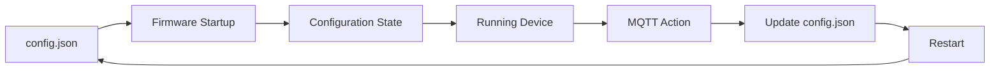

# Chapter 09. Configuration Architecture

## Overview

Every distributed system must define how its components obtain configuration and how that configuration evolves throughout the system's lifecycle.

In Esp Monitor, the server and ESP devices serve different architectural roles, follow different lifecycle models, and therefore use different configuration strategies.

The server acts as the central coordination component of the platform. Its configuration is resolved once during application startup and remains unchanged throughout runtime.

Devices operate in remote networks, may be temporarily offline, and must support configuration updates during normal operation. Consequently, each device maintains and manages its own configuration independently of the server.

Esp Monitor therefore treats configuration as a responsibility of individual system components rather than as a shared resource. Each component owns its own configuration and never stores or manages the configuration of other components.

---

## Architectural Principle

Configuration is considered part of a component's lifecycle rather than an independent subsystem.

The central architectural concept is the **Configuration State**—the single authoritative configuration that a component uses at any point in time.

Files such as `.env` and `config.json`, the initial provisioning request (`POST /config`), MQTT Action messages, and Persistence all participate in creating, transporting, or persisting that state. None of them replaces the Configuration State or introduces an additional source of truth.

The server is solely responsible for its own operational configuration.

Each device is solely responsible for its own configuration.

This separation allows device configuration to evolve independently of the server configuration, and vice versa.

As a result, the server and devices remain architecturally independent while still cooperating through well-defined communication interfaces.

---

## Server Configuration

The server configuration is resolved once during application startup.

The final configuration is constructed by combining multiple configuration sources, each with a defined precedence.


The configuration resolution process consists of the following steps:

1. Built-in default values are applied.
2. Values from the `.env` file override the defaults.
3. Selected parameters may be overridden by command-line arguments.
4. The resulting **Configuration State** is created.
5. After startup completes, the configuration becomes immutable.

Built-in defaults allow the server to start even when certain configuration values are missing. They improve operational resilience but are not intended to replace explicit configuration.

For most deployment scenarios, the `.env` file serves as the primary configuration mechanism.

Command-line parameters are intended for overriding selected settings without modifying configuration files. In the current implementation, this mechanism is used to override the `xToken` value, making it particularly useful for automated deployments, Continuous Integration pipelines, and other automation environments.

Once startup has completed, the server configuration remains unchanged for the lifetime of the process. Any configuration change requires the application to be restarted.

---

## Device Configuration

Unlike the server, a device must support remote configuration updates throughout its operational lifetime.

Each device therefore maintains a local `config.json` file containing its complete operational configuration.

During firmware startup, this file is loaded from persistent storage and used to construct the device's **Configuration State**, which initializes all firmware services.



If the server needs to modify a device's configuration, it publishes an update to the device's MQTT Action topic.

After receiving the message, the device performs the following sequence:

1. Applies the requested changes to the current configuration.
2. Persists the updated configuration to `config.json`.
3. Restarts the firmware.
4. Reconstructs its **Configuration State** from the saved configuration file.

As a result, the device always resumes operation using a single authoritative Configuration State derived from its local `config.json` file.

> **Important**
>
> MQTT Action is **not** a configuration source.
>
> MQTT serves exclusively as a transport mechanism for configuration updates.
>
> Once an update has been applied, the device relies entirely on its local `config.json` file as the persistent representation of its Configuration State.

---

## Why the Configuration Models Differ

The server and devices operate under fundamentally different conditions and therefore require different configuration models.

The server configuration affects the platform as a whole. Consequently, it is resolved once during startup and remains unchanged until the application is restarted.

A device configuration, on the other hand, affects only a single physical device and must support remote updates without requiring physical access to the hardware.

Maintaining separate configuration models preserves clear architectural boundaries between platform components and prevents configuration concerns from propagating across different layers of the system.

---

## Configuration and Deployment Architecture

This chapter describes the configuration architecture of Esp Monitor components.

Infrastructure mechanisms such as Docker Compose, Kubernetes, ConfigMaps, Secrets, and other deployment technologies belong to the deployment architecture and are documented separately.

Keeping these concerns separate allows the product architecture and deployment architecture to evolve independently without changing the configuration model of either the server or connected devices.

# Configuration Reference

## Overview

This reference describes the current implementation of the configuration mechanisms used throughout Esp Monitor.

Unlike the **Configuration Architecture** chapter, which explains the architectural principles behind the configuration model, this reference focuses on supported parameters, configuration formats, and their practical application.

The current implementation uses three distinct configuration representations:

- Server configuration (`.env`)
- Initial device configuration (`POST /config`)
- Internal device configuration (`config.json`)

Each representation serves a different system component and is used at a different stage of the platform lifecycle.

---

## Configuration Overview

The following diagram illustrates how configuration is established for both the server and connected devices.

```text
                Server
                  │
               .env
                  │
                  ▼
         Runtime Configuration


      Mobile Application
                  │
             POST /config
                  │
                  ▼
     Firmware Normalization
                  │
                  ▼
            config.json
                  │
                  ▼
         Runtime Configuration
```

The server obtains its configuration directly from environment variables.

A device initially receives a simplified configuration through its HTTP API. The firmware then validates and normalizes the received parameters, transforms them into its internal representation, and stores the result in `config.json`. All subsequent firmware startups use this file to reconstruct the device's runtime configuration.
```

# Server Configuration (`.env`)

The server is configured through environment variables.

During application startup, these values are merged with the built-in defaults to produce the final server Configuration State.

## REST Server

| Variable     | Default | Required | Description                                          |
|--------------|---------|----------|------------------------------------------------------|
| `XTOKEN`     | —       | Yes      | Authentication token for the REST Management API.    |
| `REST_PORT`  | `80`    | No       | HTTP port used by the REST server.                   |

---

## MQTT

| Variable               | Default   | Required | Description                                  |
|------------------------|-----------|----------|----------------------------------------------|
| `MQTT_HOST`            | —         | Yes      | MQTT broker host address.                    |
| `MQTT_PORT`            | `1883`    | No       | MQTT broker TCP port.                        |
| `MQTT_PROTOCOL`        | `mqtt://` | No       | Transport protocol used to connect.          |
| `MQTT_USERNAME`        | Empty     | No       | MQTT broker username.                        |
| `MQTT_PASSWORD`        | Empty     | No       | MQTT broker password.                        |
| `MQTT_ROOT`            | —         | Yes      | Root MQTT topic for the platform.            |
| `MQTT_CLIENT_ID`       | —         | Yes      | MQTT client identifier of the server.        |
| `MQTT_KEEP_ALIVE`      | `60`      | No       | MQTT Keep Alive interval.                    |
| `MQTT_PING_TIMEOUT`    | `10`      | No       | Maximum time to wait for a Ping Response.    |

---

## Kafka

Kafka support is optional.

If Kafka is unavailable, the server continues operating normally without publishing events to the external event stream.

| Variable               | Default     | Required | Description                               |
|------------------------|-------------|----------|-------------------------------------------|
| `KAFKA_HOST`           | `localhost` | No       | Kafka broker host address.                |
| `KAFKA_PORT`           | `9092`      | No       | Kafka broker TCP port.                    |
| `KAFKA_DEFAULT_TOPIC`  | `root`      | No       | Default Kafka topic.                      |
| `KAFKA_TIMEOUT`        | `10`        | No       | Connection timeout for the Kafka broker.  |
| `KAFKA_ACKS`           | Empty       | No       | Message acknowledgment policy.            |

---

## Built-in Default Values

Some configuration parameters have built-in default values.

These defaults are used when the corresponding environment variables are absent or cannot be read during application startup.

Built-in defaults are intended solely to improve application resilience. They should not be considered a substitute for explicit server configuration.

---

# Command-line Parameters

In addition to environment variables, the server supports a limited set of command-line parameters.

The current implementation provides a single command-line option.

| Parameter | Overrides | Description                                                         |
|-----------|-----------|---------------------------------------------------------------------|
| `-xToken` | `XTOKEN`  | Overrides the authentication token used by the REST Management API. |

This parameter is primarily intended for automated deployments using Continuous Integration pipelines, Docker, Kubernetes, and other automation platforms where passing command-line arguments is preferable to modifying the `.env` file.

---

# Configuration Priority

During startup, configuration sources are applied in the following order:

```text
Built-in Defaults
        │
        ▼
      .env
        │
        ▼
Command-line Parameters
        │
        ▼
Runtime Configuration
```

Each subsequent source has higher precedence and overrides values supplied by previous sources.

Once startup has completed, the resulting Configuration State becomes immutable and remains in effect until the server is restarted.

# Device Initial Configuration API

The initial device configuration is performed through the device's built-in HTTP API.

This mechanism is intended for use by the mobile application or other provisioning software to deliver the initial connectivity parameters before the device joins the user's local network.

After successfully receiving the request, the firmware validates the supplied parameters, applies default values where necessary, transforms the input into its internal configuration model, and stores the result in `config.json`.

The resulting file becomes the persistent representation of the device's Configuration State and is used for all subsequent firmware startups.

---

## HTTP Request

```http
POST /config
Content-Type: application/json
```

The request body is a JSON document with the following structure.

```json
{
    "WIFI_SSID": "<WIFI_SSID>",
    "WIFI_PASS": "<WIFI_PASS>",
    "MDNS": "<MDNS>",
    "SSDP": "<SSDP>",
    "HTTP_PORT": "<HTTP_PORT>",
    "MQTT_HOST": "<MQTT_HOST>",
    "MQTT_PORT": "<MQTT_PORT>",
    "MQTT_USER": "<MQTT_USER>",
    "MQTT_PASS": "<MQTT_PASS>",
    "MQTT_ROOT": "<MQTT_ROOT>"
}
```

---

## Request Parameters

| Parameter     | Required | Default              | Description                                     |
|---------------|----------|----------------------|-------------------------------------------------|
| `WIFI_SSID`   | Yes      | —                    | Wi-Fi network name (SSID).                      |
| `WIFI_PASS`   | Yes      | —                    | Wi-Fi network password.                         |
| `MDNS`        | No       | `local.esp8266`      | Device name advertised via mDNS.               |
| `SSDP`        | No       | `esp8266-<unixtime>` | Device name advertised via SSDP.               |
| `HTTP_PORT`   | No       | `80`                 | HTTP port of the device's embedded REST API.   |
| `MQTT_HOST`   | Yes      | —                    | MQTT broker host address.                      |
| `MQTT_PORT`   | No       | `1883`               | MQTT broker TCP port.                          |
| `MQTT_USER`   | No       | Empty                | MQTT broker username.                          |
| `MQTT_PASS`   | No       | Empty                | MQTT broker password.                          |
| `MQTT_ROOT`   | Yes      | —                    | Root MQTT topic for the platform.              |

---

## Automatic Configuration

If certain parameters are omitted from the request, the firmware automatically generates appropriate default values.

| Parameter   | Default Value         | Description                                              |
|-------------|-----------------------|----------------------------------------------------------|
| `MDNS`      | `local.esp8266`       | Uses the default mDNS device name.                       |
| `SSDP`      | `esp8266-<unixtime>`  | Generated automatically using the current Unix time.     |
| `HTTP_PORT` | `80`                  | Uses the default HTTP port for the embedded REST API.    |
| `MQTT_PORT` | `1883`                | Uses the standard MQTT broker port.                      |

Automatically generated SSDP names follow the format:

```text
esp8266-1781289531
```

where the numeric suffix represents either the device's MAC address or the current Unix timestamp, depending on the firmware implementation.

---

# Internal Device Configuration (`config.json`)

After processing the initial provisioning request, the firmware transforms the received parameters into its internal configuration model and stores the result in `config.json`.

This file is an implementation detail of the firmware. It is maintained automatically by the device and is not intended to be created or edited manually.

Every time the firmware starts, it reconstructs the device's Configuration State from this file.

---

## Configuration Structure

```json
{
    "wifi": {
        "ssid": "<WIFI_SSID>",
        "pass": "<WIFI_PASS>"
    },
    "ssdp": {
        "name": "<SSDP>",
        "url": "/",
        "serial": "",
        "model": {
            "name": "",
            "number": "",
            "url": ""
        },
        "manufacturer": {
            "name": "",
            "url": ""
        },
        "device_type": "upnp:rootdevice",
        "schema_url": "description.xml",
        "http_port": "<HTTP_PORT>"
    },
    "mdns": "<MDNS>",
    "mqtt": {
        "host": "<MQTT_HOST>",
        "port": "<MQTT_PORT>",
        "user": "<MQTT_USER>",
        "pass": "<MQTT_PASS>",
        "root": "<MQTT_ROOT>"
    }
}
```

---

## Configuration Sections

### Wi-Fi

| Field        | Description              |
|--------------|--------------------------|
| `wifi.ssid`  | Wi-Fi network name.      |
| `wifi.pass`  | Wi-Fi network password.  |

---

### SSDP

| Field                      | Description                                 |
|----------------------------|---------------------------------------------|
| `ssdp.name`                | Device name advertised via SSDP.            |
| `ssdp.url`                 | Device URL.                                 |
| `ssdp.serial`              | Device serial number.                       |
| `ssdp.model.name`          | Device model name.                          |
| `ssdp.model.number`        | Device model number.                        |
| `ssdp.model.url`           | Device model URL.                           |
| `ssdp.manufacturer.name`   | Manufacturer name.                          |
| `ssdp.manufacturer.url`    | Manufacturer URL.                           |
| `ssdp.device_type`         | UPnP device type.                           |
| `ssdp.schema_url`          | URL of the UPnP device description.         |
| `ssdp.http_port`           | HTTP port of the embedded REST API.         |

---

### mDNS

| Field  | Description                      |
|--------|----------------------------------|
| `mdns` | Device name advertised via mDNS. |

### MQTT

| Field         | Description              |
|---------------|--------------------------|
| `mqtt.host`   | MQTT broker host address. |
| `mqtt.port`   | MQTT broker TCP port.     |
| `mqtt.user`   | MQTT broker username.     |
| `mqtt.pass`   | MQTT broker password.     |
| `mqtt.root`   | Root MQTT topic for the platform. |

---

# Minimal Configuration Examples

## Minimal Server Configuration

```dotenv
XTOKEN=MySecretToken
REST_PORT=80

MQTT_HOST=192.168.1.2
MQTT_ROOT=root
MQTT_CLIENT_ID=esp-monitor

KAFKA_HOST=localhost
```

This example shows the minimum recommended configuration required to start the server in a typical deployment. Any parameters omitted from the file are resolved using the built-in default values, where available.

---

## Initial Device Configuration

```json
{
    "WIFI_SSID": "MyWiFi",
    "WIFI_PASS": "MyPassword",
    "MQTT_HOST": "192.168.1.2",
    "MQTT_ROOT": "root"
}
```

All remaining configuration parameters are generated automatically by the firmware using the appropriate default values.

---

## Internal Device Configuration

The `config.json` file is generated automatically by the firmware after the initial provisioning process.

It serves as the persistent representation of the device's Configuration State and is loaded during every subsequent firmware startup.

Under normal operating conditions, this file does not require manual editing.