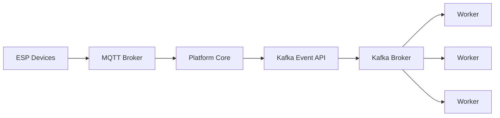
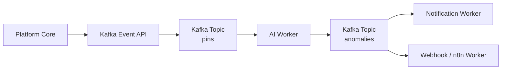

# Chapter 10. Workers Architecture

## Purpose

As the platform evolves, it inevitably requires capabilities that extend beyond direct management of ESP devices. Telemetry analysis, event processing, external system integration, notification delivery, and AI-assisted analytics all require significant computational resources and evolve independently of Platform Core.

Embedding these responsibilities directly into the server application would increase architectural complexity, introduce unnecessary dependencies, and reduce the platform's ability to scale.

To address this challenge, Esp Monitor adopts a **Workers** architecture. Workers are independent processes that perform specialized event processing by consuming events published through the Kafka Event API.

This allows the server to remain focused exclusively on its primary responsibility—managing devices and publishing events—while all secondary processing is delegated to components outside Platform Core.

---

## Architectural Role of Workers

A Worker is an independent application that runs as a separate process and subscribes to one or more Kafka topics.

Workers are not part of the server process and are never loaded into Platform Core. Each Worker has its own lifecycle, configuration, dependencies, and deployment model, allowing it to be developed, maintained, and scaled independently of the rest of the platform.

Communication between Platform Core and Workers occurs exclusively through the Kafka Event API and the Kafka broker.

As a result, the server has no knowledge of:

- how many Worker instances are running;
- where they are deployed;
- which responsibilities they implement;
- which technologies they use;
- which dependencies they require.

The sole responsibility of Platform Core is to publish events to the appropriate Kafka topics.



This separation creates a loosely coupled architecture and allows new platform capabilities to be introduced without modifying the server application.

---

## Event-Driven Processing

The Kafka Event API forms the architectural boundary between Platform Core and external event-processing services, while the Kafka broker provides the infrastructure responsible for transporting and persisting event records.

Throughout this chapter:

- an **event** represents a semantic fact published by the platform;
- a **message** is the serialized representation of that event;
- a **record** is the persisted Kafka entry containing that message.

Once an event has been published, all subsequent processing is completely decoupled from the server.

Each Worker independently decides which events to consume, how to process them, and which actions to perform in response.

A Worker may also publish the results of its processing to additional Kafka topics, enabling other Workers to continue the processing pipeline.

This architecture makes it possible to build multi-stage event processing pipelines without requiring any modifications to Platform Core.



The platform can therefore evolve incrementally by introducing new event-processing services while leaving existing components unchanged.

---

## Independent Scalability

Each Worker type forms its own Kafka consumer group and may run in multiple instances.

Kafka automatically distributes records among members of the same consumer group, enabling parallel event processing.

The maximum degree of parallelism is determined by the number of partitions configured for the corresponding Kafka topic.

As a result, processing capacity can be increased simply by deploying additional Worker instances without modifying the server application.

Meanwhile, Platform Core performs the same amount of work regardless of the number of Workers deployed.

---

## Implementation Independence

A Worker is a fully independent application.

It may use:

- its own configuration;
- its own libraries and frameworks;
- its own AI models;
- its own databases;
- external APIs;
- any internal processing algorithms.

Platform Core remains completely unaware of the implementation details of any Worker.

The only architectural contract between the server and Workers is the Kafka Event API—that is, the format of events exchanged through Kafka.

This enables different teams to develop, deploy, and maintain independent event-processing services without modifying the server application.

---

## Example Workers

The project includes three demonstration Workers that illustrate different aspects of the event-driven architecture.

### `kworker`

`kworker` subscribes to the `pins` topic, which contains changes to the digital and analog pin states of ESP devices.

Incoming events are aggregated on a per-device basis, allowing the Worker to build statistical tables that summarize the frequency of observed pin-state combinations.

These statistics are continuously updated as new events arrive and displayed in the console.

This Worker demonstrates how telemetry can be processed as a continuous event stream without involving the server application.

---

### `ai-worker`

`ai-worker` also consumes events from the `pins` topic. Rather than simply aggregating data, it maintains a sliding observation window for each device.

Once a sufficient number of events has been collected, the Worker analyzes the accumulated telemetry using a large language model (LLM).

If potential anomalies are detected, the Worker publishes its findings to the `anomalies` topic.

These events can be inspected through Kafdrop or consumed by other Workers to implement additional business logic, such as:

- sending notifications;
- integrating with automation platforms;
- triggering webhooks;
- interacting with n8n workflows;
- performing additional stages of event processing.

In this way, the output of one Worker naturally becomes the input of another, forming extensible event-processing pipelines.

---

### Webhook Worker (`hworker`)

`hworker` subscribes to the `anomalies` topic, which contains analytical reports generated by `ai-worker` with `WARNING` or `CRITICAL` severity.

Each received event is immediately forwarded as an HTTP `POST` request to the endpoint specified by the `WEBHOOK_URL` environment variable.

Its primary purpose is to bridge anomaly events into external automation platforms such as n8n through standard webhooks.

---

## Platform Extensibility

The Workers included with Esp Monitor are optional components rather than mandatory parts of the platform.

They serve as reference implementations of the event-driven architecture and may be modified, replaced, or omitted entirely from a deployment.

Developers are free to implement their own Workers for specialized tasks, including:

- intelligent data analysis;
- report generation;
- email delivery;
- push notifications;
- enterprise system integration;
- automated device management;
- interaction with external services.

This approach allows the platform to evolve by adding new capabilities without modifying the server application or violating the architectural boundaries of Platform Core.

---

## Summary

The Workers architecture transforms Esp Monitor into an event-driven platform that can be extended indefinitely through specialized processing services.

Platform Core remains responsible solely for device management and event publication through the Kafka Event API, while all secondary processing is delegated to independent Workers.

This separation provides loose coupling, independent scalability, support for multi-stage event-processing pipelines, and continuous platform evolution without changes to Platform Core.

# Workers Reference

## Overview

Workers are standalone applications that perform specialized processing of events published by Esp Monitor through Kafka.

Unlike the server application, a Worker does not manage ESP devices or communicate with them directly. Instead, it consumes events from Kafka, executes its own business logic, and may publish new events for further processing.

Each Worker runs as an independent process with its own lifecycle and configuration.

The current distribution includes three demonstration Workers.

| Worker      | Purpose                                                              |
|-------------|----------------------------------------------------------------------|
| `kworker`   | Aggregates pin-state change events and builds statistical summaries. |
| `ai-worker` | Analyzes device behavior using an LLM and detects anomalies.         |
| `hworker`   | Forwards significant events to automation platforms via webhooks.    |

These Workers serve as reference implementations of the platform's event-driven architecture and can be modified or replaced as needed.

---

# General Requirements

Every Worker requires the following infrastructure.

```text
ESP Devices
      │
      ▼
 MQTT Broker
      │
      ▼
 Platform Core
      │
      ▼
    Kafka
      │
      ▼
    Worker
```

Platform Core publishes events to Kafka, after which all subsequent processing is performed by Workers.

Without Kafka, a Worker cannot perform its role as an event-processing service. While the same functionality could be implemented as a conventional standalone application, it would no longer participate in the platform's event-driven architecture.

---

# Common Configuration

Each Worker maintains its own `.env` configuration file.

In the current implementation, only Kafka connection parameters are externally configurable.

| Variable     | Default     | Required | Description               |
|--------------|-------------|----------|---------------------------|
| `KAFKA_HOST` | `localhost` | Yes      | Kafka broker host name.   |
| `KAFKA_PORT` | `9092`      | Yes      | Kafka broker TCP port.    |

Most internal parameters are intentionally **not** exposed through configuration files.

These include:

- Consumer Group names;
- internal queue sizes;
- analysis window sizes;
- aggregation parameters;
- AI model selection;
- internal processing logic.

These settings are considered implementation details and are expected to be modified directly in the source code of the corresponding Worker.

---

# Worker Scaling

Each Worker type uses its own Kafka Consumer Group.

Multiple instances of the same Worker may run simultaneously.

Kafka automatically distributes records across all members of the Consumer Group, enabling parallel event processing.

The maximum number of active Worker instances is determined by the number of partitions configured for the corresponding Kafka topic.

| Topic Partitions | Maximum Active Worker Instances |
|-----------------:|--------------------------------:|
| 1                | 1                               |
| 4                | Up to 4                         |
| 16               | Up to 16                        |
| 50               | Up to 50                        |

Launching more Worker instances than available partitions does not increase throughput because the additional instances will not receive records.

For local deployments, Kafka topics are typically created with a single partition, making one instance of each Worker sufficient.

---

# `kworker`

## Purpose

`kworker` performs continuous stream aggregation of digital and analog pin-state changes reported by ESP devices.

It consumes events from Kafka, counts recurring pin-state combinations, and displays continuously updated statistical summaries in the console.

---

## Topics

| Topic  | Role           |
|--------|----------------|
| `pins` | Event source.  |

---

## Processing Model

Each record received from the `pins` topic represents the current state of a single device.

For every incoming event, the Worker:

1. identifies the originating device;
2. constructs an aggregated representation of its pin state;
3. increments the counter for the corresponding state combination;
4. refreshes the displayed statistics.

Processing is continuous.

Statistical summaries are automatically recalculated whenever new events arrive.

---

## Example Output

```text
                                 esp8266-001 | Count
------------------------------------------------
A0:3 D1:0 D2:0 D3:1 D4:1 D5:1 D6:1 D7:1 D8:0 | 326
A0:3 D1:1 D2:1 D3:1 D4:1 D5:0 D6:0 D7:1 D8:0 | 248
------------------------------------------------
                                       Total | 584
```

This Worker demonstrates continuous telemetry aggregation without involving Platform Core.

# `ai-worker`

## Purpose

`ai-worker` performs intelligent analysis of ESP device telemetry.

The Worker consumes pin-state events, maintains a sliding observation window for each device, and submits aggregated telemetry to a large language model (LLM) for analysis.

The primary objective is to identify potential anomalies in device behavior rather than simply report individual pin-state changes.

---

## Topics

| Topic        | Role             |
|--------------|------------------|
| `pins`       | Event source.    |
| `anomalies`  | Event output.    |

---

## Analysis Window

The Worker maintains an independent observation window for each device.

Analysis is triggered after **500 events** have been collected from the `pins` topic.

In the current firmware implementation, devices publish pin-state updates at most once per second.

Consequently, for devices with continuously changing states, analysis is typically performed every **8–9 minutes**.

---

## AI Model

The current implementation uses the following language model.

| Parameter | Value |
|-----------|-------|
| AI Model | `meta-llama/llama-3.1-8b-instruct` |

The selected model is an implementation detail rather than part of the architectural contract and may be replaced without affecting the platform architecture.

---

## OpenRouter Configuration

Access to the language model requires a dedicated API key.

| Variable             | Required  | Description         |
|----------------------|-----------|---------------------|
| `OPENROUTER_API_KEY` | Yes       | OpenRouter API key. |

---

## Console Output

During execution, `ai-worker` reports the progress and outcome of each analysis.

Example:

```text
2026/07/06 13:19:44 [esp8266-002] Launching AI analysis for the current sliding window...
2026/07/06 13:19:55 ⚠️ [WARNING LOG] Device: esp8266-002 -> System is mostly stable but minor noise detected on some digital and analog pins.

2026/07/06 13:23:56 [esp8266-001] Launching AI analysis for the current sliding window...
2026/07/06 13:24:01 🟢 [STATUS NORMAL] Device: esp8266-001 is running smoothly.
```

Whenever a `WARNING` or `CRITICAL` condition is detected, the analysis result is also published to the `anomalies` topic.

---

## Anomaly Message Format

Detected anomalies are published to the `anomalies` topic.

Example:

```json
{
    "device_id": "esp8266-002",
    "status": "WARNING",
    "summary": "System is mostly stable but minor noise detected on some digital and analog pins.",
    "anomalies": [
        {
            "type": "noise",
            "affected_pins": [
                "D3",
                "D4",
                "D5",
                "D6"
            ],
            "description": "Frequent unstable state switches indicating electrical noise."
        },
        {
            "type": "system_shift",
            "affected_pins": [
                "D2",
                "A0"
            ],
            "description": "Multiple occurrences of unusual state combinations, possibly due to system configuration changes or hardware malfunctions."
        }
    ]
}
```

---

### Message Fields

| Field | Description |
|-------------|-------------------------------------------------------|
| `device_id` | Identifier of the ESP device.                         |
| `status`    | Analysis result (`NORMAL`, `WARNING`, or `CRITICAL`). |
| `summary`   | High-level summary of the device's condition.         |
| `anomalies` | List of detected anomalies.                           |

Each object in the `anomalies` array contains the following fields.

| Field           | Description                                 |
|-----------------|---------------------------------------------|
| `type`          | Type of anomaly detected.                   |
| `affected_pins` | Pins associated with the anomaly.           |
| `description`   | Detailed explanation of the detected issue. |

---

# Webhook Worker (`hworker`)

## Purpose

`hworker` bridges anomaly events into external automation platforms such as n8n, Jenkins, or Hudson.

The Worker consumes anomaly reports from Kafka and forwards each event as an HTTP `POST` request to the endpoint specified by the `WEBHOOK_URL` environment variable.

If `WEBHOOK_URL` is not configured, incoming events are ignored.

---

## Topics

| Topic       | Role          |
|-------------|---------------|
| `anomalies` | Event source. |

---

## Processing Model

Each message received from the `anomalies` topic contains an AI-generated anomaly report describing the affected pins, severity, and analytical summary.

`hworker` acts as a bridge between `ai-worker` and external automation systems by forwarding these events without modification.

Processing is continuous and event-driven.

---

## Example Output

```text
2026/07/07 14:57:34 {"device_id":"esp8266-002","status":"WARNING","summary":"System is mostly stable but minor noise detected on digital pins D2 and D3.","anomalies":[{"type":"noise","affected_pins":["D2","D3"],"description":"Frequent state switches on multiple digital pins indicating minor glitches."}]}
```

This Worker demonstrates how event-processing pipelines can be extended to integrate seamlessly with external automation platforms.

# Kafka Topics Used by Workers

The demonstration Workers included with Esp Monitor use the following Kafka topics.

| Topic | Producer | Consumers |
|-------|----------|-----------|
| `pins` | Platform Core | `kworker`, `ai-worker` |
| `anomalies` | `ai-worker` | `hworker`, user-defined Workers |

The `anomalies` topic is intended to distribute analytical results to downstream services.

Typical consumers include:

- notification services;
- monitoring systems;
- webhook integrations;
- n8n workflows;
- custom Workers.

---

# Using Kafdrop

Esp Monitor recommends using **Kafdrop** alongside Kafka to inspect and monitor event streams.

Kafdrop provides a web-based interface for:

- browsing Kafka topics;
- inspecting published messages;
- monitoring Worker activity;
- viewing messages in the `anomalies` topic;
- diagnosing event-processing pipelines.

Kafdrop is an operational observability tool and does not participate in event processing.

---

# Event Processing Flow

```text
                         Kafka

                 +----------------+
                 |     pins       |
                 +----------------+
                    │         │
                    │         │
            +---------------+ +----------------+
            |   kworker     | |   ai-worker    |
            +---------------+ +----------------+
                                      │
                                      ▼
                             +----------------+
                             |   anomalies    |
                             +----------------+
                               │            │
                               ▼            ▼
                User-defined Workers  +----------------+
                                      |   hworker      |
                                      +----------------+
```

One Worker may consume the output produced by another, allowing complex event-processing pipelines to be constructed without modifying Platform Core.

---

# Developing Custom Workers

The supplied `kworker`, `ai-worker`, and `hworker` applications are intended as reference implementations of the platform's event-driven architecture.

Developers are encouraged to build their own Workers to implement project-specific business logic.

A custom Worker may:

- consume any Kafka topics;
- publish events to existing or new topics;
- be implemented in any programming language;
- communicate with the REST Management Interface;
- interact with the MQTT broker;
- send webhooks;
- integrate with n8n or other automation platforms;
- use its own databases;
- incorporate any AI models or analytics frameworks;
- perform arbitrary domain-specific processing.

Because Workers communicate exclusively through the Kafka Event API, they remain completely independent of the server implementation and require no modifications to Platform Core.

---

# Current Implementation Limitations

The three Workers included with Esp Monitor are demonstration applications intended to showcase the capabilities of the platform's event-driven architecture.

For this reason, many implementation-specific parameters—such as Consumer Group names, analysis window sizes, AI model selection, and internal processing logic—are defined directly in source code rather than exposed through `.env` configuration files.

Production deployments are expected to adapt the supplied Workers or replace them with implementations tailored to the requirements of a particular project.

---

# Summary

The supplied `kworker`, `ai-worker`, and `hworker` applications demonstrate the fundamental principles of building event-processing services within the Esp Monitor ecosystem.

Each Worker operates as an independent application that consumes events from Kafka and, when appropriate, publishes the results of its own processing to additional Kafka topics.

This architectural approach enables the platform to grow incrementally by adding specialized processing services while preserving the loose coupling, scalability, and architectural boundaries established by Platform Core.