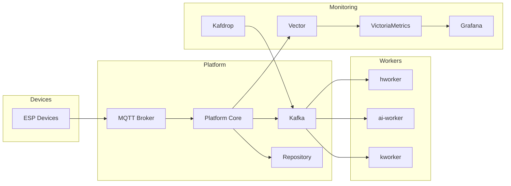

# Chapter 11. Deployment Architecture

## Purpose

The preceding chapters described the architecture of the platform's major subsystems, including the REST Management Interface, MQTT Device Interface, Persistence, Configuration, and Workers. This chapter brings those architectural decisions together and explains how they form a cohesive distributed platform.

Deployment Architecture defines the organizational principles of the platform rather than a specific deployment mechanism. It describes how Esp Monitor is structured as a collection of independent services that communicate through well-defined architectural contracts.

The primary goals of this architecture are:

- independent deployment of individual components;
- independent service upgrades;
- independent scalability;
- replacement of individual components without affecting the rest of the platform;
- adoption of established infrastructure technologies instead of developing proprietary alternatives.

It is important to distinguish the platform architecture from the deployment environment. Technologies such as Docker Compose, Kubernetes, Minikube, or other orchestration platforms are **not** part of the Esp Monitor architecture. They are alternative implementations of the same deployment model.

---

## Architectural Principles

The deployment architecture of Esp Monitor is built around independent services connected through public architectural contracts.

Each component has a clearly defined responsibility and its own lifecycle. As a result, changes to the deployment environment, infrastructure, or scaling strategy do not require modifications to Platform Core.

---

## Component Classification

From an architectural perspective, the platform consists of several independent categories of components.

| Category                     | Components                                   | Responsibility                                                |
| ---------------------------- | -------------------------------------------- | ------------------------------------------------------------- |
| **Reference Implementations**| Device Firmware, Demo Workers                | Reference implementations of architectural contracts          |
| **Platform Core**            | Server                                       | Central coordination component of the platform                |
| **Infrastructure Services**  | MQTT Broker, SQLite, PostgreSQL, Kafka       | Standard infrastructure services required by the platform     |
| **Operational Infrastructure** | Vector, VictoriaMetrics, Grafana, Kafdrop  | Monitoring, logging, and observability                        |
| **Deployment Environment**   | Docker Compose, Docker, Kubernetes, Minikube | Lifecycle management and orchestration of platform components |

Each category owns a distinct architectural responsibility and can evolve independently of the others.

For example, migrating from Docker Compose to Kubernetes does not require any changes to Platform Core. Likewise, replacing SQLite with PostgreSQL has no impact on the REST Management Interface, MQTT Device Interface, or communication with connected devices.

---

## Architectural Contracts

One of the fundamental design principles of Esp Monitor is the separation between an architectural contract and its implementation.

The architecture defines **how components interact**, not **which technology implements that interaction**.

This allows individual implementations to be replaced without affecting the rest of the platform.

The primary architectural contracts are summarized below.

| Architectural Contract    | Reference Implementation     | Replaceable |
|---------------------------|------------------------------|-------------|
| MQTT Device Interface     | Device Firmware              | Yes         |
| REST Management Interface | Go Server                    | No          |
| Storage API               | SQLite / PostgreSQL          | Yes         |
| Kafka Event API           | `kworker`, `ai-worker`       | Yes         |
| Deployment Environment    | Docker Compose / Kubernetes  | Yes         |

The MQTT Device Interface provides the clearest example of this principle.

The project includes a reference firmware implementation for ESP microcontrollers. However, the platform architecture is intentionally independent of any specific hardware family.

Any device that implements the MQTT Device Interface can participate in the platform regardless of its hardware architecture, operating system, or programming language.

The same principle applies to persistent storage.

Platform Core communicates exclusively through the Storage API rather than interacting directly with SQLite or PostgreSQL. Consequently, the choice of database technology is determined solely by deployment requirements.

SQLite is well suited for lightweight installations, while PostgreSQL is typically preferred for larger distributed deployments that require greater scalability and concurrency.

---

## Deployment Topology

The deployment architecture of Esp Monitor intentionally separates platform responsibilities into independent services.

Each component can be deployed, upgraded, restarted, or scaled without requiring changes to other parts of the platform.

The following diagram illustrates a typical deployment.



Each component communicates only through its designated architectural contract.

No component relies on the internal implementation details of another service.

---

## Independent Deployment

Every major component of the platform can be deployed independently.

| Component          | Can Be Deployed Independently | Notes                                              |
| ------------------ | ----------------------------- | -------------------------------------------------- |
| Platform Core      | Yes                           | Central server application                         |
| MQTT Broker        | Yes                           | Standard MQTT broker implementation                |
| Repository         | Yes                           | SQLite or PostgreSQL                               |
| Kafka              | Yes                           | Event streaming infrastructure                     |
| Workers            | Yes                           | Optional event-processing services                 |
| Monitoring Stack   | Yes                           | Vector, VictoriaMetrics, Grafana                   |
| Kafdrop            | Yes                           | Optional Kafka inspection interface                |

This deployment model allows each component to follow its own release cycle.

For example:

- the server application may be upgraded without interrupting monitoring services;
- Workers may be added or removed without restarting Platform Core;
- the monitoring stack may evolve independently of device management;
- infrastructure services may be migrated without affecting the platform architecture.

---

## Independent Scalability

Different components experience different workloads.

For this reason, Esp Monitor allows each service to scale independently according to its operational requirements.

| Component        | Typical Scaling Strategy                  |
| ---------------- | ----------------------------------------- |
| Platform Core    | Horizontal or vertical scaling            |
| MQTT Broker      | Clustered deployment                      |
| Repository       | Database replication or clustering        |
| Kafka            | Partition-based horizontal scaling        |
| Workers          | Multiple Consumer Group instances         |
| VictoriaMetrics  | Native clustered deployment               |

Because communication occurs exclusively through architectural contracts, scaling one subsystem does not require modifications to any other subsystem.

For example, increasing the number of `ai-worker` instances has no impact on Platform Core, MQTT communication, or the REST Management Interface.

Instead, Kafka automatically redistributes the workload across the available Worker instances.

---

## Technology Independence

One of the key architectural objectives of Esp Monitor is to minimize dependencies on specific technologies.

The architecture defines responsibilities and communication contracts rather than prescribing implementation technologies.

Consequently, many platform components may be replaced without affecting the overall architecture.

Examples include:

- SQLite → PostgreSQL
- Docker Compose → Kubernetes
- One MQTT broker implementation → another
- One AI model → another
- Existing Workers → project-specific Workers

As long as each replacement preserves the corresponding architectural contract, Platform Core and the remaining platform components continue to operate without modification.

This separation between architecture and implementation provides long-term sustainability and enables the platform to evolve alongside changing infrastructure technologies.

---

## Deployment Scenarios

The deployment architecture is intentionally independent of any particular infrastructure platform.

The same architecture can be deployed in environments ranging from a single-board computer to a distributed Kubernetes cluster.

Typical deployment scenarios include:

| Environment         | Typical Use Case                            |
| ------------------- | ------------------------------------------- |
| Local Development   | Software development and debugging          |
| Home Automation     | Small self-hosted installation              |
| Edge Deployment     | Industrial gateways and local installations |
| Enterprise          | Large distributed deployments               |
| Cloud               | Multi-node production environments          |

Each scenario uses the same architectural components.

Only the deployment environment changes.

This separation allows development, testing, and production environments to share an identical architecture while differing only in infrastructure configuration.

---

## Operational Independence

Operational services are intentionally separated from Platform Core.

Monitoring, logging, metrics collection, and event inspection are implemented as independent infrastructure services rather than being embedded into the server application.

This architecture provides several important advantages:

- failures in monitoring components do not interrupt device management;
- operational tooling can be upgraded independently;
- additional observability services can be introduced without modifying Platform Core;
- infrastructure teams may manage operational services independently of application development.

Consequently, observability becomes an infrastructure concern rather than an application responsibility.

---

## Deployment Architecture Summary

Deployment Architecture completes the architectural view of Esp Monitor.

The platform is organized as a collection of loosely coupled services connected through stable architectural contracts.

Each subsystem owns a clearly defined responsibility and can evolve independently of the others.

This approach provides:

- independent deployment;
- independent scalability;
- implementation flexibility;
- technology independence;
- operational simplicity;
- long-term sustainability.

Together with the REST Management Interface, MQTT Device Interface, Storage API, and Kafka Event API, the deployment architecture establishes the final architectural boundary of the platform.

# Deployment Reference

## Overview

This reference describes the deployment of the current Esp Monitor implementation.

Unlike the architectural chapter, which explains deployment principles, this section documents the technologies, infrastructure components, and deployment artifacts used by the reference implementation.

The project currently supports deployment using Docker Compose and Kubernetes.

Both environments deploy the same architectural components while differing only in orchestration and operational management.

---

## Deployment Components

The reference implementation consists of the following services.

| Component            | Required | Purpose                                      |
| -------------------- | -------- | -------------------------------------------- |
| Platform Core        | Yes      | Central server application                   |
| MQTT Broker          | Yes      | Communication with ESP devices               |
| Repository           | Yes      | Persistent storage                           |
| Kafka                | Optional | Event streaming infrastructure               |
| Vector               | Optional | Log collection                               |
| VictoriaMetrics      | Optional | Time-series database                         |
| Grafana              | Optional | Dashboards and visualization                 |
| Kafdrop              | Optional | Kafka topic inspection                       |
| Workers              | Optional | Event-processing services                    |

Only Platform Core, the MQTT broker, and the Repository are required for a minimal deployment.

All remaining components extend the platform with additional operational or analytical capabilities.

---

## Docker Compose Deployment

Docker Compose provides the simplest way to deploy the complete Esp Monitor platform.

Each architectural component runs as an independent container connected through a shared Docker network.

A typical deployment includes the following services.

| Service           | Container                         | Required |
| ----------------- | --------------------------------- | -------- |
| Platform Core     | `esp-monitor`                     | Yes      |
| MQTT Broker       | `eclipse-mosquitto`               | Yes      |
| Repository        | `postgres` or embedded SQLite     | Yes      |
| Kafka             | `kafka`                           | Optional |
| Vector            | `vector`                          | Optional |
| VictoriaMetrics   | `victoria-metrics`                | Optional |
| Grafana           | `grafana`                         | Optional |
| Kafdrop           | `kafdrop`                         | Optional |
| Workers           | `kworker`, `ai-worker`, `hworker` | Optional |

Docker Compose is the recommended deployment method for:

- local development;
- testing;
- demonstrations;
- small self-hosted installations.

---

## Kubernetes Deployment

For larger installations, the same architecture can be deployed using Kubernetes.

Kubernetes does not alter the platform architecture.

Instead, it provides infrastructure capabilities such as:

- container orchestration;
- automatic restart of failed services;
- horizontal scaling;
- rolling updates;
- service discovery;
- resource management.

From the perspective of Platform Core, there is no architectural difference between Docker Compose and Kubernetes deployments.

Both environments expose the same architectural contracts and communication interfaces.

---

## Repository Selection

Esp Monitor currently supports two Repository implementations.

| Repository | Recommended Usage                               |
| ----------- | ---------------------------------------------- |
| SQLite      | Local development and small installations      |
| PostgreSQL  | Production and distributed deployments         |

Both implementations expose the same Storage API.

As a result, Platform Core operates identically regardless of the selected database engine.

Changing the Repository implementation requires deployment changes only and does not affect the application architecture.

---

## Optional Infrastructure

Several infrastructure components extend the capabilities of the platform but are not required for normal operation.

| Component         | Responsibility                              |
| ----------------- | ------------------------------------------- |
| Kafka             | Event streaming                             |
| Workers           | Event processing                            |
| Vector            | Log forwarding                              |
| VictoriaMetrics   | Time-series storage                         |
| Grafana           | Metrics visualization                       |
| Kafdrop           | Kafka inspection                            |

If these components are omitted:

- device management continues to operate normally;
- REST and MQTT communication remain fully functional;
- Persistence continues to function normally;
- only the corresponding optional capabilities become unavailable.

This modular deployment model allows installations to remain lightweight while enabling additional services to be introduced as operational requirements grow.

---

## Example Deployment Topology

```text
                     Internet
                         │
                         ▼
                 REST Management API
                         │
                  Platform Core
                  ┌──────┴──────┐
                  │             │
                  ▼             ▼
           MQTT Broker      Repository
                  │
                  ▼
             ESP Devices

                  │
                  ▼
                Kafka
                  │
          ┌───────┼────────┐
          ▼       ▼        ▼
      kworker  ai-worker  hworker

                  │
                  ▼
         Monitoring Infrastructure
     (Vector, VictoriaMetrics, Grafana)
```

This topology represents the reference deployment included with the project.

Actual production environments may distribute these services across multiple hosts, virtual machines, or Kubernetes clusters while preserving the same architectural relationships.

---

## Environment Variables

Each service maintains its own configuration.

Platform Core, Workers, Kafka, Grafana, and other infrastructure components are configured independently using their respective environment variables or native configuration files.

This separation ensures that every service can evolve without affecting the configuration model of the rest of the platform.

Typical configuration responsibilities are summarized below.

| Component           | Configuration Source          |
| ------------------- | ----------------------------- |
| Platform Core       | `.env`                        |
| ESP Device          | `config.json`                 |
| Workers             | `.env`                        |
| MQTT Broker         | Broker configuration          |
| PostgreSQL          | PostgreSQL configuration      |
| SQLite              | Database file                 |
| Kafka               | Kafka configuration           |
| Vector              | `vector.yaml`                 |
| VictoriaMetrics     | Startup parameters            |
| Grafana             | Provisioning files            |

The platform does not define a global configuration mechanism.

Each component owns its own Configuration State, consistent with the architectural principles described in the Configuration chapter.

---

## Service Startup Order

Although the platform is composed of loosely coupled services, certain infrastructure components must be available before others can operate correctly.

A typical startup sequence is shown below.

| Order  | Component              | Purpose                                   |
| -----  | ---------------------- | ----------------------------------------- |
| 1      | Repository             | Persistent storage                        |
| 2      | MQTT Broker            | Device communication                      |
| 3      | Kafka *(optional)*     | Event streaming                           |
| 4      | Platform Core          | Central platform services                 |
| 5      | Workers *(optional)*   | Event processing                          |
| 6      | Monitoring Stack       | Metrics, logs, and dashboards             |

This sequence is recommended for initial deployment.

In practice, orchestration platforms such as Docker Compose or Kubernetes automatically restart services as dependencies become available.

---

## Production Recommendations

For production deployments, the following practices are recommended.

- Use PostgreSQL instead of SQLite.
- Enable regular database backups.
- Protect the REST Management Interface with HTTPS and a reverse proxy.
- Store sensitive configuration values using secrets rather than plain-text files.
- Run Kafka and Workers only when event processing is required.
- Deploy monitoring services independently from Platform Core.
- Use container orchestration for high-availability deployments.

These recommendations improve operational reliability while preserving the architecture described throughout this documentation.

---

# Summary

This reference describes the deployment of the current Esp Monitor implementation rather than defining additional architectural concepts.

The reference implementation demonstrates how the architectural components introduced in previous chapters can be assembled into a complete deployment using standard infrastructure technologies.

Because the platform is built upon stable architectural contracts rather than implementation-specific dependencies, individual technologies may be replaced, upgraded, or scaled independently without affecting the overall system architecture.

With this chapter, the architectural documentation of Esp Monitor is complete.

The preceding chapters progressively introduced the platform's design philosophy, core architectural principles, communication interfaces, persistence model, configuration lifecycle, event-processing architecture, and deployment model.

Together, they define a modular, technology-independent platform whose components cooperate through explicit architectural contracts while remaining independently deployable, scalable, and maintainable.