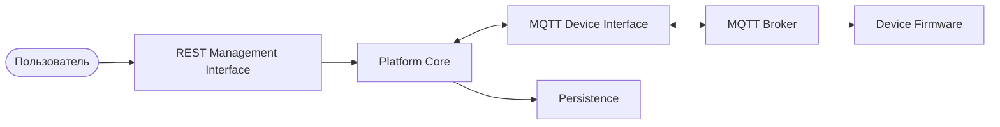

# Обзор системы

Esp Monitor представляет собой серверную платформу, предоставляющую архитектурные интерфейсы для взаимодействия с пользователями, приложениями и управляемыми устройствами.

Архитектура системы построена вокруг четко определённых контрактов взаимодействия. Внешние участники не взаимодействуют с внутренними компонентами напрямую, а используют соответствующие интерфейсы и API. Такой подход позволяет независимо развивать отдельные части системы, сохраняя стабильность общей архитектуры.

## Архитектура системы

## Архитектурные компоненты

### Пользователь

Пользователь является основным участником системы. Все операции управления, настройки и мониторинга инициируются пользователем посредством одного из клиентов, использующих REST Management Interface.

### REST Management Interface

REST Management Interface является основным административным интерфейсом Esp Monitor для взаимодействия с пользователями и внешними приложениями.

Веб-интерфейс, мобильные приложения, инструменты автоматизации и любые другие клиенты используют единый REST Management Interface, независимо от способа своей реализации.

### Platform Core

Platform Core является центральной подсистемой сервера.

Она координирует работу внешних интерфейсов, информационной модели, Persistence и механизмов обмена сообщениями, не раскрывая внутреннюю реализацию внешним участникам системы.

### MQTT Device Interface

MQTT Device Interface определяет архитектурный интерфейс взаимодействия между платформой и управляемыми устройствами.

Этот интерфейс задает контракт обмена сообщениями, используемый устройствами через MQTT-инфраструктуру.

### Persistence

Persistence отвечает за сохранение актуальной информационной модели системы.

Platform Core взаимодействует с Persistence через Storage API и не зависит от конкретной реализации хранения данных.

### MQTT Broker

MQTT Broker является внешним инфраструктурным сервисом, обеспечивающим доставку сообщений по протоколу MQTT между сервером и управляемыми устройствами.

Брокер не является частью Esp Monitor и может быть заменён любой совместимой реализацией MQTT.

### Управляемые устройства

Управляемые устройства являются конечными объектами управления платформы.

Они получают команды конфигурирования и управления через MQTT Device Interface, а также передают данные, используя тот же механизм обмена сообщениями.

## Модель взаимодействия

Esp Monitor организован вокруг архитектурных контрактов, а не вокруг прямых связей между внутренними и внешними компонентами системы.

Пользователи и приложения взаимодействуют с платформой через REST Management Interface, а управляемые устройства — через MQTT Device Interface, используя внешний MQTT Broker в качестве транспортной инфраструктуры.

Такое разделение обеспечивает независимость платформы от конкретных клиентских приложений, аппаратных платформ и реализаций инфраструктурных сервисов, сохраняя единый и стабильный способ взаимодействия между всеми участниками системы.

## Заключение

В данной главе представлены основные архитектурные компоненты Esp Monitor и показаны связи между ними на верхнем уровне абстракции.

Последующие главы подробно рассматривают отдельные части архитектуры, не изменяя представленную здесь общую модель системы.
