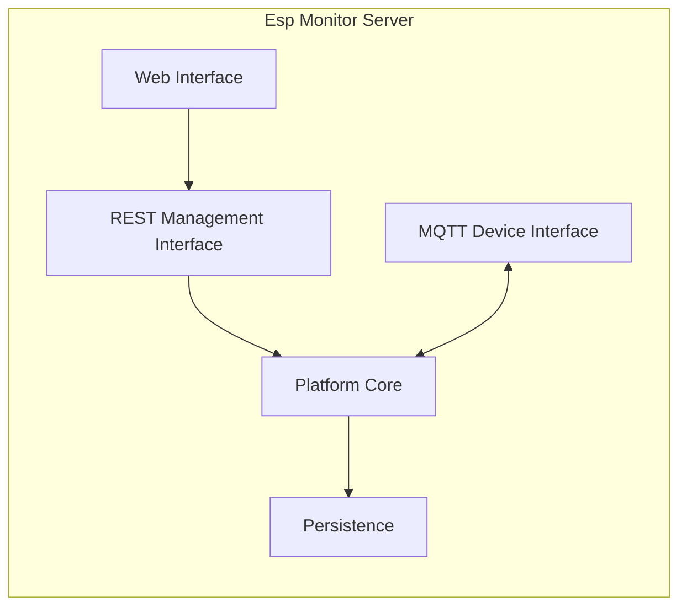
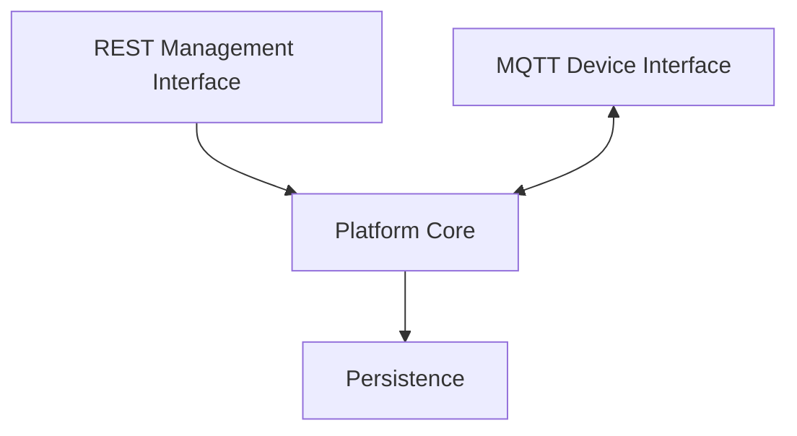

# Глава 05. Архитектура сервера

## 1. Введение

С ростом функциональности сервер Esp Monitor перестаёт быть системой с единым центром ответственности и начинает одновременно решать несколько принципиально различных задач: обработку внешних запросов, взаимодействие с устройствами, координацию платформенных подсистем, работу с Persistence и формирование пользовательского представления.

Если эти задачи реализованы в рамках единого неразделённого контура, изменения в одной части системы неизбежно начинают затрагивать остальные. Это приводит к росту связности, усложнению сопровождения и снижению предсказуемости поведения системы при развитии.

В архитектуре Esp Monitor эта проблема решается через сознательную декомпозицию сервера на набор специализированных подсистем, каждая из которых отвечает за строго определённый аспект поведения системы.

Диаграмма 5.1 иллюстрирует эту декомпозицию.

**Диаграмма 5.1 — Архитектурные подсистемы Esp Monitor Server**

---

## 2. Архитектурные подсистемы

Архитектура сервера не является отражением структуры исходного кода или организацией пакетов. Она формируется вокруг разделения **архитектурных обязанностей**, а не технических компонентов.

Каждая подсистема представляет собой ограниченную область ответственности, в рамках которой определяется один тип поведения сервера. Взаимодействие между подсистемами осуществляется через явно определённые зависимости.

Такой подход позволяет изменять отдельные части системы без изменения общей архитектурной модели.

Диаграмма 5.1 показывает выделенные подсистемы:

- REST Management Interface
- MQTT Device Interface
- Platform Core
- Persistence
- Web Interface

---

### REST Management Interface и MQTT Device Interface

REST Management Interface и MQTT Device Interface представляют два независимых внешних канала взаимодействия с системой.

Их выделение в отдельные подсистемы обусловлено необходимостью изоляции протокольных различий от Platform Core.

Каждый из этих интерфейсов выполняет одну и ту же архитектурную роль: преобразование входящих сообщений во внутренние операции системы. При этом различия протоколов и способов доставки сообщений не влияют на правила обработки внутри Platform Core.

Такое разделение позволяет добавлять новые способы взаимодействия с системой без изменения её внутренней модели поведения.

---

### Platform Core

Platform Core является центральной подсистемой архитектуры сервера.

Он координирует работу внешних интерфейсов, Persistence, механизмов конфигурации и публикации событий, не смешивая эти обязанности с протокольной обработкой или деталями хранения данных.

Все внешние интерфейсы делегируют выполнение операций этой подсистеме.

Таким образом, Platform Core выступает единственной точкой координации поведения серверной части платформы.

---

### Persistence

Подсистема Persistence изолирует сохранение информационной модели от остальной архитектуры.

Её назначение состоит не только в хранении данных, но прежде всего в предоставлении Storage API, через который Platform Core работает с актуальным состоянием системы.

Благодаря этому Platform Core не зависит от структуры базы данных и технологических деталей реализации хранения, а работает через ограниченный архитектурный контракт.

---

### HTTP Server

HTTP Server обеспечивает инфраструктурный уровень обработки HTTP-запросов.

Его роль ограничена предоставлением среды выполнения для веб-взаимодействия и не включает правила обработки платформы.

Таким образом, HTTP Server является техническим механизмом доставки запросов, не влияющим на структуру Platform Core.

---

### Web Interface

Web Interface отвечает за формирование пользовательского представления данных.

Его выделение отражает архитектурный принцип разделения представления и Platform Core.

Это позволяет изменять пользовательский интерфейс независимо от поведения серверной платформы.

---

## 3. Взаимодействие подсистем

Разделение на подсистемы имеет смысл только при наличии строго определённой модели их взаимодействия.

В Esp Monitor взаимодействие организовано таким образом, чтобы минимизировать перекрёстные зависимости и обеспечить единое направление потока управления.

Диаграмма 5.2 показывает структуру этих зависимостей.

**Диаграмма 5.2 — Взаимодействие архитектурных подсистем**

REST Management Interface и MQTT Device Interface являются независимыми входными точками системы. Оба интерфейса направляют обработку запросов в Platform Core, не реализуя правила обработки самостоятельно.

Platform Core является единственной подсистемой, которая работает с Persistence. Это создаёт централизованную точку управления состоянием системы.

Такое направление зависимостей формирует архитектурное свойство, при котором все внешние взаимодействия сводятся к единой модели поведения системы.

В результате:

- протокольные различия не влияют на Platform Core;
- прикладные правила не дублируются в интерфейсах;
- изменения в механизме хранения данных не требуют изменения внешних интерфейсов.

Архитектура остаётся устойчивой к расширению способов взаимодействия, поскольку новые каналы подключаются к существующему Platform Core, а не формируют собственную модель поведения.

---

## 4. Заключение

Архитектурная декомпозиция сервера Esp Monitor формирует внутреннюю структуру системы на основе разделения ответственности между специализированными подсистемами.

Каждая подсистема выполняет строго ограниченную архитектурную роль, а взаимодействие между ними подчинено единому направлению зависимостей через Platform Core.

Такой подход снижает связность системы, упрощает её развитие и сохраняет независимость Platform Core от протоколов взаимодействия и механизмов хранения данных.

В последующих главах каждая подсистема будет рассмотрена более детально с точки зрения её внутренней роли в общей архитектуре системы.
