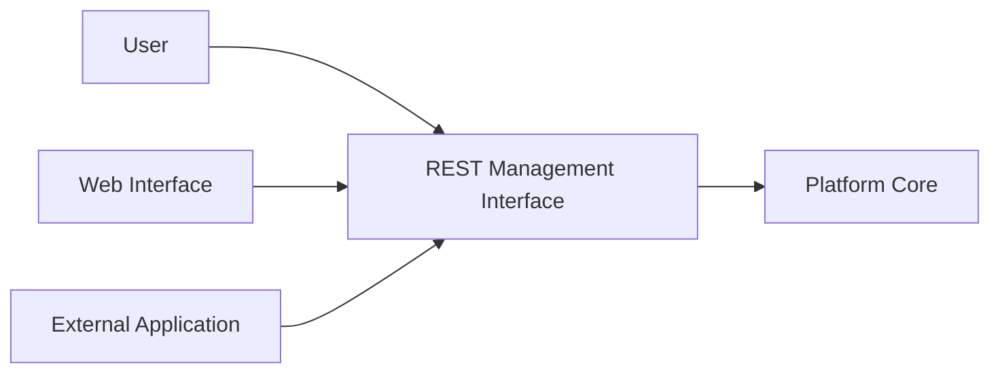
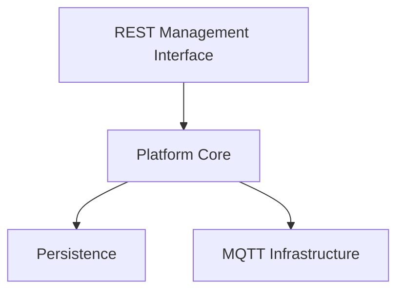

# Chapter 06. REST Management Interface

## 6.1 Назначение

REST Management Interface является основным административным интерфейсом сервера Esp Monitor. Он предоставляет пользователям, веб-интерфейсу и внешним приложениям единый механизм взаимодействия с системой, скрывая особенности ее внутренней реализации и обеспечивая стабильную точку доступа к функциональности сервера.



Архитектурно REST Management Interface предназначен для взаимодействия исключительно с сервером, а не с ESP-устройствами. Он предоставляет доступ к информационной модели платформы: зарегистрированным устройствам, их конфигурации, последнему известному состоянию и другим данным, накопленным сервером.

Передача команд устройствам и получение телеметрии относятся к MQTT Device Interface и подробно рассматриваются в следующей главе.

---

## 6.2 Архитектурные обязанности

REST Management Interface отвечает за прием HTTP-запросов, проверку входных данных, применение механизмов авторизации и преобразование внешних запросов во внутренние операции Platform Core.

Интерфейс не содержит бизнес-правил, не обращается непосредственно к Persistence и не взаимодействует с MQTT-инфраструктурой. Все решения, связанные с обработкой пользовательских запросов, принимаются исключительно подсистемой Platform Core.

Такое разделение обязанностей обеспечивает независимость Platform Core от используемого протокола взаимодействия. Благодаря этому внутреннее устройство сервера может изменяться без нарушения совместимости с существующими клиентскими приложениями.

---

## 6.3 Обработка запросов

Все операции, выполняемые через REST Management Interface, проходят одинаковую архитектурную последовательность обработки.



После получения HTTP-запроса REST Management Interface выполняет его первичную обработку и передает управление подсистеме Platform Core. Далее именно Platform Core определяет сценарий выполнения операции и координирует работу остальных компонентов сервера.

В зависимости от характера запроса Platform Core может обновить информацию, хранящуюся в Persistence, сформировать сообщение для MQTT-инфраструктуры или выполнить оба действия в рамках одной логической операции. REST Management Interface не участвует в дальнейшей обработке запроса и остается полностью изолированным от механизмов хранения данных и обмена сообщениями.

Если операция затрагивает устройство, REST Management Interface инициирует изменение информационной модели, а дальнейшая доставка команды выполняется через MQTT Device Interface.

---

## 6.4 Итоги

REST Management Interface является административным интерфейсом сервера Esp Monitor и предоставляет пользователям единый механизм взаимодействия с информационной моделью платформы.

Его архитектурная роль ограничена приемом административных запросов и передачей операций в Platform Core. Взаимодействие с устройствами остается обязанностью MQTT Device Interface, что сохраняет четкие границы ответственности между подсистемами.

# REST Management API Reference

## 1. Назначение

REST Management API предоставляет программный интерфейс для взаимодействия с сервером Esp Monitor.

API предназначен для веб-интерфейса, внешних приложений, сценариев автоматизации и административных инструментов. Все операции выполняются посредством HTTP-запросов с передачей данных в формате JSON, если иное не указано в описании конкретного метода.

REST Management API взаимодействует исключительно с сервером Esp Monitor. Передача команд устройствам, получение телеметрии и обмен сообщениями с микроконтроллерами выполняются внутренними компонентами сервера и не являются частью REST Management API.

---

## 2. Базовый URL

Все методы API имеют общий префикс:

```
/api/v1
```

Версия API включена в URL и определяет контракт взаимодействия между клиентом и сервером.

---

## 3. Аутентификация

Большинство методов API требуют авторизации.

Авторизация выполняется посредством HTTP-заголовка:

```http
xToken: <access-token>
```

Значение токена должно совпадать со значением, заданным в конфигурации сервера или переданным при его запуске.

При отсутствии токена или передаче неверного значения сервер возвращает ошибку авторизации.

---

## 4. Формат запросов

Если описание метода не содержит иных требований, используются следующие соглашения.

### HTTP Methods

| Метод  | Назначение                               |
|--------|------------------------------------------|
| GET    | Получение информации                     |
| POST   | Создание объекта или выполнение операции |
| DELETE | Удаление объекта                         |

### Content-Type

Для JSON-запросов используется

```http
Content-Type: application/json
```

Для загрузки файлов используется

```http
Content-Type: multipart/form-data
```

---

## 5. Формат ответов

Все ответы API имеют формат JSON.

При успешном выполнении операции сервер возвращает HTTP-код, соответствующий выполненному действию, и, при необходимости, тело ответа.

В случае возникновения ошибки сервер возвращает соответствующий HTTP-код и описание ошибки.

---

## 6. HTTP Status Codes

API использует стандартные коды состояния HTTP.

| Код                       | Описание                                            |
|---------------------------|-----------------------------------------------------|
| 200 OK                    | Операция успешно выполнена                          |
| 201 Created               | Объект успешно создан                               |
| 204 No Content            | Операция успешно выполнена, тело ответа отсутствует |
| 400 Bad Request           | Некорректный запрос                                 |
| 401 Unauthorized          | Ошибка авторизации                                  |
| 403 Forbidden             | Выполнение операции запрещено                       |
| 404 Not Found             | Запрашиваемый ресурс отсутствует                    |
| 409 Conflict              | Конфликт данных                                     |
| 500 Internal Server Error | Внутренняя ошибка сервера                           |

---

# Device Management

## GET /api/v1/devices

### Назначение

Возвращает список всех зарегистрированных устройств.

### Аутентификация

Требуется.

### Запрос

Тело запроса отсутствует.

### Ответ

Возвращает JSON-массив зарегистрированных устройств.

### Возможные ошибки

| Код  | Причина |
|------|---------------------------|
| 401  | Ошибка авторизации        |
| 500  | Внутренняя ошибка сервера |

---

## POST /api/v1/devices/upload

### Назначение

Импортирует список устройств из CSV-файла.

### Аутентификация

Требуется.

### Content-Type

```http
multipart/form-data
```

### Параметры

| Имя  | Тип  | Описание                      |
|------|------|-------------------------------|
| file | File | CSV-файл со списком устройств |

### Ответ

Возвращает информацию о результате импорта.

---

## POST /api/v1/devices/cfg

### Назначение

Передает новую конфигурацию выбранному устройству.

Конфигурация сохраняется сервером и публикуется в MQTT-инфраструктуру для последующей доставки устройству.

### Аутентификация

Требуется.

### Заголовки

| Заголовок | Назначение               |
|-----------|--------------------------|
| SSDP      | Идентификатор устройства |

### Content-Type

```http
application/json
```

### Тело запроса

JSON-документ с новой конфигурацией устройства.

### Ответ

Возвращает результат выполнения операции.

| Status                    | Description                                    |
|---------------------------|------------------------------------------------|
| 200 OK                    | Configuration accepted successfully.           |
| 400 Bad Request           | Invalid request body or configuration format.  |
| 401 Unauthorized          | Authentication failed.                         |
| 404 Not Found             | The specified device does not exist.           |
| 500 Internal Server Error | Unexpected server error.                       |


### Примечание

Публикация сообщения не означает немедленного применения конфигурации устройством. Если устройство временно недоступно, новая конфигурация будет получена после восстановления соединения с MQTT-брокером.

---

## DELETE /api/v1/devices

### Назначение

Удаляет устройство из реестра сервера.

### Аутентификация

Требуется.

### Заголовки

| Заголовок  | Назначение               |
|------------|--------------------------|
| SSDP       | Идентификатор устройства |

### Ответ

Возвращает результат выполнения операции.

---

## История изменений

| Версия  | Описание                          |
|---------|-----------------------------------|
| v1      | Первая версия REST Management API |

