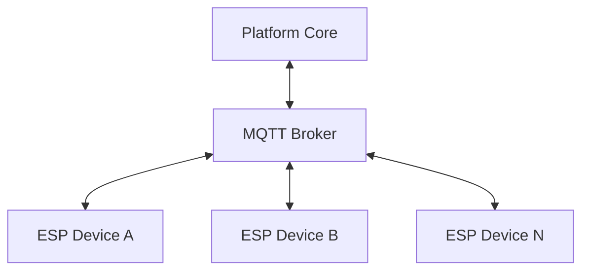
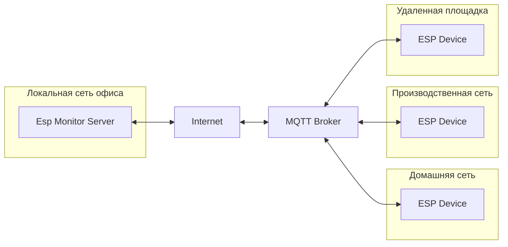
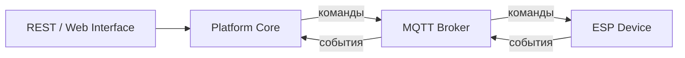
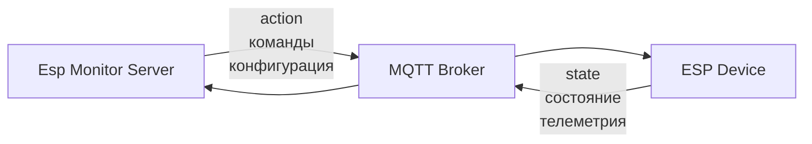

# Глава 07. MQTT Device Interface

После завершения первоначальной настройки микроконтроллера Esp Monitor больше не использует прямое сетевое взаимодействие с устройствами. Вся дальнейшая коммуникация между сервером и устройством осуществляется через MQTT Device Interface. Такое решение является одним из ключевых архитектурных принципов системы и определяет способ взаимодействия с распределенным парком устройств независимо от их физического расположения.

На архитектурном уровне глава описывает MQTT Device Interface. Конкретный контракт сообщений, топиков и JSON-документов приведен в справочной части как MQTT Device API.

Первоначальная настройка представляет собой исключение из общего правила. На этом этапе пользователь находится рядом с устройством и передает ему параметры подключения к локальной сети и MQTT-брокеру. После завершения настройки устройство становится полноценным участником распределенной системы и дальнейшее взаимодействие с ним осуществляется исключительно посредством обмена сообщениями через брокер.



Использование MQTT полностью исключает необходимость прямого сетевого соединения между сервером и микроконтроллером. Сервер не устанавливает TCP-сессии с устройствами, не выполняет HTTP-запросы по их IP-адресам и не пытается определить их местоположение в сети. Вместо этого обе стороны независимо подключаются к одному MQTT-брокеру и взаимодействуют исключительно через публикацию и получение сообщений.

Такой подход делает архитектуру независимой от топологии сети. Микроконтроллеры могут находиться в различных локальных сетях, за NAT, получать динамические IP-адреса, периодически терять соединение или полностью менять место установки. Ни одно из этих обстоятельств не требует изменений в работе сервера. Для него устройство остается логическим участником системы, идентифицируемым собственным именем, а не сетевым адресом.

Одним из важнейших следствий такого решения является устранение самого понятия местоположения устройства из серверной архитектуры. Platform Core оперирует зарегистрированными устройствами и их идентификаторами, не располагая сведениями об их физических адресах или способах достижения. Все вопросы доставки сообщений передаются инфраструктуре MQTT и не оказывают влияния на остальную архитектуру системы.



MQTT используется как двусторонний транспорт обмена сообщениями. Инициатором коммуникации может выступать любая из сторон. Сервер публикует команды, предназначенные для конкретного устройства, а устройства самостоятельно отправляют информацию о своем состоянии, не ожидая предварительного запроса со стороны сервера. Такая модель соответствует природе систем мониторинга, где изменение состояния оборудования является событием, которое должно быть своевременно передано системе.

Сервер не выполняет периодический опрос устройств. Вместо этого информационная модель обновляется по мере поступления сообщений от микроконтроллеров. Аналогично, изменение конфигурации устройства не приводит к непосредственному сетевому обращению со стороны пользователя. После обработки пользовательского запроса Platform Core формирует соответствующую команду и публикует ее через MQTT, после чего доставка осуществляется брокером независимо от пользовательского интерфейса.

Взаимодействие с MQTT полностью сосредоточено внутри Platform Core и MQTT Device Interface. Пользовательские интерфейсы, включая REST Management Interface и Web Interface, не работают с MQTT непосредственно. Они лишь инициируют операции над информационной моделью системы, после чего Platform Core самостоятельно принимает решение, требуется ли публикация сообщений устройствам. Благодаря этому пользовательские интерфейсы остаются полностью независимыми от особенностей транспортного уровня.



Использование брокера также устраняет непосредственную зависимость сервера от жизненного цикла отдельных устройств. Микроконтроллеры могут подключаться, отключаться и повторно подключаться в произвольный момент времени. Каждое новое соединение автоматически восстанавливает возможность обмена сообщениями без участия остальных компонентов системы. Серверу не требуется отслеживать процесс восстановления соединения или выполнять повторные попытки подключения к каждому устройству.

Даже временная недоступность MQTT-брокера не нарушает архитектуру Esp Monitor. Сервер продолжает обслуживать REST-запросы, отображать накопленную информацию через Web Interface и работать с информационной моделью системы. В этот период лишь прекращается обмен сообщениями с устройствами. После восстановления соединения транспортный уровень вновь становится доступным без необходимости изменения логики пользовательских интерфейсов или модели данных.

Таким образом, MQTT в архитектуре Esp Monitor является не просто выбранным протоколом обмена сообщениями, а механизмом, который полностью отделяет информационную модель системы от физической инфраструктуры размещения устройств. Благодаря этому сервер сохраняет единый способ взаимодействия с любым количеством микроконтроллеров независимо от их сетевого окружения, обеспечивая масштабируемость, устойчивость к изменениям топологии сети и естественную поддержку событийной модели обмена данными.

# MQTT Device API Reference

## 1. Overview

MQTT является единственным интерфейсом взаимодействия между сервером Esp Monitor и зарегистрированными ESP-устройствами после завершения процедуры первоначальной настройки (Provisioning).

Все сообщения передаются через MQTT Broker. Сервер и устройства не устанавливают прямых сетевых соединений друг с другом и взаимодействуют исключительно посредством публикации и получения сообщений.

Все MQTT-сообщения представляют собой JSON-документы в кодировке UTF-8.

---

## 2. Структура топиков

Все топики имеют следующую структуру:

```
<ROOT>/<DEVICE>/<TOPIC>
```

где

| Компонент  | Описание                                                                                                                                            |
|------------|-----------------------------------------------------------------------------------------------------------------------------------------------------|
| `<ROOT>`   | Корневой префикс MQTT, задаваемый параметром `MQTT_ROOT`. Позволяет изолировать несколько независимых инсталляций Esp Monitor на одном MQTT Broker. |
| `<DEVICE>` | Уникальный идентификатор устройства (SSDP Name).                                                                                                    |
| `<TOPIC>`  | Тип сообщения.                                                                                                                                      |

### Пример

```
company-a/
    esp-0001/
        state
        action

    esp-0002/
        state
        action
```

---

## 3. Сводная таблица топиков

| Topic    | Publisher  | Subscriber | Назначение                               |
|----------|------------|------------|------------------------------------------|
| `state`  | ESP Device | Server     | Передача текущего состояния устройства   |
| `action` | Server     | ESP Device | Передача команд и изменений конфигурации |

---

## 4. Topic: state

### Полное имя

```
<ROOT>/<DEVICE>/state
```

### Publisher

ESP Device

### Subscriber

Esp Monitor Server

### Назначение

Топик предназначен для передачи текущего состояния устройства.

Сообщения публикуются:

- после успешного подключения к MQTT Broker;
- после изменения состояния устройства;
- при изменении состояния входов или выходов;
- в иных случаях, определяемых прошивкой устройства.

Сервер использует полученные данные для обновления собственной информационной модели.

### Формат сообщения

```json
{
    "SSDP": "esp-0001",
    "MDNS": "esp-0001.local",
    "Started": 1750000000,
    "Updated": 1750001234,
    "Pins": {
        "D1": "1",
        "D2": "0",
        "A0": "512"
    }
}
```

### Поля

| Поле    | Тип     | Описание                                                                                        |
|---------|---------|-------------------------------------------------------------------------------------------------|
| SSDP    | string  | Уникальный идентификатор устройства.                                                            |
| MDNS    | string  | mDNS-имя устройства.                                                                            |
| Started | integer | Время запуска устройства (Unix Time).                                                           |
| Updated | integer | Время формирования сообщения (Unix Time).                                                       |
| Pins    | object  | Текущее состояние цифровых и аналоговых выводов. Состав объекта зависит от прошивки устройства. |

---

## 5. Topic: action

### Полное имя

```
<ROOT>/<DEVICE>/action
```

### Publisher

Esp Monitor Server

### Subscriber

ESP Device

### Назначение

Топик используется для передачи команд устройству.

В текущей версии основным назначением является обновление конфигурации устройства.

После получения новой конфигурации устройство:

1. объединяет изменения с текущей конфигурацией;
2. сохраняет обновленный файл `config.json`;
3. выполняет перезагрузку.

### Формат сообщения

```json
{
    "config": {
        "wifi": {
            "ssid": "Office",
            "pass": "********"
        },
        "mqtt": {
            "host": "broker.example.com",
            "port": 1883
        }
    }
}
```

### Поля

| Поле   | Тип    | Описание                                      |
|--------|--------|-----------------------------------------------|
| config | object | Частичная или полная конфигурация устройства. |

Поддерживается передача только изменяемых параметров. Отсутствующие поля не изменяются.

---

## 6. Потоки сообщений



В системе существуют два независимых потока сообщений.

### Поток состояния

```
ESP Device
      │
 publish state
      │
      ▼
 MQTT Broker
      │
      ▼
 Esp Monitor Server
```

Устройство самостоятельно уведомляет сервер обо всех значимых событиях.

---

### Поток команд

```
Esp Monitor Server
         │
 publish action
         │
         ▼
   MQTT Broker
         │
         ▼
    ESP Device
```

Сервер публикует команды после обработки пользовательских запросов или выполнения внутренних правил Platform Core.

---

## 7. Гарантии доставки

### QoS

Используемые уровни QoS определяются реализацией клиента MQTT.

Текущая реализация использует:

| Компонент          | QoS |
|--------------------|-----|
| ESP Device         | 0   |
| Esp Monitor Server | 1   |

Это означает, что сообщения, публикуемые устройством, могут быть потеряны при неблагоприятных условиях сети, тогда как сервер использует более надежный режим доставки.

### Retained Messages

Retained-сообщения не используются.

Каждое сообщение отражает текущее состояние системы и не предназначено для хранения на стороне брокера.

### Повторное подключение

При разрыве соединения MQTT-клиенты автоматически выполняют повторное подключение.

После восстановления соединения обмен сообщениями продолжается без участия пользователя.

---

## 8. Жизненный цикл топиков

Топики не требуют предварительного создания.

Они автоматически появляются при первой публикации сообщения соответствующим клиентом MQTT.

Удаление сообщений и внутреннее хранение топиков полностью определяется реализацией MQTT Broker.

Esp Monitor не управляет жизненным циклом топиков напрямую.

---

## 9. Формат сообщений

Все сообщения должны соответствовать следующим требованиям.

| Свойство                 | Значение  |
|--------------------------|-----------|
| Кодировка                | UTF-8     |
| Формат                   | JSON      |
| Время                    | Unix Time |
| Идентификатор устройства | SSDP Name |
| Тип сообщений            | Object    |

Неизвестные поля должны игнорироваться принимающей стороной.

Это позволяет расширять протокол без нарушения совместимости существующих устройств.

---

## 10. Расширяемость API

Структура MQTT Device API допускает добавление новых типов сообщений без изменения существующих топиков.

Например:

```
<ROOT>/<DEVICE>/action
```

может в будущем содержать дополнительные команды:

```json
{
    "reboot": {}
}
```

```json
{
    "ota": {
        "url": "https://example.com/fw.bin"
    }
}
```

```json
{
    "gpio": {
        "D5": 1
    }
}
```

Устройства, не поддерживающие новые типы команд, должны игнорировать неизвестные поля.

Такой подход обеспечивает обратную совместимость между различными версиями серверного программного обеспечения и прошивок устройств.
