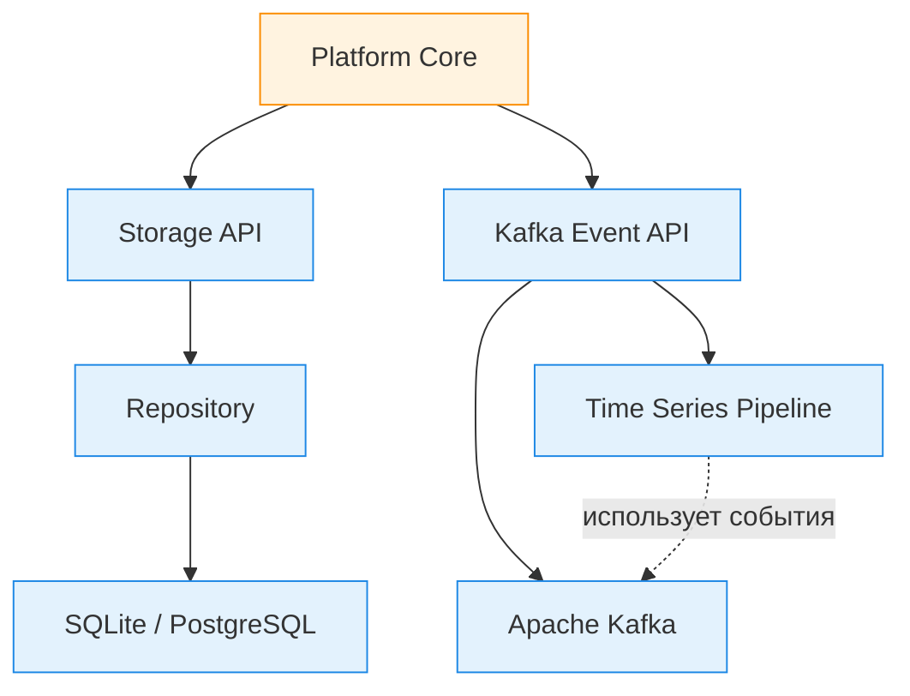
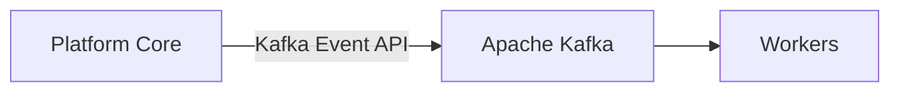
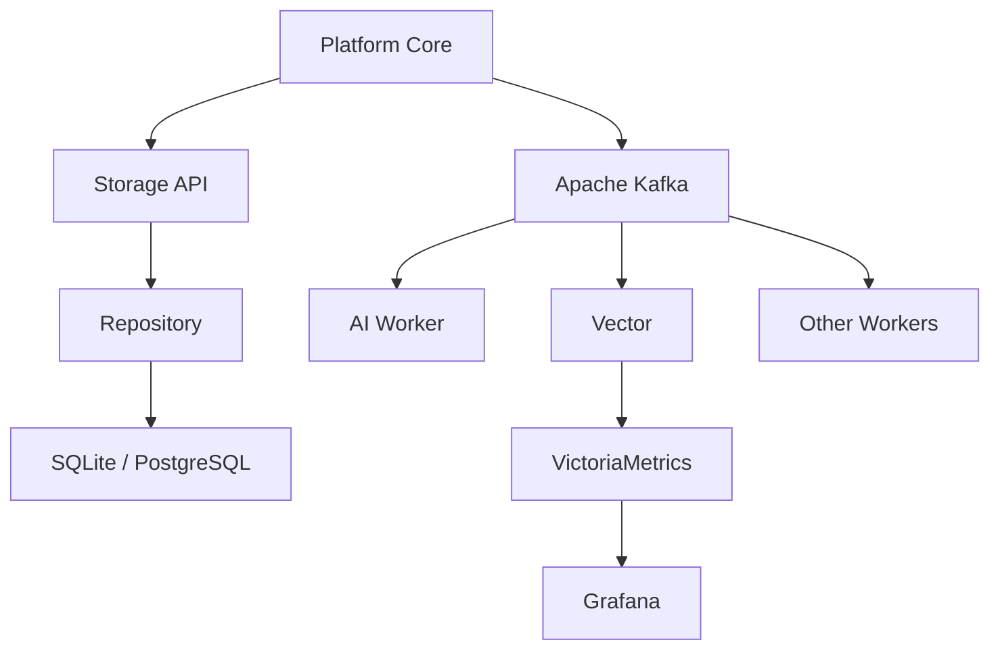
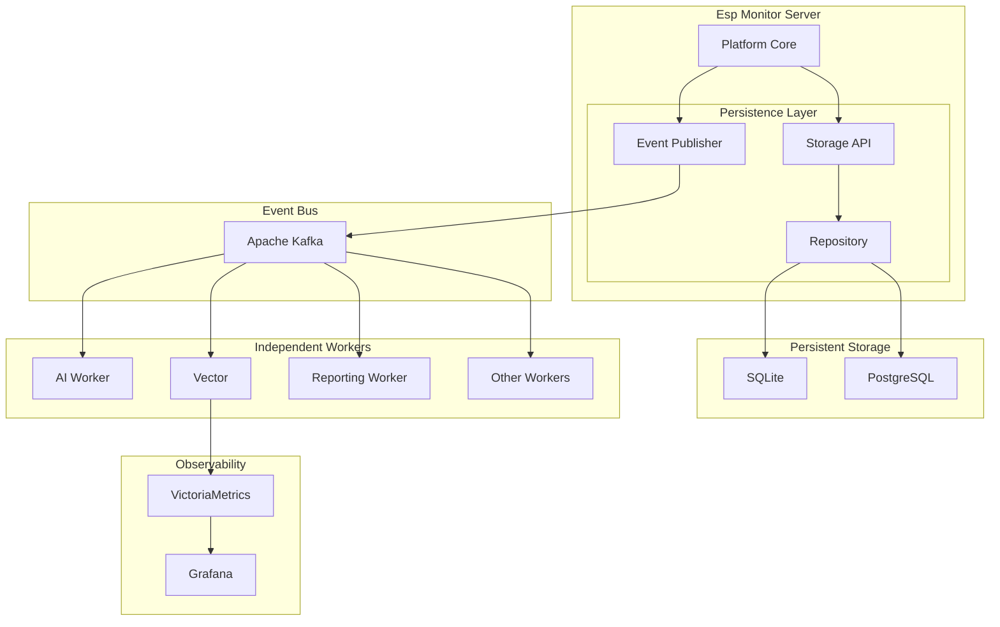

# Глава 08. Архитектура Persistence

## Назначение

Подсистема Persistence предназначена для сохранения знаний сервера об управляемой инфраструктуре независимо от текущего состояния сети, доступности устройств или наличия активных соединений.

В предыдущих главах были рассмотрены внешние интерфейсы взаимодействия с пользователем и устройствами: REST Management Interface и MQTT Device Interface. Оба интерфейса отвечают исключительно за обмен информацией.

Подсистема Persistence решает другую задачу — сохранение информации и предоставление её другим компонентам системы.

В этой главе используются три разных уровня терминологии:

- **Persistence** — архитектурная подсистема сохранения информации;
- **Storage API** — архитектурный контракт, через который Platform Core работает с актуальным состоянием;
- **SQLite** и **PostgreSQL** — конкретные реализации хранения данных.

Эти понятия не являются синонимами. Persistence задает архитектурную ответственность, Storage API фиксирует контракт взаимодействия, а база данных является только выбранным механизмом реализации.

Одним из ключевых архитектурных решений Esp Monitor является отказ от использования единого универсального хранилища данных.

Различные категории информации имеют различное назначение, различный жизненный цикл и используются различными компонентами системы. Попытка хранить их в одной базе данных неизбежно приводит к усложнению архитектуры и снижению эффективности.

По этой причине система разделяет хранение информации на несколько независимых специализированных подсистем.

В архитектуре Esp Monitor используются три самостоятельные категории хранения данных:

- Repository;
- Event Bus;
- Time Series Pipeline.

Каждая из них отвечает за собственный класс информации и использует технологии, наиболее подходящие для решения соответствующей задачи.

---

## Три класса хранимой информации

Несмотря на то что все перечисленные подсистемы относятся к хранению данных, их назначение принципиально различается.



### Информационная модель

Информационная модель описывает текущее состояние управляемого парка устройств.

Она включает сведения о зарегистрированных микроконтроллерах, их конфигурации, последних известных состояниях, а также другую информацию, необходимую для управления системой.

Именно эта модель отражает текущее представление сервера о мире.

При поступлении нового MQTT-сообщения существующая информация обновляется, а не накапливается в виде истории изменений.

---

### События

События описывают действия, происходящие внутри системы.

К ним относятся:

- запуск сервера;
- подключение к MQTT-брокеру;
- изменение состояния устройств;
- отправка команд устройствам;
- работа фоновых сервисов;
- диагностические сообщения;
- результаты аналитической обработки.

В отличие от информационной модели события являются неизменяемыми.

Каждое новое событие дополняет журнал событий, а более старые записи автоматически удаляются в соответствии с политикой хранения.

---

### Временные ряды

Некоторые данные представляют ценность не сами по себе, а как последовательность изменений во времени.

К таким данным относятся:

- значения GPIO;
- показания датчиков;
- изменения аналоговых параметров;
- эксплуатационные метрики;
- статистика работы системы.

Подобная информация используется для построения графиков, мониторинга и анализа тенденций, а не для выполнения транзакционных операций.

---

Важно понимать, что именно различие между этими тремя категориями информации определяет архитектуру системы.

Каждая категория имеет собственные требования к производительности, времени хранения, способу обработки и кругу потребителей.

Именно поэтому Esp Monitor использует несколько специализированных подсистем хранения вместо единой универсальной базы данных.

---

## Repository

Repository представляет собой основное хранилище информационной модели системы.

Его задача — сохранять актуальное представление обо всех зарегистрированных устройствах независимо от того, находятся ли они в настоящий момент в сети.

Для каждого устройства Repository хранит:

- идентификатор устройства;
- регистрационные сведения;
- конфигурацию;
- последнее известное состояние;
- последнюю команду Action, переданную устройству;
- другую информацию, необходимую для управления устройством.

Repository является **единственным источником актуального состояния системы (Source of Truth)**.

Все компоненты сервера работают исключительно с этой информационной моделью.

REST Management Interface, Web Interface и Platform Core никогда не пытаются восстановить текущее состояние устройства по журналу событий Kafka.

При получении нового MQTT-сообщения Platform Core обновляет информационную модель через Storage API, после чего именно Repository становится источником актуальной информации для всех остальных компонентов системы.

### Реализации Repository

Esp Monitor поддерживает две реализации Repository.

#### SQLite

SQLite используется по умолчанию.

Это встроенная реляционная база данных, не требующая отдельного сервера и хранящая всю информацию в одном файле.

Такой подход значительно упрощает развертывание системы и делает SQLite оптимальным выбором для автономных установок, небольших проектов и среды разработки.

#### PostgreSQL

PostgreSQL является промышленной клиент-серверной системой управления базами данных.

Она предназначена для крупных инсталляций, где требуется централизованное хранение данных, одновременная работа нескольких клиентов, резервное копирование, репликация и высокая масштабируемость.

Несмотря на различия в реализации, обе базы данных предоставляют одну и ту же реализацию Storage API.

Platform Core взаимодействует со Storage API и не зависит от выбранной системы управления базами данных.

Поэтому переход между SQLite и PostgreSQL не требует изменения Platform Core.

---

## Event Bus

Если Repository хранит текущее состояние системы, то Event Bus предназначен для распространения событий между независимыми компонентами архитектуры.

В Esp Monitor события публикуются через Kafka Event API, а в качестве инфраструктурной реализации Event Bus используется Apache Kafka.

Kafka Broker представляет собой инфраструктурный сервис потоковой обработки событий, предназначенный для публикации, хранения и доставки сообщений между независимыми сервисами.

В отличие от Repository, Kafka не хранит информационную модель системы.

Её задача состоит в регистрации происходящих событий и их доставке всем заинтересованным потребителям.

Platform Core публикует события по Kafka Event API в соответствующие топики Kafka, после чего дальнейшая обработка этих событий выполняется независимо от работы самого сервера.

В типовой конфигурации используются следующие топики:

- `root` — события жизненного цикла сервера;
- `logs` — сообщения журнала и диагностическая информация;
- `pins` — изменения состояний выводов микроконтроллеров;
- `actions` — команды, отправляемые устройствам;
- `anomalies` — результаты аналитической обработки и обнаруженные аномалии.

Каждый топик имеет собственную политику хранения (Retention Policy), после истечения которой старые сообщения автоматически удаляются.

Поэтому Kafka рассматривается как журнал событий с ограниченным временем хранения, а не как хранилище текущего состояния. Единственным источником актуального состояния системы остаётся Repository.

---

## Независимые сервисы (Workers)

Kafka Event API отделяет публикацию событий от их последующей обработки.

После публикации события Platform Core не определяет, какие сервисы будут использовать опубликованные данные и каким образом они будут их обрабатывать.

В архитектуре Esp Monitor такие потребители событий называются **Workers**. В контексте Persistence важно лишь то, что они работают с журналом событий, а не с информационной моделью Repository.

Подробная архитектура Workers рассматривается в главе 10.



---

## Конвейер обработки временных рядов

Отдельную категорию информации составляют данные, предназначенные для долговременного мониторинга.

Подобная информация представляет собой последовательность измерений, изменяющихся во времени, и значительно отличается как от информационной модели, так и от журнала событий.

По этой причине Esp Monitor использует независимый конвейер обработки временных рядов.

Принципиальной особенностью данной архитектуры является то, что сервер **не взаимодействует с системой хранения временных рядов напрямую**.

Обработка выполняется отдельными специализированными компонентами.

Последовательность обработки имеет следующий вид:

1. Platform Core публикует события через Kafka Event API.
2. Vector получает необходимые события из соответствующих топиков.
3. Vector преобразует поток событий в формат метрик Prometheus.
4. VictoriaMetrics сохраняет полученные временные ряды.
5. Grafana выполняет визуализацию накопленных данных.

Подобная архитектура позволяет полностью отделить задачи мониторинга от Platform Core.

Серверу не требуется знать каким образом строятся графики, где хранятся метрики и какие панели мониторинга используются оператором системы.

Все эти задачи выполняются независимо от серверного приложения.

### Vector

Vector представляет собой высокопроизводительный агент обработки телеметрии.

Он способен получать данные из различных источников, преобразовывать их и передавать в различные системы хранения и мониторинга.

В архитектуре Esp Monitor Vector выполняет роль промежуточного конвейера между Kafka и системой хранения временных рядов.

### VictoriaMetrics

VictoriaMetrics является специализированной системой хранения временных рядов, совместимой с экосистемой Prometheus.

Она оптимизирована для эффективного хранения большого объёма телеметрических данных, быстрого выполнения запросов и длительного хранения метрик.

В отличие от Repository, VictoriaMetrics не содержит сведений об устройствах и не используется Platform Core.

Её единственная задача — долговременное хранение временных рядов.

### Grafana

Grafana является системой визуализации эксплуатационных данных.

Она получает информацию из VictoriaMetrics и предоставляет пользователю интерактивные панели мониторинга (Dashboards), графики и средства анализа накопленной статистики.

Grafana не участвует в работе сервера и не оказывает влияния на Platform Core.

Она является исключительно пользовательским инструментом визуального анализа данных.

---

## Независимость архитектуры от технологий

Platform Core не зависит от конкретных технологий хранения данных.

Он взаимодействует только с архитектурными контрактами:

- Storage API;
- Kafka Event API.

Конкретные реализации этих контрактов могут изменяться без изменения Platform Core.

Например, Repository может быть реализован на основе SQLite или PostgreSQL.

Аналогично, состав Worker-сервисов может расширяться без внесения изменений в серверное приложение.

Конвейер обработки временных рядов также является полностью независимой подсистемой и может быть модернизирован или заменён без изменения основной архитектуры Esp Monitor.

Подобное разделение обязанностей позволяет каждой подсистеме использовать технологии, наиболее подходящие именно для её класса задач.

---



## Архитектурные последствия

Разделение хранения информации на несколько специализированных подсистем оказывает существенное влияние на архитектуру всей системы.

Во-первых, Repository становится единственным источником актуального состояния устройств.

Во-вторых, Kafka Event API превращается в универсальный контракт обмена событиями между независимыми сервисами.

В-третьих, подсистема мониторинга полностью отделяется от серверного приложения и развивается независимо от него.

Подобная архитектура обеспечивает ряд важных преимуществ:

- разделение ответственности между подсистемами;
- минимальную связанность компонентов;
- независимое масштабирование отдельных сервисов;
- возможность подключения новых Worker-компонентов без изменения сервера;
- использование специализированных технологий для каждого класса данных;
- возможность независимого развития подсистем хранения, аналитики и мониторинга.

Таким образом, Persistence в архитектуре Esp Monitor представляет собой не единую базу данных, а совокупность специализированных подсистем хранения информации, каждая из которых решает собственный класс задач и оптимизирована для своего типа данных.



# Database Reference

## Назначение

Database Reference описывает структуру Repository, используемого сервером Esp Monitor для хранения информационной модели управляемых устройств.

В отличие от архитектурной главы *Persistence*, в которой рассматриваются принципы организации хранения данных, данный документ описывает конкретную реализацию Repository, структуру базы данных и назначение её элементов.

На текущем этапе развития проекта Repository имеет предельно простую структуру и состоит из одной таблицы — `devices`.

Такое решение является осознанным архитектурным выбором.

Repository не предназначен для хранения истории изменений или телеметрии устройств. Его задача — сохранять актуальное состояние зарегистрированных устройств и предоставлять эту информацию Platform Core, REST Management API и Web Interface.

История событий хранится в Apache Kafka, а долговременная телеметрия — в специализированной системе хранения временных рядов. Поэтому Repository содержит только текущую информационную модель системы.

---

# Поддерживаемые системы управления базами данных

Repository поддерживает две реализации:

- SQLite;
- PostgreSQL.

Обе реализации используют одинаковую логическую модель данных и полностью совместимы между собой.

SQLite используется по умолчанию и является рекомендуемым вариантом для большинства установок.

PostgreSQL предназначен для промышленных внедрений, где требуется централизованное хранение данных, резервное копирование, репликация и высокая масштабируемость.

Platform Core не зависит от выбранной системы управления базами данных и взаимодействует исключительно со Storage API.

---

# Общая структура базы данных

В текущей версии проекта база данных состоит из одной таблицы.

```text
devices
```

Таблица содержит сведения обо всех зарегистрированных микроконтроллерах и представляет собой информационную модель управляемого парка устройств.

Каждая запись соответствует одному устройству.

---

# Структура таблицы devices

| Поле        | Тип               | Назначение                                                        |
|-------------|-------------------|-------------------------------------------------------------------|
| `id`        | INTEGER / BIGINT  | Внутренний идентификатор записи                                   |
| `ssdp`      | TEXT              | Уникальное SSDP-имя устройства                                    |
| `mdns`      | TEXT              | mDNS-имя устройства                                               |
| `active`    | BOOLEAN           | Признак активности устройства                                     |
| `activated` | TIMESTAMP         | Время регистрации устройства                                      |
| `started`   | TIMESTAMP         | Время последнего запуска устройства                               |
| `updated`   | TIMESTAMP         | Время получения последнего состояния                              |
| `pins`      | TEXT              | Последнее известное состояние выводов устройства в формате JSON   |
| `action`    | TEXT              | Последняя команда, отправленная устройству, в формате JSON        |
|-------------|-------------------|-------------------------------------------------------------------|

---

# Назначение полей

## id

Внутренний уникальный идентификатор записи.

Используется сервером при работе с Repository и не передаётся устройствам.

---

## ssdp

Основной логический идентификатор устройства.

Именно это имя используется сервером для идентификации устройства и построения MQTT Topic.

SSDP-имя является уникальным в пределах Repository.

---

## mdns

Сетевое имя устройства, используемое при первоначальном обнаружении устройства в локальной сети.

После завершения процедуры регистрации дальнейшая работа системы не зависит от сетевого расположения устройства.

---

## active

Флаг активности устройства.

Позволяет временно исключить устройство из обработки без удаления записи из Repository.

---

## activated

Дата и время регистрации устройства в системе.

Значение устанавливается один раз при добавлении устройства.

---

## started

Дата и время последнего запуска микроконтроллера.

Обновляется после получения соответствующего сообщения от устройства.

---

## updated

Дата и время получения последнего сообщения состояния.

Используется для определения актуальности информации об устройстве.

---

## pins

Содержит последнее известное состояние устройства.

Поле представляет собой сериализованный JSON-документ, содержащий значения доступных GPIO, аналоговых входов и других параметров, публикуемых устройством.

При получении нового MQTT-сообщения предыдущее содержимое полностью заменяется.

Repository хранит только актуальное состояние устройства.

---

## action

Содержит последнюю команду, отправленную устройству.

Поле используется для хранения сериализованного JSON-документа, описывающего последнее управляющее действие, сформированное Platform Core.

Как и поле `pins`, данное значение всегда отражает только последнее состояние.

---

# Хранение JSON-документов

Поля `pins` и `action` содержат структуры переменного состава.

Использование отдельных реляционных таблиц для хранения этих данных существенно усложнило бы схему Repository и привело бы к увеличению количества операций чтения и записи.

По этой причине сложные структуры сериализуются в JSON и сохраняются в текстовых полях базы данных.

SQLite не содержит встроенного типа данных JSON, поэтому сериализованные документы сохраняются в полях типа `TEXT`.

Для обеспечения полной совместимости обеих поддерживаемых реализаций Repository такой же подход используется и в PostgreSQL.

Несмотря на наличие специализированных типов `JSON` и `JSONB`, PostgreSQL также использует тип `TEXT`.

Это позволяет:

- использовать единую схему базы данных;
- применять одинаковые миграции;
- использовать общий код сериализации и десериализации;
- исключить зависимость Platform Core от выбранной СУБД.

При чтении данных сервер автоматически выполняет десериализацию текстового представления обратно в соответствующие структуры Go.

---

# Миграции базы данных

Структура Repository создаётся системой миграций.

Для SQLite и PostgreSQL используются отдельные SQL-файлы миграции, содержащие реализацию одной и той же логической модели данных.

Это обеспечивает идентичную структуру Repository независимо от выбранной системы управления базами данных.

---

# Развитие схемы данных

Текущая структура Repository является минимальной и отражает текущее состояние проекта.

По мере развития Esp Monitor состав таблиц может расширяться.

При этом сохраняются следующие архитектурные принципы:

- Repository остаётся единственным источником актуального состояния системы;
- Repository не используется для хранения истории событий;
- Repository не используется для хранения временных рядов;
- изменения структуры выполняются исключительно посредством миграций.

Благодаря такому подходу развитие схемы базы данных не оказывает влияния на архитектуру приложения и сохраняет совместимость между поддерживаемыми реализациями Repository.
