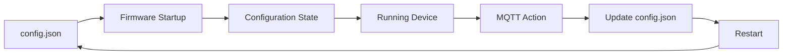

# Chapter 09. Configuration Architecture

## Overview

Любая распределенная система должна определить, каким образом ее компоненты получают конфигурацию и каким образом эта конфигурация изменяется в процессе эксплуатации.

В Esp Monitor сервер и устройства имеют различные жизненные циклы и выполняют разные задачи. По этой причине они используют разные модели конфигурирования.

Сервер представляет собой центральный компонент системы и получает свою конфигурацию только при запуске.

Устройства, напротив, могут находиться в удаленной сети, быть временно недоступными и изменять свою конфигурацию в процессе эксплуатации. Поэтому они используют собственную модель хранения и обновления параметров.

Таким образом, архитектура Esp Monitor разделяет конфигурацию между независимыми компонентами системы. Каждый компонент является владельцем собственной конфигурации и не хранит конфигурацию других компонентов.

---

## Архитектурный принцип

Конфигурация рассматривается как часть жизненного цикла конкретного компонента.

Центральным архитектурным понятием является **Configuration State** — единственное текущее состояние конфигурации, с которым работает компонент в данный момент времени.

Файлы `.env` и `config.json`, HTTP-запрос первоначальной настройки, MQTT Action и Persistence являются механизмами формирования, доставки или сохранения этого состояния. Они не заменяют Configuration State и не образуют несколько параллельных источников истины.

Сервер отвечает исключительно за собственные параметры работы.

Каждое устройство отвечает исключительно за собственную конфигурацию.

Это разделение позволяет изменять конфигурацию устройств без изменения конфигурации сервера и наоборот.

В результате сервер и устройства остаются архитектурно независимыми друг от друга.

---

## Конфигурация сервера

Конфигурация сервера формируется однократно во время запуска приложения.

При построении итоговой конфигурации используется несколько источников параметров, имеющих различный приоритет.


Процесс формирования конфигурации состоит из следующих этапов:

1. Используются встроенные значения по умолчанию.
2. Значения переопределяются параметрами файла `.env`.
3. Отдельные параметры могут быть дополнительно переопределены аргументами командной строки.
4. Формируется итоговый Configuration State сервера.
5. После завершения запуска конфигурация считается неизменяемой.

Использование встроенных значений позволяет серверу корректно запускаться даже в случае отсутствия отдельных параметров конфигурации. Такие значения являются механизмом повышения отказоустойчивости, а не рекомендуемым способом настройки системы.

Файл `.env` является основным способом конфигурирования сервера и используется в большинстве сценариев эксплуатации.

Аргументы командной строки предназначены для переопределения отдельных параметров без изменения файлов конфигурации. В текущей реализации данный механизм используется для задания значения `xToken`, что особенно удобно при автоматизированном запуске приложения средствами Continuous Integration и других систем автоматизации.

После завершения запуска никакие параметры сервера больше не изменяются. Любое изменение конфигурации требует повторного запуска приложения.

---

## Конфигурация устройства

В отличие от сервера, устройство должно поддерживать возможность удаленного изменения собственной конфигурации.

Для этого каждое устройство хранит локальный файл `config.json`, содержащий полный набор параметров его работы.

При запуске прошивки файл конфигурации считывается из постоянной памяти и используется для инициализации всех сервисов устройства.



Если серверу необходимо изменить параметры устройства, он публикует сообщение в MQTT Action Topic.

После получения сообщения устройство:

1. применяет изменения к текущей конфигурации;
2. сохраняет обновленный файл `config.json`;
3. выполняет перезапуск;
4. повторно загружает конфигурацию из сохраненного файла.

Таким образом, после завершения обновления устройство вновь формирует единственный текущий Configuration State из локального файла `config.json`.

> **Важно**
>
> MQTT Action не является источником конфигурации.
>
> MQTT используется исключительно как механизм доставки изменений.
>
> После применения обновления устройство полностью переходит на использование собственного файла `config.json`.

---

## Причины разделения моделей конфигурирования

Сервер и устройства работают в различных условиях и имеют различные требования к управлению конфигурацией.

Конфигурация сервера влияет сразу на всю систему, поэтому формируется однократно при запуске и остается неизменной до следующего перезапуска.

Конфигурация устройства относится только к одному конкретному устройству и должна поддерживать возможность удаленного изменения без физического доступа к оборудованию.

Разделение этих моделей позволяет сохранить независимость компонентов системы и избежать распространения изменений конфигурации между различными архитектурными уровнями.

---

## Конфигурация и архитектура развертывания

Настоящая глава описывает архитектуру конфигурации компонентов Esp Monitor.

Вопросы передачи конфигурационных параметров через Docker Compose, Kubernetes, ConfigMap, Secrets и другие механизмы инфраструктуры относятся к архитектуре развертывания и рассматриваются отдельно.

Такое разделение позволяет независимо развивать архитектуру продукта и способы его развертывания без изменения принципов конфигурирования сервера и устройств.

# Configuration Reference

## Overview

Настоящий документ описывает текущую реализацию механизмов конфигурирования компонентов Esp Monitor.

В отличие от главы **Configuration Architecture**, рассматривающей архитектурные принципы построения системы конфигурации, данный документ содержит практическую информацию о поддерживаемых параметрах, форматах конфигурации и порядке их применения.

В текущей реализации Esp Monitor используются три представления конфигурации:

- конфигурация сервера (`.env`);
- первоначальная конфигурация устройства (`POST /config`);
- внутренняя конфигурация устройства (`config.json`).

Каждое представление предназначено для своего участника системы и используется на различных этапах жизненного цикла платформы.

---

## Configuration Overview

Ниже показан общий процесс формирования конфигурации сервера и устройств.

```text
                Server
                  │
               .env
                  │
                  ▼
         Runtime Configuration


      Mobile Application
                  │
             POST /config
                  │
                  ▼
     Firmware Normalization
                  │
                  ▼
            config.json
                  │
                  ▼
         Runtime Configuration
```

Сервер получает конфигурацию непосредственно из переменных окружения.

Устройство первоначально получает упрощенную конфигурацию через HTTP API. После проверки и обработки прошивка преобразует полученные параметры во внутренний формат и сохраняет их в файл `config.json`, который используется при всех последующих запусках устройства.

---

# Server Configuration (.env)

Конфигурация сервера задается посредством переменных окружения.

Во время запуска приложения значения параметров объединяются со встроенными значениями по умолчанию, после чего формируется итоговая конфигурация сервера.

## REST Server

| Variable    | Default | Required | Description                              |
|-------------|---------|----------|------------------------------------------|
| `XTOKEN`    | —       | Yes      | Токен аутентификации REST Management API. |
| `REST_PORT` | `80`    | No       | Порт HTTP REST-сервера.                  |

---

## MQTT

| Variable              | Default    | Required | Description                                 |
|-----------------------|------------|----------|---------------------------------------------|
| `MQTT_HOST`           | —          | Yes      | Адрес MQTT Broker.                          |
| `MQTT_PORT`           | `1883`     | No       | TCP-порт MQTT Broker.                       |
| `MQTT_PROTOCOL`       | `mqtt://`  | No       | Используемый транспортный протокол.         |
| `MQTT_USERNAME`       | Empty      | No       | Имя пользователя MQTT Broker.               |
| `MQTT_PASSWORD`       | Empty      | No       | Пароль MQTT Broker.                         |
| `MQTT_ROOT`           | —          | Yes      | Корневой MQTT Topic проекта.                |
| `MQTT_CLIENT_ID`      | —          | Yes      | Идентификатор MQTT-клиента сервера.         |
| `MQTT_KEEP_ALIVE`     | `60`       | No       | Интервал MQTT Keep Alive.                   |
| `MQTT_PING_TIMEOUT`   | `10`       | No       | Максимальное время ожидания Ping Response.  |

---

## Kafka

Использование Kafka является опциональным.

При отсутствии Kafka сервер продолжает работать в обычном режиме, не публикуя события во внешнюю шину сообщений.

| Variable              | Default     | Required | Description                                  |
|-----------------------|-------------|----------|----------------------------------------------|
| `KAFKA_HOST`          | `localhost` | No       | Адрес Kafka Broker.                          |
| `KAFKA_PORT`          | `9092`      | No       | TCP-порт Kafka Broker.                       |
| `KAFKA_DEFAULT_TOPIC` | `root`      | No       | Kafka Topic, используемый по умолчанию.      |
| `KAFKA_TIMEOUT`       | `10`        | No       | Таймаут подключения к Kafka Broker.          |
| `KAFKA_ACKS`          | Empty       | No       | Политика подтверждения записи сообщений.     |

---

## Default Values

Часть параметров имеет встроенные значения по умолчанию.

Они используются в случаях, когда соответствующая переменная отсутствует или не может быть корректно прочитана при запуске приложения.

Встроенные значения предназначены исключительно для повышения устойчивости приложения и не заменяют полноценную настройку сервера.

---

# Command-line Parameters

Помимо переменных окружения сервер поддерживает ограниченный набор параметров командной строки.

В текущей реализации поддерживается только один параметр.

| Parameter | Overrides | Description                                                |
|-----------|-----------|------------------------------------------------------------|
| `-xToken` | `XTOKEN`  | Переопределяет значение токена аутентификации REST Management API. |

Параметр предназначен прежде всего для автоматизированного запуска приложения средствами Continuous Integration, Docker, Kubernetes и других систем автоматизации, где использование аргументов командной строки предпочтительнее изменения файла `.env`.

---

# Configuration Priority

При запуске сервера источники конфигурации применяются в следующем порядке.

```text
Built-in Defaults
        │
        ▼
      .env
        │
        ▼
Command-line Parameters
        │
        ▼
Runtime Configuration
```

Каждый следующий источник имеет более высокий приоритет и переопределяет значения предыдущего.

После завершения запуска сформированная конфигурация считается неизменяемой и используется сервером до следующего перезапуска.

# Device Initial Configuration API

Первоначальная конфигурация устройства выполняется посредством HTTP-запроса к встроенному REST API устройства.

Данный механизм используется мобильным приложением или другим программным обеспечением для передачи параметров подключения перед первым запуском устройства в локальной сети пользователя.

После успешного получения конфигурации прошивка выполняет проверку параметров, при необходимости формирует значения по умолчанию и сохраняет результат во внутренний файл `config.json`.

В результате у устройства формируется единственный текущий Configuration State, который используется при последующих запусках.

---

## HTTP Request

```http
POST /config
Content-Type: application/json
```

Тело запроса представляет собой JSON-документ следующего вида.

```json
{
    "WIFI_SSID": "<WIFI_SSID>",
    "WIFI_PASS": "<WIFI_PASS>",
    "MDNS": "<MDNS>",
    "SSDP": "<SSDP>",
    "HTTP_PORT": "<HTTP_PORT>",
    "MQTT_HOST": "<MQTT_HOST>",
    "MQTT_PORT": "<MQTT_PORT>",
    "MQTT_USER": "<MQTT_USER>",
    "MQTT_PASS": "<MQTT_PASS>",
    "MQTT_ROOT": "<MQTT_ROOT>"
}
```

---

## Request Parameters

| Parameter     | Required | Default                 | Description                                        |
|---------------|----------|-------------------------|----------------------------------------------------|
| `WIFI_SSID`   | Yes      | —                       | Имя беспроводной сети Wi-Fi.                       |
| `WIFI_PASS`   | Yes      | —                       | Пароль беспроводной сети Wi-Fi.                    |
| `MDNS`        | No       | `local.esp8266`         | Имя устройства в сети mDNS.                        |
| `SSDP`        | No       | `esp8266-<unixtime>`    | Отображаемое имя устройства для SSDP.              |
| `HTTP_PORT`   | No       | `80`                    | HTTP-порт встроенного REST API устройства.          |
| `MQTT_HOST`   | Yes      | —                       | Адрес MQTT Broker.                                 |
| `MQTT_PORT`   | No       | `1883`                  | TCP-порт MQTT Broker.                              |
| `MQTT_USER`   | No       | Empty                   | Имя пользователя MQTT Broker.                      |
| `MQTT_PASS`   | No       | Empty                   | Пароль пользователя MQTT Broker.                   |
| `MQTT_ROOT`   | Yes      | —                       | Корневой MQTT Topic проекта.                       |

---

## Automatic Configuration

Если отдельные параметры отсутствуют в запросе, прошивка автоматически формирует значения по умолчанию.

| Parameter   | Default Value            | Description                                                  |
|-------------|--------------------------|--------------------------------------------------------------|
| `MDNS`      | `local.esp8266`          | Используется стандартное mDNS-имя устройства.                |
| `SSDP`      | `esp8266-<unixtime>`     | Формируется автоматически с использованием Unix Time.        |
| `HTTP_PORT` | `80`                     | Используется стандартный HTTP-порт устройства.               |
| `MQTT_PORT` | `1883`                   | Используется стандартный MQTT-порт Broker.                   |

При автоматическом формировании имени SSDP используется следующий формат.

```text
esp8266-1781289531
```

где числовой суффикс представляет собой MAC адрес или количество секунд, прошедших с 1 января 1970 года (Unix Time).

---

# Internal Device Configuration (config.json)

После обработки первоначальной конфигурации устройство преобразует полученные параметры во внутренний формат и сохраняет их в файл `config.json`.

Данный файл используется исключительно прошивкой и не предназначен для непосредственного формирования пользователем.

При каждом запуске устройства конфигурация считывается именно из этого файла.

---

## Configuration Structure

```json
{
    "wifi": {
        "ssid": "<WIFI_SSID>",
        "pass": "<WIFI_PASS>"
    },
    "ssdp": {
        "name": "<SSDP>",
        "url": "/",
        "serial": "",
        "model": {
            "name": "",
            "number": "",
            "url": ""
        },
        "manufacturer": {
            "name": "",
            "url": ""
        },
        "device_type": "upnp:rootdevice",
        "schema_url": "description.xml",
        "http_port": "<HTTP_PORT>"
    },
    "mdns": "<MDNS>",
    "mqtt": {
        "host": "<MQTT_HOST>",
        "port": "<MQTT_PORT>",
        "user": "<MQTT_USER>",
        "pass": "<MQTT_PASS>",
        "root": "<MQTT_ROOT>"
    }
}
```

---

## Configuration Sections

### Wi-Fi

| Field         | Description                              |
|---------------|------------------------------------------|
| `wifi.ssid`   | Имя беспроводной сети Wi-Fi.             |
| `wifi.pass`   | Пароль беспроводной сети Wi-Fi.          |

---

### SSDP

| Field                        | Description                                   |
|------------------------------|-----------------------------------------------|
| `ssdp.name`                  | Имя устройства, отображаемое через SSDP.      |
| `ssdp.url`                   | URL устройства.                               |
| `ssdp.serial`                | Серийный номер устройства.                    |
| `ssdp.model.name`            | Название модели устройства.                   |
| `ssdp.model.number`          | Номер модели устройства.                      |
| `ssdp.model.url`             | URL модели устройства.                        |
| `ssdp.manufacturer.name`     | Производитель устройства.                     |
| `ssdp.manufacturer.url`      | URL производителя.                            |
| `ssdp.device_type`           | Тип UPnP-устройства.                          |
| `ssdp.schema_url`            | URL XML-описания устройства.                  |
| `ssdp.http_port`             | HTTP-порт встроенного REST API устройства.    |

---

### mDNS

| Field    | Description                  |
|----------|------------------------------|
| `mdns`   | mDNS-имя устройства.         |

---

### MQTT

| Field         | Description                          |
|---------------|--------------------------------------|
| `mqtt.host`   | Адрес MQTT Broker.                   |
| `mqtt.port`   | TCP-порт MQTT Broker.                |
| `mqtt.user`   | Имя пользователя MQTT Broker.        |
| `mqtt.pass`   | Пароль пользователя MQTT Broker.     |
| `mqtt.root`   | Корневой MQTT Topic проекта.         |

---

# Minimal Configuration Examples

## Minimal Server Configuration

```dotenv
XTOKEN=MySecretToken
REST_PORT=80

MQTT_HOST=192.168.1.2
MQTT_ROOT=root
MQTT_CLIENT_ID=esp-monitor

KAFKA_HOST=localhost
```

---

## Device Initial Configuration

```json
{
    "WIFI_SSID": "MyWiFi",
    "WIFI_PASS": "MyPassword",
    "MQTT_HOST": "192.168.1.2",
    "MQTT_ROOT": "root"
}
```

Все остальные параметры будут автоматически заполнены прошивкой значениями по умолчанию.

---

## Internal Device Configuration

Файл `config.json` создается устройством автоматически после обработки первоначальной конфигурации и в дальнейшем используется при каждом запуске прошивки.

Ручное редактирование данного файла не требуется.
