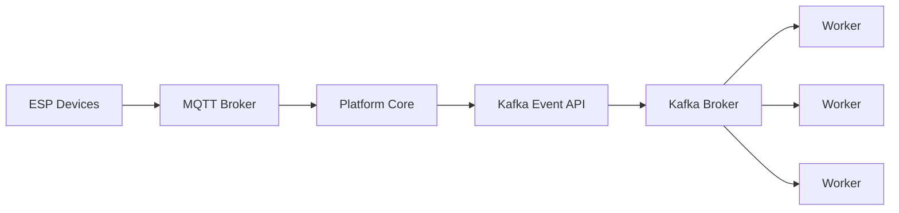
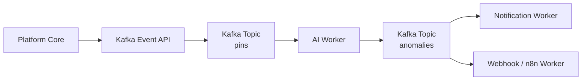

# Глава 10. Архитектура Workers

## Назначение

По мере развития системы возникает необходимость выполнять задачи, которые не относятся непосредственно к управлению ESP-устройствами. Анализ телеметрии, обработка событий, интеграция с внешними сервисами, отправка уведомлений и применение алгоритмов искусственного интеллекта требуют значительных вычислительных ресурсов и развиваются независимо от Platform Core.

Размещение подобных функций непосредственно внутри серверного приложения неизбежно приводит к усложнению архитектуры, увеличению количества зависимостей и снижению масштабируемости системы.

По этой причине Esp Monitor использует архитектуру **Workers** — независимых процессов, выполняющих специализированную обработку событий, публикуемых сервером через Kafka Event API.

Таким образом сервер остается сосредоточенным исключительно на своей основной задаче — управлении устройствами и публикации событий, тогда как вся вторичная обработка переносится за пределы Platform Core.

---

## Архитектурная роль Workers

Worker представляет собой самостоятельный процесс, запускаемый независимо от сервера и подписывающийся на один или несколько топиков Kafka.

Worker не является частью серверного приложения и не загружается внутрь его процесса. Он имеет собственный жизненный цикл, собственную конфигурацию и может разрабатываться, сопровождаться и масштабироваться независимо от остальных компонентов системы.

Взаимодействие между сервером и Worker осуществляется исключительно посредством обмена событиями через Kafka Event API и Kafka Broker.

В результате сервер не знает:

- сколько экземпляров Worker работает в системе;
- где они размещены;
- какие задачи они выполняют;
- какие технологии используют;
- какие зависимости имеют.

Единственной обязанностью Platform Core является публикация событий в соответствующие топики Kafka.



Такое разделение обеспечивает слабую связанность компонентов и позволяет расширять функциональность платформы без изменения серверного приложения.

---

## Событийная архитектура

Kafka Event API служит архитектурной границей между Platform Core и внешними сервисами обработки данных, а Kafka Broker является инфраструктурной реализацией доставки и хранения записей.

В этой главе **событие** означает семантический факт, опубликованный платформой; **сообщение** — передаваемое представление этого факта; **record** — его запись в Kafka.

После публикации события дальнейшая обработка полностью отделяется от сервера.

Каждый Worker самостоятельно принимает решение, какие события ему интересны, каким образом их анализировать и какие действия выполнять далее.

При этом один Worker может не только потреблять события, но и публиковать результаты своей работы в новые топики Kafka.

Это позволяет строить многоступенчатые конвейеры обработки данных без каких-либо изменений в серверном приложении.



Подобная архитектура позволяет постепенно расширять систему, добавляя новые сервисы обработки событий без модификации существующих компонентов.

---

## Независимое масштабирование

Каждый тип Worker образует собственную группу потребителей Kafka и может запускаться в нескольких экземплярах.

Kafka автоматически распределяет сообщения между экземплярами одной группы, обеспечивая параллельную обработку данных.

Максимальная степень параллелизма определяется количеством партиций соответствующего топика Kafka.

Таким образом увеличение вычислительной производительности достигается путем запуска дополнительных экземпляров Worker без изменения серверного приложения.

Сервер при этом продолжает выполнять одинаковый объем работы независимо от количества запущенных Worker.

---

## Независимость реализации

Worker является полностью самостоятельным приложением.

Он может использовать:

- собственную конфигурацию;
- собственные библиотеки;
- собственные модели искусственного интеллекта;
- собственные базы данных;
- внешние API;
- любые внутренние алгоритмы обработки данных.

При этом сервер ничего не знает об особенностях реализации конкретного Worker.

Единственным контрактом взаимодействия остается Kafka Event API — формат событий, публикуемых через Kafka.

Благодаря этому различные команды могут независимо разрабатывать новые сервисы обработки данных, не вмешиваясь в код серверного приложения.

---

## Примеры Workers

В состав проекта входят три демонстрационных Worker, иллюстрирующих возможности событийной архитектуры.

### kworker

`kworker` подписывается на топик `pins`, содержащий изменения состояний входов и выходов ESP-устройств.

Полученные события агрегируются по каждому устройству, после чего Worker формирует статистические таблицы, отображающие количество возникших комбинаций состояний пинов.

Таблицы непрерывно пересчитываются по мере поступления новых событий и выводятся в консоль.

Данный Worker демонстрирует возможность потоковой обработки телеметрии без участия серверного приложения.

---

### ai-worker

`ai-worker` также использует поток событий из топика `pins`, однако вместо простой агрегации формирует окно наблюдений для каждого устройства.

После накопления заданного количества событий Worker выполняет анализ полученных данных с использованием большой языковой модели.

При обнаружении потенциальных аномалий Worker публикует результаты анализа в отдельный топик `anomalies`.

Полученные события могут быть просмотрены через Kafdrop либо использованы другими Worker для реализации дополнительной бизнес-логики, например:

- отправки уведомлений;
- интеграции с системами автоматизации;
- передачи сообщений через Webhook;
- взаимодействия с платформами N8N;
- выполнения последующих этапов обработки.

Таким образом результаты работы одного Worker могут становиться входными данными для других Worker, формируя цепочки независимой обработки событий.

---
### hworker

`hworker` подписывается на топик `anomalies`,  в котором содержатся аналитические отчеты от AI со статусами [WARNING] и [CRITICAL].

Полученные из топика данные, отправляются немедленно по адресу указанному в переменной `WEBHOOK_URL` окружения в виде POST запроса.

Основное назначение - пробрасывать `webhook` событие в системы автоматизации типа `N8n`.

---
## Расширяемость платформы

Поставляемые вместе с системой Worker не являются обязательными компонентами Esp Monitor.

Они служат примерами использования событийной архитектуры и могут быть модифицированы, заменены или полностью исключены из развертывания.

При необходимости пользователь может разработать собственные Worker, реализующие специализированные правила обработки, например:

- интеллектуальный анализ данных;
- генерацию отчетов;
- отправку электронной почты;
- Push-уведомления;
- интеграцию с корпоративными системами;
- автоматическую настройку устройств;
- взаимодействие с внешними сервисами.

Подобный подход позволяет расширять функциональность платформы без изменения серверного приложения и без нарушения архитектуры Platform Core.

---

## Итоги

Архитектура Workers превращает Esp Monitor в событийную платформу, допускающую неограниченное расширение специализированными сервисами обработки данных.

Сервер отвечает исключительно за управление устройствами и публикацию событий через Kafka Event API, тогда как вся вторичная обработка переносится в независимые Worker.

Такое разделение обеспечивает слабую связанность компонентов, независимое масштабирование, возможность построения конвейеров обработки событий и постепенное развитие платформы без изменения Platform Core.

# Workers Reference

## Overview

Workers представляют собой самостоятельные приложения, выполняющие специализированную обработку событий, публикуемых сервером Esp Monitor в Kafka.

В отличие от серверного приложения, Worker не участвует в управлении ESP-устройствами и не взаимодействует с ними напрямую. Его задачей является обработка данных, поступающих из Kafka, выполнение собственной бизнес-логики и, при необходимости, публикация новых событий.

Каждый Worker запускается как отдельный процесс и обладает собственным жизненным циклом.

В состав текущей поставки входят три демонстрационных Worker.

| Worker      | Назначение                                                      |
|-------------|-----------------------------------------------------------------|
| `kworker`   | Агрегация событий изменения состояний пинов и построение        |
|             | статистических таблиц.                                          |
| `ai-worker` | Анализ агрегированных состояний устройств с использованием LLM  |
|             | и обнаружение аномалий.                                         |
| `hworker`   | Пробрасывание важных событий в средства автоматизации типа N8n. |
|-------------|-----------------------------------------------------------------|

Оба Worker являются примерами использования событийной архитектуры и могут быть модифицированы пользователем.

---

# Общие требования

Для работы любого Worker необходим следующий набор компонентов.

```text
ESP Devices
      │
      ▼
 MQTT Broker
      │
      ▼
    Server
      │
      ▼
    Kafka
      │
      ▼
    Worker
```

Server публикует события в Kafka, после чего дальнейшая обработка полностью переходит к Worker.

Если Kafka отсутствует, Worker выполнять свои функции не сможет. В этом случае приложение может быть переработано в обычный внешний сервис, однако перестает являться Kafka Worker.

---

# Общие параметры конфигурации

Каждый Worker использует собственный файл `.env`.

В текущей реализации используются только параметры подключения к Kafka.

| Variable     | Default     | Required | Description              |
|--------------|-------------|----------|--------------------------|
| `KAFKA_HOST` | `localhost` | Yes      | Имя хоста Kafka Broker.  |
| `KAFKA_PORT` | `9092`      | Yes      | Порт Kafka Broker.       |

Большинство внутренних параметров намеренно **не выносится** в файл конфигурации.

К таким параметрам относятся:

- имя Consumer Group;
- размер внутренних очередей;
- размер окна анализа;
- параметры агрегации;
- используемая AI-модель;
- внутренняя бизнес-логика Worker.

Предполагается, что подобные параметры изменяются разработчиком непосредственно в исходном коде конкретного Worker.

---

# Масштабирование Worker

Каждый тип Worker использует собственную Consumer Group Kafka.

Допускается запуск нескольких экземпляров одного Worker одновременно.

Kafka автоматически распределяет сообщения между экземплярами одной группы потребителей, обеспечивая параллельную обработку потока событий.

Максимальное количество одновременно работающих экземпляров определяется количеством партиций соответствующего топика Kafka.

| Partitions | Максимальное количество активных Worker |
|------------|-----------------------------------------|
| 1          | 1                                       |
| 4          | До 4                                    |
| 16         | До 16                                   |
| 50         | До 50                                   |

Запуск дополнительных экземпляров сверх количества партиций не увеличивает производительность, поскольку такие процессы не будут получать сообщения.

При локальном развертывании каждый топик, как правило, создается с одной партицией, поэтому достаточно одного экземпляра каждого Worker.

---

# kworker

## Назначение

`kworker` предназначен для непрерывной потоковой агрегации изменений состояний цифровых и аналоговых пинов ESP-устройств.

Worker читает поток событий из Kafka, подсчитывает количество возникших комбинаций состояний пинов и отображает статистические таблицы в консоли.

---

## Используемые топики

| Topic    | Role             |
|----------|------------------|
| `pins`   | Источник данных. |

---

## Принцип работы

Каждое сообщение из топика `pins` содержит очередное состояние одного устройства.

После получения сообщения Worker:

1. определяет устройство;
2. формирует агрегированное представление состояния его пинов;
3. увеличивает счетчик соответствующей комбинации;
4. обновляет отображаемую статистику.

Обработка выполняется непрерывно.

После поступления каждого нового сообщения статистические таблицы автоматически пересчитываются.

---

## Пример результата

```text
                                 esp8266-001 | Count
------------------------------------------------
A0:3 D1:0 D2:0 D3:1 D4:1 D5:1 D6:1 D7:1 D8:0 | 326
A0:3 D1:1 D2:1 D3:1 D4:1 D5:0 D6:0 D7:1 D8:0 | 248
------------------------------------------------
                                       Total | 584
```

Данный Worker демонстрирует возможность непрерывной потоковой обработки телеметрии без участия серверного приложения.

---

# ai-worker

## Назначение

`ai-worker` предназначен для интеллектуального анализа состояний ESP-устройств.

Worker получает поток изменений состояний пинов, накапливает статистику по каждому устройству и передает агрегированные сведения большой языковой модели для анализа.

Результатом анализа является обнаружение потенциальных аномалий в работе устройства.

---

## Используемые топики

| Topic         | Role                    |
|---------------|-------------------------|
| `pins`        | Источник данных.        |
| `anomalies`   | Публикация аномалий.    |

---

## Окно анализа

Для каждого устройства Worker поддерживает собственное окно наблюдений.

После накопления **500 сообщений**, полученных из топика `pins`, запускается очередной анализ.

При текущей реализации прошивки микроконтроллер отправляет изменения состояний пинов не чаще одного раза в секунду.

Поэтому при постоянно изменяющемся состоянии устройства анализ обычно выполняется приблизительно один раз каждые **8–9 минут**.

---

## Используемая AI-модель

Текущая реализация использует следующую модель.

| Parameter  | Value                              |
|------------|------------------------------------|
| AI Model   | `meta-llama/llama-3.1-8b-instruct` |

Используемая модель не является частью архитектурного контракта и может быть заменена разработчиком Worker.

---

## Подключение к OpenRouter

Для доступа к модели используется отдельный API-ключ.

| Variable             | Required | Description             |
|----------------------|----------|-------------------------|
| `OPENROUTER_API_KEY` | Yes      | API-ключ OpenRouter.    |

---

## Консольный вывод

Во время работы `ai-worker` отображает процесс запуска анализа и его результат.

Пример:

```text
2026/07/06 13:19:44 [esp8266-002] Launching AI analysis for the current sliding window...
2026/07/06 13:19:55 ⚠️ [WARNING LOG] Device: esp8266-002 -> System is mostly stable but minor noise detected on some digital and analog pins.

2026/07/06 13:23:56 [esp8266-001] Launching AI analysis for the current sliding window...
2026/07/06 13:24:01 🟢 [STATUS NORMAL] Device: esp8266-001 is running smoothly.
```

При обнаружении состояний `WARNING` или `CRITICAL` результаты анализа дополнительно публикуются в Kafka.

---

## Формат сообщения об аномалии

Сообщения об обнаруженных аномалиях публикуются в топик `anomalies`.

Пример сообщения:

```json
{
    "device_id": "esp8266-002",
    "status": "WARNING",
    "summary": "System is mostly stable but minor noise detected on some digital and analog pins.",
    "anomalies": [
        {
            "type": "noise",
            "affected_pins": [
                "D3",
                "D4",
                "D5",
                "D6"
            ],
            "description": "Frequent unstable state switches indicating electrical noise."
        },
        {
            "type": "system_shift",
            "affected_pins": [
                "D2",
                "A0"
            ],
            "description": "Multiple occurrences of unusual state combinations, possibly due to system configuration changes or hardware malfunctions."
        }
    ]
}
```

---

### Поля сообщения

| Field         | Description                                          |
|---------------|------------------------------------------------------|
| `device_id`   | Идентификатор ESP-устройства.                        |
| `status`      | Результат анализа (`NORMAL`, `WARNING`, `CRITICAL`). |
| `summary`     | Краткое текстовое описание общего состояния.         |
| `anomalies`   | Список обнаруженных аномалий.                        |

Каждый элемент массива `anomalies` содержит следующую информацию.

| Field           | Description                               |
|-----------------|-------------------------------------------|
| `type`          | Тип обнаруженной аномалии.                |
| `affected_pins` | Список пинов, связанных с аномалией.      |
| `description`   | Подробное описание обнаруженной проблемы. |

---

# hworker

## Назначение

`kworker` предназначен для пробрасывания `webhook` в средства автоматизации, такие как N8n, Hudson, Jenkins.

Worker читает поток событий из Kafka и отправляет полученные данные POST запросом по адресу, указанному в переменной окружения `WEBHOOK_URL`.
Если переменная не задана, ничего не происходит.

---

## Используемые топики

| Topic      | Role             |
|------------|------------------|
| `anomalies`| Источник данных. |

---

## Принцип работы

Каждое сообщение из топика `anomalies` содержит JSON  сообщение с перечнем пинов, на которых аномалия была зарегистрирована, тип сообщения, текстовое описание.
`hworker` использует результаты работы `ai-worker`.


Обработка выполняется непрерывно.

---

## Пример результата

```text
2026/07/07 14:57:34 {"device_id":"esp8266-002","status":"WARNING","summary":"System is mostly stable but minor noise detected on digital pins D2 and D3.","anomalies":[{"type":"noise","affected_pins":["D2","D3"],"description":"Frequent state switches on multiple digital pins indicating minor glitches."}]}
```

Данный Worker демонстрирует возможность каскадного использования средств автоматизации и анализа данных.

---

# Используемые топики Kafka

Поставляемые Worker используют следующие топики Kafka.

| Topic         | Producer      | Consumer                  |
|---------------|---------------|---------------------------|
| `pins`        | Server        | `kworker`, `ai-worker`    |
| `anomalies`   | `ai-worker`   | `hworker` и               |
|               |               | пользовательские workers  |

Топик `anomalies` предназначен для передачи результатов анализа другим сервисам.

Например:

- сервисам уведомлений;
- системам мониторинга;
- Webhook-интеграциям;
- автоматизациям N8N;
- пользовательским Worker.

---

# Использование Kafdrop

Совместно с Kafka рекомендуется использовать **Kafdrop**, предоставляющий Web-интерфейс для просмотра содержимого топиков.

Kafdrop позволяет:

- просматривать сообщения Kafka;
- контролировать поступление новых событий;
- анализировать результаты работы Worker;
- просматривать сообщения топика `anomalies`;
- выполнять диагностику потоков данных.

Kafdrop является инструментом наблюдения и диагностики и не участвует в обработке сообщений.

---

# Поток обработки данных

```text
                         Kafka

                 +----------------+
                 |     pins       |
                 +----------------+
                    │         │
                    │         │
            +---------------+ +----------------+
            |   kworker     | |   ai-worker    |
            +---------------+ +----------------+
                                      │
                                      ▼
                             +----------------+
                             |   anomalies    |
                             +----------------+
                               │            │      
                               ▼            ▼
                User-defined Workers  +----------------+
                                      |   hworker      |
                                      +----------------+
```

Один Worker может использовать результаты работы другого Worker, формируя последовательные этапы обработки событий без изменения серверного приложения.

---

# Создание собственных Worker

Поставляемые `kworker`, `ai-worker` и `hworker` являются демонстрационными примерами использования событийной архитектуры.

Пользователь может разрабатывать собственные Worker, реализующие необходимую бизнес-логику.

Worker может:

- читать любые топики Kafka;
- публиковать сообщения в существующие или новые топики;
- использовать любой язык программирования;
- обращаться к REST Management API сервера;
- взаимодействовать с MQTT Broker;
- использовать Webhook;
- интегрироваться с N8N;
- использовать собственные базы данных;
- применять любые модели искусственного интеллекта;
- выполнять специализированную обработку данных.

Worker остается полностью независимым приложением и не требует изменения серверного кода.

---

# Ограничения текущей реализации

В состав поставки входят три демонстрационных Worker, предназначенных прежде всего для иллюстрации возможностей событийной архитектуры.

По этой причине значительная часть внутренних параметров (например, Consumer Group, размер окна анализа, используемая AI-модель и внутренняя логика обработки) задается непосредственно в исходном коде и не выносится в файл `.env`.

При необходимости пользователь может изменить существующие Worker или создать собственные реализации, ориентированные на конкретные требования проекта.

---

# Заключение

`kworker`, `ai-worker` и `hworker` демонстрируют базовые принципы построения сервисов обработки событий в Esp Monitor.

Каждый Worker является независимым приложением, использующим Kafka в качестве источника данных и, при необходимости, публикующим результаты собственной обработки в новые топики.

Подобный подход позволяет постепенно расширять функциональность платформы, создавая специализированные сервисы без изменения серверного приложения и сохраняя слабую связанность компонентов системы.
