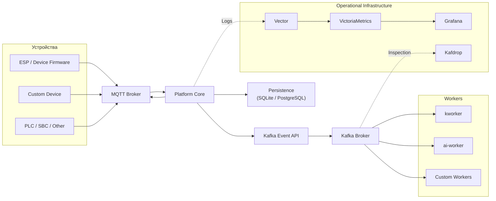
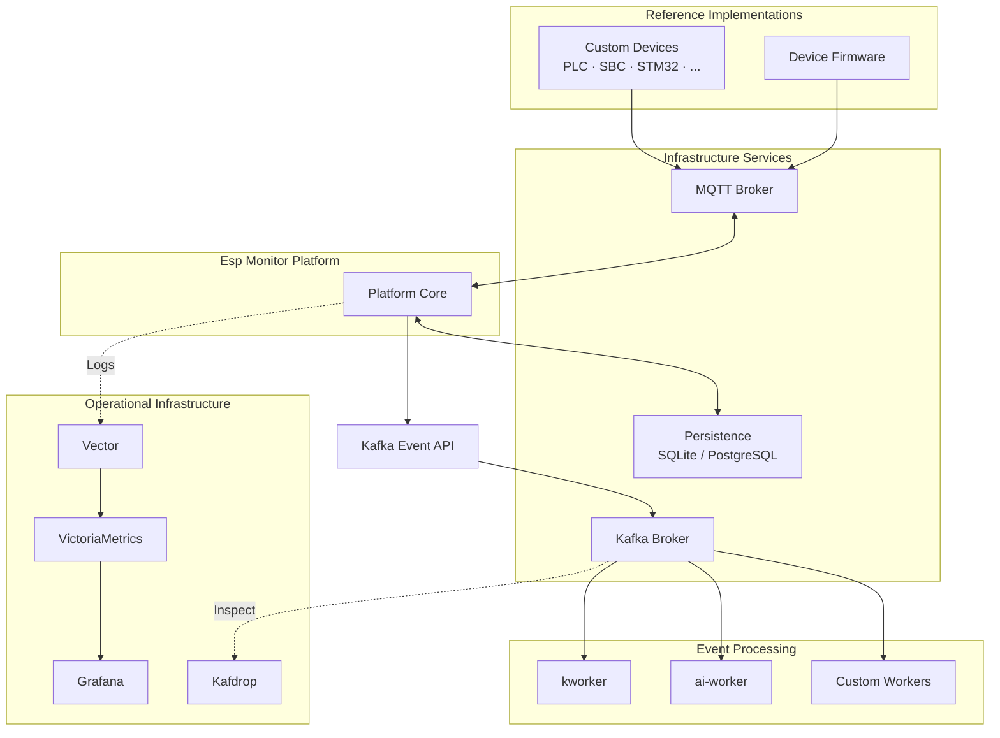

# Глава 11. Архитектура развертывания (Deployment Architecture)

## 11.1. Назначение

Предыдущие главы описывали архитектуру отдельных подсистем платформы: REST Management Interface, MQTT Device Interface, Persistence, Configuration и Workers. Настоящая глава объединяет эти архитектурные решения и показывает, каким образом они формируют единую распределённую систему.

Архитектура развертывания определяет не конкретный способ запуска приложения, а принципы организации платформы как набора независимых сервисов, взаимодействующих через стандартизованные интерфейсы.

Основными целями такой архитектуры являются:

- независимое развертывание компонентов;
- независимое обновление сервисов;
- независимое масштабирование;
- возможность замены отдельных компонентов без изменения остальных;
- использование общепринятых инфраструктурных решений вместо разработки собственных аналогов.

Важно понимать, что Docker Compose, Kubernetes, Minikube или любая другая среда развертывания не являются частью архитектуры платформы. Они представляют собой лишь различные способы реализации одной и той же архитектурной модели.

---

## 11.2. Принципы архитектуры развертывания

Архитектура Esp Monitor построена вокруг независимых сервисов, связанных публичными архитектурными контрактами.

Каждый компонент выполняет строго определённую функцию и имеет собственный жизненный цикл. Благодаря этому изменения в среде эксплуатации, инфраструктуре или способе масштабирования не требуют изменения Platform Core.

---

## 11.3. Классификация компонентов

Архитектурно все компоненты можно разделить на несколько независимых категорий.

| Категория                     | Компоненты                                             | Назначение                                                |
| ----------------------------- | ------------------------------------------------------ | --------------------------------------------------------- |
| **Reference Implementations** | Device Firmware, Demo Workers                          | Демонстрационные реализации архитектурных контрактов      |
| **Platform Core**             | Server                                                 | Центральная подсистема координации платформы              |
| **Infrastructure Services**   | MQTT Broker, SQLite, PostgreSQL, Kafka                 | Стандартные сервисы, обеспечивающие работу платформы      |
| **Operational Infrastructure**| Vector, VictoriaMetrics, Grafana, Kafdrop              | Мониторинг, журналирование и наблюдаемость                |
| **Среда развертывания**       | Docker Compose, Docker, Kubernetes, Minikube           | Управление жизненным циклом компонентов                   |

Каждая категория имеет собственную область ответственности и может развиваться независимо от остальных.

Например, смена среды развертывания с Docker Compose на Kubernetes не требует изменения Platform Core. Аналогично, переход со встроенной базы SQLite на PostgreSQL не влияет на REST Management API, MQTT Device API или взаимодействие с устройствами.

---

## 11.4. Архитектурные контракты

Одним из фундаментальных принципов Esp Monitor является разделение архитектурного контракта и его конкретной реализации.

Архитектура определяет **интерфейс взаимодействия**, а не конкретную технологию.

Это позволяет заменять отдельные реализации без изменения остальной части системы.

Ниже приведены основные архитектурные контракты платформы.

| Архитектурный контракт | Референсная реализация           | Возможность замены |
| ---------------------- | -------------------------------- | ------------------ |
| MQTT Device API        | Device Firmware                  | Да                 |
| REST Management API    | Go Server                        | Нет                |
| Storage API            | SQLite / PostgreSQL              | Да                 |
| Kafka Event API        | kworker / ai-worker              | Да                 |
| Среда развертывания    | Docker Compose / Kubernetes      | Да                 |

Наиболее показательным примером является MQTT Device API.

В состав проекта входит демонстрационная прошивка для микроконтроллеров ESP, однако архитектура платформы не зависит от конкретного семейства устройств.

Любое устройство, реализующее MQTT Device API, может стать полноценным участником системы независимо от используемой аппаратной платформы или языка программирования.

Аналогичный принцип применяется и к подсистеме хранения данных.

Сервер взаимодействует не с PostgreSQL или SQLite напрямую, а со Storage API. Благодаря этому выбор конкретной СУБД определяется исключительно требованиями эксплуатации.

Для небольших инсталляций достаточно встроенной базы SQLite, тогда как крупные распределённые развертывания обычно используют PostgreSQL благодаря значительно более широким возможностям масштабирования.

## 11.5. Топология развертывания

Архитектура платформы построена вокруг набора независимых сервисов, каждый из которых выполняет собственную функцию и взаимодействует с остальными исключительно через стандартизованные интерфейсы.

Ни один компонент не требует непосредственного доступа к внутренней реализации другого компонента.

Основная топология платформы представлена ниже.



Центральной подсистемой платформы является Platform Core, реализуемый сервером Esp Monitor.

Именно он координирует внешние интерфейсы, взаимодействует с устройствами посредством MQTT Device Interface, работает с Persistence через Storage API и публикует события через Kafka Event API.

Остальные компоненты выполняют специализированные функции и не требуют прямого взаимодействия между собой.

Такое разделение позволяет минимизировать связанность системы и обеспечивает возможность независимого развития каждого компонента.

---

## 11.6. Независимость компонентов

Одним из важнейших архитектурных принципов платформы является независимость жизненного цикла каждого сервиса.

Каждый компонент может быть:

- развернут независимо;
- обновлён независимо;
- масштабирован независимо;
- заменён независимо;
- перезапущен независимо.

При этом остальные компоненты продолжают функционировать без необходимости изменения собственной логики.

Например:

- увеличение количества экземпляров Server не требует изменения Workers;
- масштабирование Workers не влияет на MQTT Broker;
- переход со SQLite на PostgreSQL не изменяет REST Management API;
- добавление новых Workers не требует изменения Server;
- подключение Grafana или Vector никак не влияет на обработку сообщений устройств.

Подобная независимость значительно упрощает развитие платформы и позволяет постепенно расширять инфраструктуру по мере роста системы.

---

## 11.7. Использование промышленных инфраструктурных сервисов

Esp Monitor не стремится заменить существующие инфраструктурные технологии собственными реализациями.

Наоборот, архитектура платформы сознательно строится вокруг широко распространённых промышленных стандартов.

Каждый внешний сервис отвечает исключительно за собственную специализированную область.

| Сервис              | Ответственность                                      |
| ------------------- | ---------------------------------------------------- |
| MQTT Broker         | Доставка сообщений между устройствами и сервером     |
| SQLite / PostgreSQL | Постоянное хранение данных                           |
| Kafka               | Инфраструктурная доставка событий                    |
| Vector              | Сбор журналов и телеметрии                           |
| VictoriaMetrics     | Хранение временных рядов                             |
| Grafana             | Визуализация метрик и мониторинг                     |
| Kafdrop             | Просмотр содержимого Kafka                           |

Подобный подход позволяет использовать зрелые технологии, хорошо зарекомендовавшие себя в промышленной эксплуатации.

В результате проект концентрируется исключительно на собственной предметной области — управлении устройствами и обработке их состояния.

Особую роль играет MQTT Broker.

Он является обязательным инфраструктурным компонентом платформы, поскольку обеспечивает транспортный уровень взаимодействия между устройствами и сервером.

Использование брокера сообщений позволяет объединять в единую систему устройства, расположенные в различных локальных сетях, дата-центрах или географических регионах.

При этом серверу не требуется устанавливать прямые соединения с устройствами — всё взаимодействие осуществляется через MQTT Broker.

Kafka, напротив, является дополнительным компонентом.

Если система используется исключительно для управления устройствами, сервер способен полноценно функционировать без Kafka.

Однако при необходимости потоковой обработки событий, интеграции с внешними сервисами или использования Workers именно Kafka Event API становится архитектурной границей между Platform Core и внешними обработчиками событий.

---

## 11.8. Масштабирование

Архитектура платформы позволяет масштабировать каждый компонент независимо.

Не существует требования совместного масштабирования нескольких сервисов.

Каждый компонент увеличивает количество экземпляров исключительно в соответствии с собственной нагрузкой.

| Компонент     | Причина масштабирования                          |
| ------------- | ------------------------------------------------ |
| Server        | Рост количества REST и MQTT запросов             |
| Persistence   | Рост объёма данных и количества транзакций       |
| MQTT Broker   | Рост количества подключённых устройств           |
| Kafka         | Рост объёма событий                              |
| Workers       | Рост интенсивности обработки событий             |
| Monitoring    | Рост объёма журналов и метрик                    |

Конкретный механизм масштабирования определяется средой эксплуатации. Архитектура фиксирует только независимость компонентов и не требует совместного изменения Server, Workers, MQTT Broker, Persistence или Operational Infrastructure.

---

## 11.9. Типовые сценарии развертывания

Благодаря независимости компонентов платформа допускает различные варианты эксплуатации.

Наиболее распространённые сценарии представлены ниже.

| Сценарий                 | Типичная инфраструктура                                  |
| ------------------------ | -------------------------------------------------------- |
| Локальная разработка     | Docker Compose, SQLite                                   |
| Домашняя эксплуатация    | Docker Compose, PostgreSQL (опционально)                 |
| Корпоративный сервер     | Docker или Kubernetes, PostgreSQL, Kafka                 |
| Облачная инфраструктура  | Kubernetes, PostgreSQL, Kafka, Workers, Monitoring Stack |

Следует подчеркнуть, что приведённые варианты являются лишь примерами. Архитектура платформы не накладывает ограничений на используемую среду эксплуатации.

---

## 11.10. Заключение

Архитектура развертывания завершает описание Esp Monitor как распределённой системы независимых сервисов.

Ключевой вывод этой главы состоит в том, что состав инфраструктуры может меняться от локальной установки до промышленного Kubernetes-развертывания, а архитектурные контракты платформы при этом остаются неизменными.

## Deployment Layers



# Deployment Reference

## Overview

Deployment Reference описывает текущую реализацию развертывания платформы Esp Monitor.

В отличие от главы **Deployment Architecture**, настоящий документ описывает только существующую реализацию проекта и содержит сведения, необходимые для установки, настройки и эксплуатации компонентов платформы.

Документ охватывает:

- поддерживаемые варианты развертывания;
- инфраструктурные сервисы;
- переменные окружения;
- Docker Compose;
- Kubernetes;
- развертывание Workers;
- мониторинг;
- рекомендации по масштабированию.

Все примеры соответствуют текущей реализации проекта.

---

# Supported Deployment Models

В настоящий момент проект поддерживает несколько вариантов эксплуатации.

| Сценарий                | Поддержка | Назначение                                   |
| ----------------------- | --------- | -------------------------------------------- |
| Локальный запуск        | Да        | Разработка и отладка                         |
| Docker Compose          | Да        | Локальная и небольшая эксплуатация           |
| Kubernetes              | Да        | Масштабируемое промышленное развертывание    |
| Minikube                | Да        | Локальная разработка Kubernetes-конфигураций |

Docker Compose рассматривается как демонстрационная реализация архитектуры развертывания.

Основной промышленной платформой является Kubernetes.

---

# Deployment Components

Полное развертывание платформы может включать следующие компоненты.

| Компонент          | Обязательный | Назначение                                   |
| ------------------ | ------------ | -------------------------------------------- |
| Server             | Да           | Реализация Platform Core                     |
| MQTT Broker        | Да           | MQTT транспорт между устройствами и сервером |
| SQLite             | Нет          | Встроенное хранилище данных                  |
| PostgreSQL         | Нет          | Внешняя промышленная СУБД                    |
| Kafka              | Нет          | Потоковая обработка событий                  |
| Workers            | Нет          | Дополнительная обработка событий             |
| Vector             | Нет          | Сбор журналов                                |
| VictoriaMetrics    | Нет          | Хранилище метрик                             |
| Grafana            | Нет          | Визуализация                                 |
| Kafdrop            | Нет          | Просмотр Kafka Topics                        |

Минимальная рабочая конфигурация состоит из:

```text
Device

↓

MQTT Broker

↓

Server

↓

SQLite
```

Полная конфигурация проекта включает:

```text
Device

↓

MQTT Broker

↓

Server

├── SQLite / PostgreSQL

└── Kafka

        ↓

    Workers

        ↓

Monitoring Stack
```

---

# Environment Variables

Каждый сервис использует собственный набор переменных окружения.

Большинство компонентов конфигурируется независимо.

Ниже приведены основные группы параметров.

| Компонент      | Конфигурация                          |
| -------------- | ------------------------------------- |
| Server         | HTTP, MQTT, Persistence, Kafka        |
| MQTT Broker    | Собственная конфигурация Broker       |
| PostgreSQL     | Собственная конфигурация СУБД         |
| Kafka          | Собственная конфигурация Kafka        |
| Workers        | Kafka, AI, пользовательские параметры |
| Vector         | Источники журналов                    |
| VictoriaMetrics| Параметры хранения метрик             |
| Grafana        | Dashboards, Datasources               |

Конкретный набор переменных окружения зависит от используемого компонента.

Подробное описание каждой группы параметров приведено в соответствующих разделах настоящего документа.

---
# Docker Compose Deployment

Docker Compose является демонстрационной реализацией архитектуры развертывания платформы.

Основная цель данного варианта развертывания — предоставить полностью готовое локальное окружение, позволяющее быстро запустить все компоненты платформы без дополнительной настройки инфраструктуры.

Docker Compose рекомендуется использовать для:

- локальной разработки;
- тестирования;
- ознакомления с платформой;
- небольших домашних инсталляций.

Типовая конфигурация включает следующие сервисы.

| Сервис            | Назначение                                 |
| ----------------- | ------------------------------------------ |
| Server            | Основной сервис платформы                  |
| MQTT Broker       | MQTT транспорт                             |
| PostgreSQL        | Внешняя СУБД (при использовании)           |
| Kafka             | Потоковая обработка событий                |
| Workers           | Демонстрационные обработчики Kafka         |
| Kafdrop           | Просмотр Kafka Topics                      |
| Vector            | Сбор журналов                              |
| VictoriaMetrics   | Хранение метрик                            |
| Grafana           | Мониторинг и визуализация                  |

Конкретный состав сервисов может изменяться в зависимости от используемого файла `docker-compose.yml`.

Все сервисы запускаются независимо и взаимодействуют через внутреннюю сеть Docker.

---

# Kubernetes Deployment

Для промышленной эксплуатации рекомендуется использовать Kubernetes.

Каждый компонент платформы разворачивается как самостоятельное приложение и имеет собственный жизненный цикл.

Как правило используются следующие объекты Kubernetes.

| Компонент        | Тип объекта Kubernetes          |
| ---------------- | ------------------------------- |
| Server           | Deployment                      |
| Workers          | Deployment                      |
| MQTT Broker      | Deployment / StatefulSet        |
| PostgreSQL       | StatefulSet                     |
| Kafka            | StatefulSet                     |
| Vector           | DaemonSet                       |
| VictoriaMetrics  | StatefulSet                     |
| Grafana          | Deployment                      |
| Kafdrop          | Deployment                      |

Точный набор Kubernetes-манифестов зависит от конкретной среды эксплуатации.

Настоящий документ описывает только рекомендуемую организацию компонентов.

---

# Database Configuration

Server поддерживает две реализации подсистемы хранения данных.

| СУБД         | Назначение                                   |
| ------------ | -------------------------------------------- |
| SQLite       | Локальная разработка и небольшие инсталляции |
| PostgreSQL   | Промышленная эксплуатация                    |

SQLite используется как встроенная база данных и не требует установки дополнительных компонентов.

PostgreSQL разворачивается как отдельный сервис и обеспечивает:

- централизованное хранение данных;
- совместную работу нескольких экземпляров Server;
- значительно более высокую масштабируемость;
- резервное копирование средствами СУБД.

При использовании нескольких экземпляров Server рекомендуется PostgreSQL.

---

# MQTT Broker Configuration

MQTT Broker является обязательным компонентом платформы.

Server не содержит встроенной реализации MQTT Broker и всегда использует внешний брокер сообщений.

В качестве брокера может использоваться любое MQTT-совместимое решение.

Основные параметры подключения обычно включают:

| Переменная     | Назначение                    |
| -------------- | ----------------------------- |
| MQTT_HOST      | Имя или IP брокера            |
| MQTT_PORT      | TCP порт                      |
| MQTT_USERNAME  | Пользователь                  |
| MQTT_PASSWORD  | Пароль                        |
| MQTT_CLIENT_ID | MQTT Client ID сервера        |

Конкретный набор параметров определяется текущей реализацией Server.

---

# Kafka Configuration

Kafka используется исключительно для потоковой обработки событий.

Если Workers не используются, Kafka может отсутствовать.

При использовании Kafka Server публикует события в соответствующие Topics, после чего они становятся доступны независимым Workers.

Типичная конфигурация включает:

| Переменная   | Назначение          |
| ------------ | ------------------- |
| KAFKA_HOST   | Kafka Broker        |
| KAFKA_PORT   | TCP порт            |

Количество Kafka Topics и число их партиций определяется требованиями конкретной системы.

Высоконагруженные Topics обычно содержат значительно больше партиций, чем Topics, предназначенные для передачи редких событий.

---

# Workers Deployment

Workers являются полностью независимыми приложениями и разворачиваются отдельно от Server.

Каждый Worker представляет собой самостоятельный процесс, подписывающийся на один или несколько Kafka Topics.

Server не управляет жизненным циклом Workers и не отслеживает их существование.

Workers могут быть развернуты:

- как отдельные процессы;
- в Docker-контейнерах;
- в Kubernetes;
- на отдельных физических или виртуальных серверах;
- в облачной инфраструктуре.

Единственным обязательным условием является наличие доступа к Kafka Broker.

---

# Kafka Consumer Groups

Каждый тип Worker использует собственную Kafka Consumer Group.

Это позволяет независимо масштабировать различные типы обработчиков.

Например:

| Worker           | Consumer Group             |
| ---------------- | -------------------------- |
| kworker          | statistics-workers         |
| ai-worker        | ai-workers                 |
| Custom Worker    | определяется пользователем |

Все экземпляры одного типа Worker должны использовать одну Consumer Group.

Kafka автоматически распределяет партиции между экземплярами Worker.

---

# Scaling Workers

Максимальная степень параллельной обработки определяется количеством партиций соответствующего Kafka Topic.

| Количество партиций | Максимальное число одновременно работающих Workers |
| ------------------- | -------------------------------------------------- |
| 1                   | 1                                                  |
| 4                   | До 4                                               |
| 8                   | До 8                                               |
| 16                  | До 16                                              |
| 32                  | До 32                                              |

Если количество экземпляров Worker превышает количество партиций, дополнительные экземпляры не получают партиций и остаются в состоянии ожидания (Idle).

Это не является ошибкой, однако приводит к неэффективному использованию вычислительных ресурсов.

При проектировании системы рекомендуется выбирать количество партиций с учетом ожидаемой степени параллелизма.

---

# Kubernetes Autoscaling

При использовании Kubernetes управление количеством экземпляров Workers полностью выполняется средствами оркестрации.

Рекомендуемым решением является использование KEDA (Kubernetes Event-driven Autoscaling).

KEDA отслеживает накопление необработанных сообщений в Kafka и автоматически изменяет количество реплик соответствующего Deployment.

Типичная схема выглядит следующим образом.

```text
Kafka Topic

↓

Consumer Lag

↓

KEDA

↓

Kubernetes Deployment

↓

Workers
```

Количество реплик обычно изменяется в диапазоне:

```
1 ... N
```

где:

```
N = количество партиций Kafka Topic
```

Настоятельно рекомендуется не устанавливать значение `maxReplicaCount` больше количества партиций соответствующего Topic.

В противном случае часть экземпляров Worker будет постоянно находиться в состоянии ожидания.

---

# Kafka Rebalancing

При изменении количества экземпляров Worker Kafka автоматически выполняет перераспределение партиций между участниками Consumer Group.

Ребалансировка происходит автоматически в следующих случаях:

- запуск нового Worker;
- остановка Worker;
- аварийное завершение процесса;
- изменение состава Consumer Group.

Во время ребалансировки Kafka временно приостанавливает обработку сообщений до завершения перераспределения партиций.

Данный механизм полностью реализуется средствами Kafka и не требует вмешательства Server или самих Workers.

---

# Monitoring Workers

Для наблюдения за состоянием обработки сообщений рекомендуется контролировать следующие показатели.

| Метрика                      | Назначение                                    |
| ---------------------------- | --------------------------------------------- |
| Consumer Lag                 | Количество необработанных сообщений           |
| Active Consumers             | Число работающих экземпляров Worker           |
| Topic Throughput             | Скорость поступления сообщений                |
| Processing Rate              | Скорость обработки сообщений                  |
| Rebalance Events             | Частота перераспределения партиций            |

Указанные метрики позволяют своевременно выявлять перегрузку системы и корректировать параметры масштабирования.

---

# Kafdrop

Kafdrop рекомендуется использовать для просмотра содержимого Kafka Topics.

Типичные задачи:

- просмотр сообщений;
- контроль структуры Topics;
- проверка работы Producers;
- проверка работы Consumers;
- анализ сообщений об аномалиях;
- отладка пользовательских Workers.

Kafdrop не участвует в обработке сообщений и используется исключительно как средство наблюдения.

---

# Summary

Настоящий документ завершает описание текущей реализации платформы Esp Monitor.

В предыдущих разделах были рассмотрены:

- поддерживаемые варианты развертывания;
- инфраструктурные сервисы;
- конфигурация среды;
- Docker Compose;
- Kubernetes;
- настройка базы данных;
- MQTT Broker;
- Kafka;
- развертывание Workers;
- масштабирование;
- мониторинг и наблюдаемость.

Все описанные рекомендации соответствуют текущей реализации проекта и могут использоваться как руководство при локальной разработке, тестировании и промышленной эксплуатации.

Следует учитывать, что архитектура платформы не ограничивается приведёнными примерами развертывания.

Благодаря использованию открытых стандартов и независимых компонентов Esp Monitor может быть адаптирован к различным требованиям эксплуатации — от небольших локальных инсталляций до распределённых кластеров Kubernetes.

По мере развития проекта данный документ будет дополняться новыми вариантами развертывания, примерами конфигурации и рекомендациями по эксплуатации.

**Архитектура Esp Monitor построена вокруг открытых протоколов, независимых компонентов и промышленных инфраструктурных решений. Такой подход позволяет развивать отдельные части платформы независимо, сохраняя совместимость на уровне архитектурных контрактов и обеспечивая масштабируемость системы по мере роста требований.**
